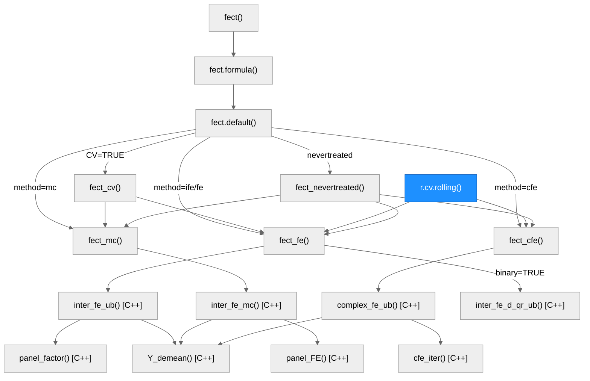
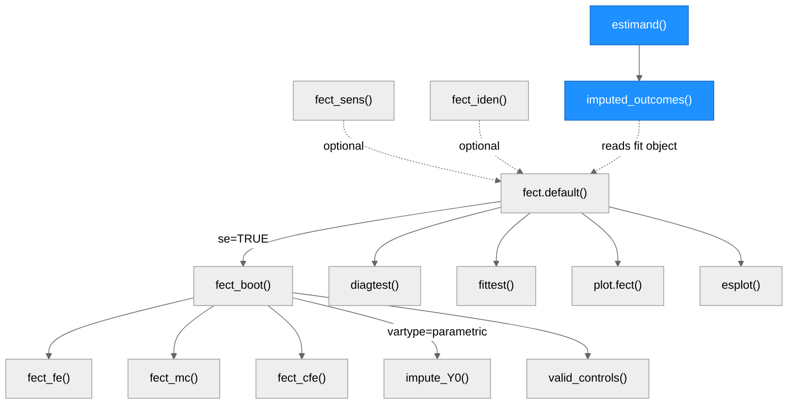
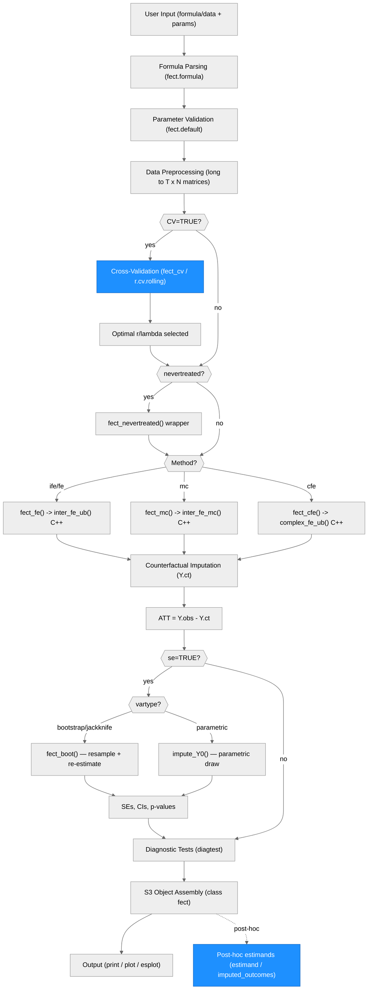

# Architecture — fect

> Generated by scriber for run `2026-04-30-architecture-regen-v241` on 2026-04-30.

## Overview

fect is an R package for estimating causal effects in panel data using counterfactual imputation methods (Fixed Effects Counterfactual Estimators). It targets causal panel analysis with binary treatments under the parallel trends assumption, supporting treatment switching and limited carryover effects. The core abstraction is counterfactual imputation: impute missing potential outcomes Y(0) for treated units using control units, then compute the Average Treatment Effect on the Treated (ATT) as the gap between observed and imputed outcomes. The package is an R/C++ hybrid using Rcpp and RcppArmadillo for numerically intensive linear algebra (SVD, EM iterations, matrix factorization). Key external dependencies include fixest (initial FE regression), ggplot2 (visualization), doParallel/doFuture/future.apply (parallel bootstrap), MASS (generalized inverse), and mvtnorm (multivariate normal draws). Estimation methods include FE (fixed effects), IFE (interactive fixed effects / factor model), MC (matrix completion via nuclear norm regularization), CFE (complex fixed effects with structured covariates), and wrappers for modern DID estimators. Version 2.4.1. References: Liu, Wang, and Xu (2024); Chiu et al. (2026).

---

## Module Structure

```mermaid
%%{init: {'theme': 'neutral'}}%%
graph TD
    subgraph API["API Layer"]
        A1["default.R — fect() entry"]
        A2["interFE.R — interFE()"]
        A3["did_wrapper.R — DID wraps"]
        A4["fect_mspe.R — MSPE comp"]
        A5["po-estimands.R — estimand()"]
    end

    subgraph Est["Estimation Layer"]
        E1["fe.R — fect_fe() IFE"]
        E2["mc.R — fect_mc() MC"]
        E3["cfe.R — fect_cfe() CFE"]
        E4["fect_nevertreated.R"]
    end

    subgraph CV["Cross-Validation"]
        V1["cv.R — fect_cv()"]
        V2["cv_binary.R — binary CV"]
        V3["cv-rolling.R — r.cv.rolling()"]
        V4["cv-rule-helpers.R — 1se/min/1pct"]
        V5["cv-helpers.R — cluster + method"]
    end

    subgraph Inf["Inference Layer"]
        I1["boot.R — fect_boot()"]
        I2["impute_Y0.R — dispatcher"]
        I3["valid_controls.R — para bootstrap"]
    end

    subgraph Diag["Diagnostics & Sensitivity"]
        D1["diagtest.R — pre-trend"]
        D2["fittest.R — fitness test"]
        D3["fect_sens.R — sensitivity"]
        D4["fect_iden.R — identification"]
    end

    subgraph Viz["Visualization Layer"]
        P1["plot.R — plot.fect()"]
        P2["esplot.R — esplot()"]
        P3["theme-helpers.R — modern theme"]
        P4["plot_return.R — return class"]
    end

    subgraph Cpp["C++ Core (RcppArmadillo)"]
        C1["ife.cpp / ife_sub.cpp"]
        C2["mc.cpp"]
        C3["cfe.cpp / cfe_sub.cpp"]
        C4["fe_sub.cpp — shared utils"]
        C5["auxiliary.cpp — EM helpers"]
        C6["binary_*.cpp — probit"]
    end

    subgraph Util["Support & Data"]
        U1["support.R — data helpers"]
        U2["polynomial.R — trends"]
        U3["effect.R / cumu.R — deprecated"]
        U4["score.R / permutation.R"]
        U5["getcohort.R — cohorts"]
        U6["print.R — S3 print"]
        U7["loading_bound.R — simplex proj"]
    end

    A1 --> E1
    A1 --> E2
    A1 --> E3
    A1 --> E4
    A1 --> V1
    A1 --> I1
    A1 --> D1
    A1 --> P1
    A5 -.->|"post-hoc"| A1
    V1 --> E1
    V1 --> E2
    V1 --> V4
    V1 --> V5
    V3 --> V4
    V3 --> V5
    I1 --> E1
    I1 --> E2
    I1 --> E3
    I1 --> I2
    I1 --> I3
    I1 --> V5
    E1 --> C1
    E2 --> C2
    E3 --> C3
    C1 --> C4
    C2 --> C4
    C3 --> C4
    C1 --> C5
    E1 --> U1
    E2 --> U1
    E3 --> U1
    A1 --> U1
    A1 --> U2
    P1 --> P3
    P2 --> P3
    E4 --> V5
```

### Module Reference

| Module / File | Layer | Purpose | Key Exports | Changed since v2.2.0 |
| --- | --- | --- | --- | --- |
| `R/default.R` (3,107 lines) | API | Main entry point, parameter validation, method routing; added `W.est`/`W.agg` per-role weight args (v2.3.1), `carryover.rm` slot (v2.3.3) | `fect()`, `fect.formula()`, `fect.default()` | yes |
| `R/interFE.R` (515 lines) | API | Standalone interactive fixed effects estimator | `interFE()` | no |
| `R/did_wrapper.R` (656 lines) | API | Modern DID estimator wrappers (did, DIDmultiplegtDYN) | `did_wrapper()` | no |
| `R/fect_mspe.R` (370 lines) | API | MSPE computation for model comparison | `fect_mspe()` | no |
| `R/po-estimands.R` (1,123 lines) | API | Two-tier post-hoc estimand surface: long-form imputed PO accessor and typed dispatcher; `vartype` enum extended to `"parametric"` in v2.4.1 | `estimand()`, `imputed_outcomes()` | yes (new v2.4.0) |
| `R/fe.R` (955 lines) | Estimation | Interactive Fixed Effects / factor model estimation | `fect_fe()` | no |
| `R/mc.R` (807 lines) | Estimation | Matrix Completion via nuclear norm regularization | `fect_mc()` | no |
| `R/cfe.R` (1,173 lines) | Estimation | Complex Fixed Effects with structured covariates | `fect_cfe()` | no |
| `R/fect_nevertreated.R` (3,459 lines) | Estimation | Never-treated comparison group variant; PSOCK cluster helper calls (v2.3.3) | `fect_nevertreated()` | yes |
| `R/cv.R` (2,052 lines) | Cross-Validation | Hyperparameter selection (r, lambda) via MSPE/PC; rolling default, 1-SE rule, per-fold scoring | `fect_cv()` | yes |
| `R/cv_binary.R` (441 lines) | Cross-Validation | Cross-validation for binary/probit models | `fect_cv_binary()` | no |
| `R/cv-rolling.R` (403 lines) | Cross-Validation | Standalone rolling-window CV; per-fold unit sampling, cv.prop/k/cv.nobs parameters | `r.cv.rolling()` | yes (new v2.3.0) |
| `R/cv-rule-helpers.R` (127 lines) | Cross-Validation | CV rule selection: 1-SE (default), min, 1pct rules; per-fold SE computation | (internal) | yes (new v2.3.0) |
| `R/cv-helpers.R` (486 lines) | Cross-Validation | Shared CV helpers: `.fect_make_future_cluster()`, `.fect_normalize_cv_method()`, per-fold scoring | (internal) | yes (new v2.3.3) |
| `R/boot.R` (4,797 lines) | Inference | Bootstrap/jackknife/parametric inference with parallel PSOCK retry-with-backoff | `fect_boot()` | yes |
| `R/impute_Y0.R` (231 lines) | Inference | Y0 imputer dispatcher for parametric bootstrap; routes by (method, predictive) | (internal) | yes (new v2.3.x) |
| `R/valid_controls.R` (34 lines) | Inference | Control screening helper for parametric bootstrap; pre/post observation threshold | (internal) | yes (new v2.3.x) |
| `R/diagtest.R` (225 lines) | Diagnostics | Pre-trend F-test, equivalence (TOST), placebo, carryover tests; `drop=FALSE` guard (v2.3.3) | `diagtest()` | yes |
| `R/fittest.R` (636 lines) | Diagnostics | Fitness/wild bootstrap test | `fect_test()` | no |
| `R/fect_sens.R` (232 lines) | Diagnostics | Sensitivity analysis via HonestDiDFEct | `fect_sens()` | no |
| `R/fect_iden.R` (224 lines) | Diagnostics | Identification analysis | `fect_iden()` | no |
| `R/plot.R` (5,274 lines) | Visualization | Comprehensive ggplot2 plotting (14 plot types); modernized visual defaults, `legacy.style`/`highlight`/`highlight.fill` args (v2.3.2) | `plot.fect()` | yes |
| `R/esplot.R` (1,215 lines) | Visualization | Standalone event-study plots; modern theme integration (v2.3.2) | `esplot()` | yes |
| `R/theme-helpers.R` (42 lines) | Visualization | Shared modern-theme constants and `.modern_theme()` builder; `.lighten_color()` helper | (internal) | yes (new v2.3.2) |
| `R/plot_return.R` (9 lines) | Visualization | Plot return object class definition | (internal) | no |
| `R/support.R` (733 lines) | Utilities | Data manipulation, initial FE fit via fixest, helper functions | `get_term()`, `align_beta0()` | yes |
| `R/polynomial.R` (845 lines) | Utilities | Polynomial/B-spline trend specification | `fect_polynomial()` | no |
| `R/effect.R` (403 lines) | Utilities | Treatment effect decomposition; **soft-deprecated v2.4.0**, redirects to `estimand()` | `effect()` | yes (deprecation) |
| `R/cumu.R` (212 lines) | Utilities | Cumulative ATT; **soft-deprecated v2.4.0**, redirects to `estimand(fit, "att.cumu", ...)`; `n_cells` fixed v2.4.1 | `att.cumu()` | yes (deprecation + fix) |
| `R/score.R` (105 lines) | Utilities | Score-based inference | (internal) | no |
| `R/permutation.R` (264 lines) | Utilities | Permutation test for treatment effects | (internal) | no |
| `R/getcohort.R` (264 lines) | Utilities | Treatment cohort identification | `get.cohort()` | no |
| `R/print.R` (119 lines) | Utilities | S3 print methods for fect and interFE objects | `print.fect()`, `print.interFE()` | yes |
| `R/loading_bound.R` (318 lines) | Utilities | Entropy-regularized simplex projection of treated factor loadings (GSC bounded-loadings) | (internal) | yes (new v2.3.x) |
| `R/RcppExports.R` (191 lines) | Utilities | Auto-generated Rcpp function bindings | (auto-generated) | no |
| `src/ife.cpp` (534 lines) | C++ Core | IFE algorithm: `inter_fe()`, `inter_fe_ub()`, `inter_fe_d()` | (Rcpp exports) | no |
| `src/ife_sub.cpp` (577 lines) | C++ Core | IFE sub-routines: SVD factor estimation, EM iterations, alternating minimization | (internal) | no |
| `src/mc.cpp` (223 lines) | C++ Core | Matrix completion: `inter_fe_mc()`, nuclear norm penalization | (Rcpp exports) | no |
| `src/cfe.cpp` (203 lines) | C++ Core | Complex FE: `complex_fe_ub()` | (Rcpp exports) | no |
| `src/cfe_sub.cpp` (564 lines) | C++ Core | Complex FE sub-routines: `cfe_iter()`, structured covariate handling | (internal) | no |
| `src/fe_sub.cpp` (291 lines) | C++ Core | Shared FE utilities: `Y_demean()`, `panel_beta()`, `panel_factor()`, `panel_FE()`, `XXinv()` | (internal) | no |
| `src/binary_sub.cpp` (539 lines) | C++ Core | Probit model sub-routines for binary outcomes | (internal) | no |
| `src/binary_qr.cpp` (347 lines) | C++ Core | QR-based probit estimation | (internal) | no |
| `src/binary_svd.cpp` (302 lines) | C++ Core | SVD-based probit estimation | (internal) | no |
| `src/auxiliary.cpp` (396 lines) | C++ Core | EM helpers, matrix utilities, log-likelihood computation | (internal) | no |
| `src/fect.h` (60 lines) | C++ Core | Header file with all C++ function declarations | (header) | no |

---

## Function Call Graph

### Main Estimation Pipeline

### Inference, Diagnostics, and Post-hoc Estimands

### Function Reference

| Function | Defined In | Called By | Calls | Changed since v2.2.0 | Purpose |
| --- | --- | --- | --- | --- | --- |
| `fect()` | `R/default.R` | user / exported | `UseMethod("fect")` | no | S3 generic entry point for counterfactual estimation |
| `fect.formula()` | `R/default.R` | `fect()` | `fect.default()` | no | Parse formula, extract variable names, delegate to default method |
| `fect.default()` | `R/default.R` | `fect.formula()`, user | `fect_cv()`, `fect_fe()`, `fect_mc()`, `fect_cfe()`, `fect_boot()`, `diagtest()` | yes | Workhorse: validation, preprocessing, method routing, inference, diagnostics; added `W.est`/`W.agg`/`carryover.rm` |
| `fect_fe()` | `R/fe.R` | `fect.default()`, `fect_cv()`, `fect_boot()`, `r.cv.rolling()` | `inter_fe_ub()`, `inter_fe_d_qr_ub()` (C++) | no | IFE estimation (factor model with r latent factors) |
| `fect_mc()` | `R/mc.R` | `fect.default()`, `fect_cv()`, `fect_boot()` | `inter_fe_mc()` (C++) | no | Matrix completion estimation (nuclear norm regularization) |
| `fect_cfe()` | `R/cfe.R` | `fect.default()`, `fect_boot()`, `r.cv.rolling()` | `complex_fe_ub()` (C++) | no | Complex FE with structured covariates (Z, Q, gamma, kappa) |
| `fect_nevertreated()` | `R/fect_nevertreated.R` | `fect.default()` | `fect_fe()`, `fect_mc()`, `fect_cfe()`, `.fect_make_future_cluster()` | yes | Wrapper for never-treated-only estimation sample; PSOCK cluster via shared helper (v2.3.3) |
| `fect_cv()` | `R/cv.R` | `fect.default()` | `fect_fe()`, `fect_mc()`, `.fect_apply_cv_rule()`, `.fect_cv_aggregate_folds()` | yes | Cross-validation to select r (IFE) or lambda (MC); rolling default (v2.3.0), 1-SE rule (v2.3.0) |
| `r.cv.rolling()` | `R/cv-rolling.R` | user / exported | `fect_fe()`, `fect_cfe()`, `.fect_apply_cv_rule()`, `.fect_make_future_cluster()` | yes (new v2.3.0) | Standalone rolling-window CV for rank selection; per-fold unit sampling; closes AR forward-leakage |
| `fect_boot()` | `R/boot.R` | `fect.default()` | `fect_fe()`, `fect_mc()`, `fect_cfe()`, `impute_Y0()`, `valid_controls()`, `.fect_make_future_cluster()` | yes | Bootstrap/jackknife/parametric inference with PSOCK retry-with-backoff (v2.3.3) |
| `impute_Y0()` | `R/impute_Y0.R` | `fect_boot()` | `fect_nevertreated()`, `fect_fe()`, `fect_cfe()` | yes (new) | Y0 imputer dispatcher for parametric bootstrap; routes by (method, predictive) pairs |
| `valid_controls()` | `R/valid_controls.R` | `fect_boot()` | — | yes (new) | Screen control units by pre/post observation threshold before parametric bootstrap |
| `interFE()` | `R/interFE.R` | user / exported | `inter_fe()` (C++) | no | Standalone interactive fixed effects estimator |
| `did_wrapper()` | `R/did_wrapper.R` | user / exported | `fixest::feols()`, `did::att_gt()` | no | Modern DID estimator wrappers |
| `plot.fect()` | `R/plot.R` | user / exported | ggplot2, `.modern_theme()` | yes | 14 plot types; modernized defaults, `legacy.style`/`highlight`/`highlight.fill` (v2.3.2) |
| `esplot()` | `R/esplot.R` | user / exported | ggplot2, `.modern_theme()` | yes | Standalone event-study plot; modern theme integration (v2.3.2) |
| `estimand()` | `R/po-estimands.R` | user / exported (new v2.4.0) | `imputed_outcomes()`, internal aggregators | yes (new v2.4.0) | Typed dispatcher: `att`, `att.cumu`, `aptt`, `log.att` across `event.time`/`cohort`/`calendar.time`/`overall`; `vartype` enum extended to `"parametric"` in v2.4.1 |
| `imputed_outcomes()` | `R/po-estimands.R` | user / exported (new v2.4.0); `estimand()` | internal helpers | yes (new v2.4.0) | Long-form accessor for cell-level imputed PO surface; `cells =` filter (logical / formula); `direction = c("on", "off")`; `eff_debias` slot support |
| `effect()` | `R/effect.R` | user / exported | (internal helpers) | yes (soft-deprecated v2.4.0) | Treatment effect decomposition; emits one-time-per-session deprecation message: *"`effect()` is soft-deprecated as of fect 2.4.0; prefer `estimand(fit, "att.cumu", ...)` API."* Removal not before v3.0.0 |
| `att.cumu()` | `R/cumu.R` | user / exported | (internal helpers) | yes (soft-deprecated v2.4.0, `n_cells` fix v2.4.1) | Cumulative ATT; emits same one-time deprecation; `n_cells` column fixed in v2.4.1 |
| `get.cohort()` | `R/getcohort.R` | user / exported | — | no | Treatment cohort identification |
| `fect_mspe()` | `R/fect_mspe.R` | user / exported | — | no | MSPE computation for model comparison |
| `fect_sens()` | `R/fect_sens.R` | user / exported | HonestDiDFEct functions | no | Sensitivity analysis |
| `fect_iden()` | `R/fect_iden.R` | user / exported | — | no | Identification analysis |
| `diagtest()` | `R/diagtest.R` | `fect.default()` | — | yes | Pre-trend, placebo, carryover, equivalence tests; `drop=FALSE` guard (v2.3.3) |
| `inter_fe_ub()` | `src/ife.cpp` | `fect_fe()` | `panel_factor()`, `fe_ub()`, `Y_demean()` | no | C++ IFE with unbalanced panels (EM algorithm) |
| `inter_fe_mc()` | `src/mc.cpp` | `fect_mc()` | `panel_FE()`, `Y_demean()` | no | C++ matrix completion with nuclear norm |
| `complex_fe_ub()` | `src/cfe.cpp` | `fect_cfe()` | `cfe_iter()`, `Y_demean()` | no | C++ complex FE estimation |
| `panel_factor()` | `src/fe_sub.cpp` | `inter_fe_ub()`, others | SVD routines | no | Extract latent factors via SVD |
| `panel_FE()` | `src/fe_sub.cpp` | `inter_fe_mc()`, others | soft-thresholding | no | Nuclear norm regularization / soft-thresholding |
| `Y_demean()` | `src/fe_sub.cpp` | most C++ estimators | (arma operations) | no | Remove unit and/or time fixed effects |

---

## Data Flow

---

## Architectural Patterns

- **S3 Dispatch with Formula Interface**: `fect()` uses `UseMethod()` to support both formula and direct (Y, D, X) interfaces. `fect.formula()` parses the formula into variable names, `fect.default()` does the computation. Same pattern for `interFE()`.

- **R/C++ Layered Computation**: All numerically intensive operations (SVD, EM iterations, demeaning, matrix factorization) are implemented in C++ via RcppArmadillo. R handles data wrangling, parameter validation, control flow, and result assembly. The boundary is at the estimation functions: R `fect_fe()` calls C++ `inter_fe_ub()`.

- **Method-Agnostic Pipeline**: `fect.default()` provides a single preprocessing, CV, estimation, inference, diagnostics pipeline. Method-specific logic is encapsulated in `fect_fe()`, `fect_mc()`, `fect_cfe()`. Adding a new estimation method requires only a new estimation function and a routing entry.

- **Matrix-Oriented Data Representation**: Panel data is converted from long-form data frames to T x N matrices early in `fect.default()`. Covariates become T x N x p arrays. All downstream computation operates on these matrix forms, enabling efficient C++ computation.

- **Two-Tier Tolerance**: Cross-validation uses a looser tolerance (`max(tol, 1e-3)`) for speed during hyperparameter search, while final estimation uses the user-specified tolerance for precision.

- **Parallel Bootstrap via foreach with PSOCK Retry**: `fect_boot()` uses `foreach` with `doParallel`/`doFuture` backends for parallel bootstrap replication. The shared `.fect_make_future_cluster()` helper (in `cv-helpers.R`) builds PSOCK clusters that propagate `.libPaths()` to workers, avoiding "no package called 'fect'" worker init errors in non-standard R session contexts (Quarto render, RStudio, Rscript). Introduced v2.3.3. A retry-with-backoff loop re-submits failed bootstrap draws through a reduced-worker cluster, falling back to sequential execution for any remaining failures.

- **Counterfactual Imputation as Core Abstraction**: All methods share the same conceptual framework: impute Y(0) for treated units using untreated observations, compute ATT as the gap. FE uses additive fixed effects, IFE adds latent factors (F * L'), MC uses nuclear norm regularization, CFE adds structured covariates.

- **Never-Treated vs Not-Yet-Treated Estimation Samples**: The package supports two estimation sample strategies. "notyettreated" includes not-yet-treated observations (requiring EM for missing data), "nevertreated" uses only never-treated units (allowing direct SVD). The `fect_nevertreated()` wrapper handles the latter.

- **Comprehensive Diagnostic Suite**: Built-in tests (F-test, TOST equivalence, placebo, carryover) allow users to validate the parallel trends assumption without external tools. Sensitivity analysis via optional HonestDiDFEct integration.

- **Two-Tier Post-hoc Estimand Surface (v2.4.0)**: Alternative estimands (cumulative ATT, APTT, log-scale ATT, window-restricted ATT) are computed off the imputed potential-outcome surface rather than baked into the fit-time pipeline. `imputed_outcomes()` returns the cell-level surface as a tidy long-form data frame with columns `id`, `time`, `event.time`, `cohort`, `treated`, `Y_obs`, `Y0_hat`, `eff`, `eff_debias`, `W.agg`. `estimand()` is a typed dispatcher (`type ∈ {"att", "att.cumu", "aptt", "log.att"}`) that aggregates that surface to a tidy frame keyed by `by ∈ {"event.time", "cohort", "calendar.time", "overall"}`. Supersedes the closure-based design rejected for stability and composability reasons (see `ref/po-estimands-contract.md`). `effect()` and `att.cumu()` continue to work byte-identically and are soft-deprecated (v2.4.0); removal not before v3.0.0. The fit object reserves an `eff_debias` slot (NULL for plain imputation; populated by future doubly-robust estimators) so DR scores can extend the surface without breaking the long-form schema. `vartype` extended to include `"parametric"` in v2.4.1.

- **Rolling-Window Cross-Validation (v2.3.0)**: The default CV method switched from random-block masking (`cv.method = "all_units"`) to rolling-window masking (`cv.method = "rolling"`, `cv.prop = 0.1`, `k = 20`). The rolling design closes the forward AR-leakage channel that block masking leaves open: each sampled unit's training set excludes the held-out block and all future observations. Per-fold unit sampling (sampling `cv.prop` fraction of eligible units per fold) prevents simultaneous masking of all donors, which would break factor identification. The 1-SE rule (Breiman et al. 1984; Hastie et al. 2009) became the default CV selection rule (`cv.rule = "1se"`), biasing toward parsimony. Both the rule selection and fold aggregation are owned by `cv-rule-helpers.R`. The standalone `r.cv.rolling()` export exposes rolling CV outside of `fect()` for exploratory rank selection.

- **Per-Role Weight Arguments (v2.3.1) and Modern Visual Defaults (v2.3.2)**: Two independent improvements ship in the same minor cycle. `W.est` and `W.agg` split the single `W` argument into outcome-model fit weights and ATT aggregation weights respectively (`W` still sets both, preserving backward compatibility). The split enables IPW aggregation without re-estimating the outcome model. `plot.fect()` and `esplot()` switched to a modern visual default (`theme.bw = TRUE`, `legacy.style = FALSE`): the `theme-helpers.R` module centralizes color constants and the `.modern_theme()` ggplot2 theme builder, used by both `plot.R` and `esplot.R`. Pass `legacy.style = TRUE` to restore the pre-2.3.1 classic style.

---

## Notes

- FE is internally treated as IFE with `r = 0` (zero latent factors). The code sets `method = "ife"` when `method = "fe"` and `r = 0`.
- The `gsynth` method is a compatibility alias that forces `time.component.from = "nevertreated"` and `em = FALSE`, matching the behavior of the gsynth package.
- `boot.R` (4,797 lines) and `plot.R` (5,274 lines) are the two largest files. Both could benefit from modular decomposition in future refactors.
- The `binary` option (probit models) is only available with `method = "ife"` and has dedicated C++ implementations (`binary_qr.cpp`, `binary_svd.cpp`, `binary_sub.cpp`).
- The package uses `fixest::feols()` for initial OLS regression to obtain starting values for iterative estimation.
- Vignettes are organized as a Quarto book (`vignettes/_quarto.yml`) with 10 chapters: getting started, FE, alternative estimands (`estimand()` / `imputed_outcomes()`, added v2.4.0), IFE/MC, CFE, heterogeneous effects, plots, gsynth compatibility, panel diagnostics, and sensitivity analysis. Chapter numbering shifted at v2.4.0: 03-ife-mc became 04-ife-mc; 03-estimands is new.
- 10 bundled datasets (`simdata`, `sim_base`, `sim_gsynth`, `sim_linear`, `sim_region`, `sim_trend`, `turnout`, `gs2020`, `hh2019`, `simgsynth`) support examples and testing.
- 14 exported functions and 8 S3 methods registered in NAMESPACE. Exports added since v2.2.0: `r.cv.rolling`, `imputed_outcomes`, `estimand`.
- New R files added since v2.2.0: `po-estimands.R` (1,123 lines), `cv-rolling.R` (403 lines), `cv-rule-helpers.R` (127 lines), `cv-helpers.R` (486 lines), `impute_Y0.R` (231 lines), `loading_bound.R` (318 lines), `theme-helpers.R` (42 lines), `valid_controls.R` (34 lines).
- Total R source: 32,047 lines across 35 files. Total C++ source: 4,848 lines across 12 files (plus header).
