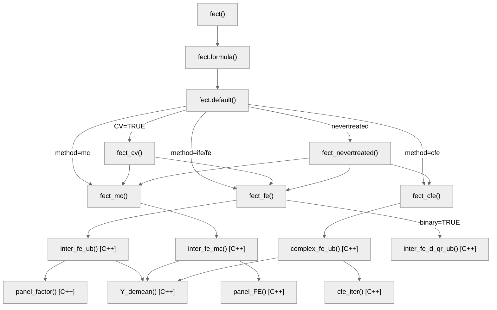
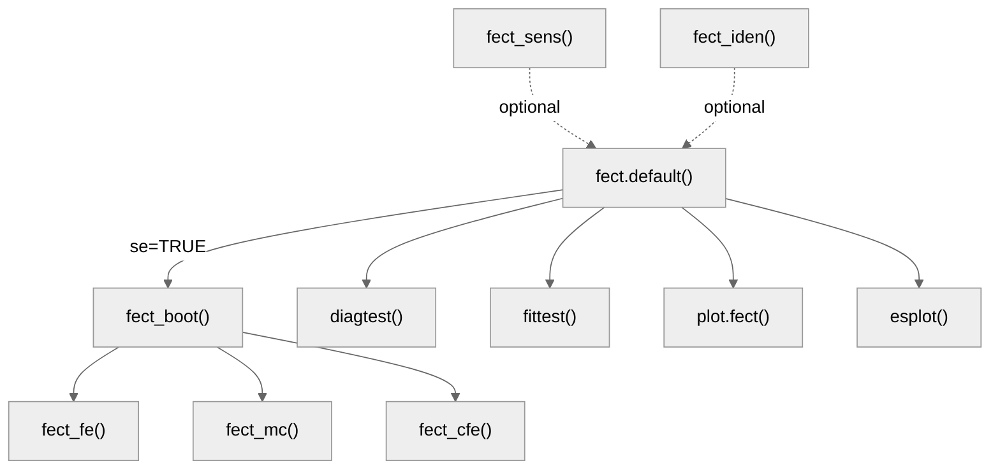
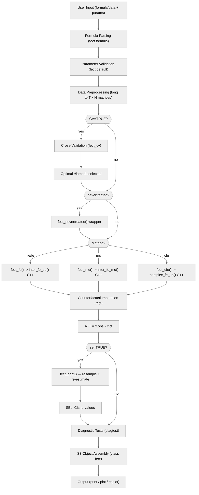

# Architecture — fect

> Generated by scriber for run `20260329-arch-docs` on 2026-03-29.

## Overview

fect is an R package for estimating causal effects in panel data using counterfactual imputation methods (Fixed Effects Counterfactual Estimators). It targets causal panel analysis with binary treatments under the parallel trends assumption, supporting treatment switching and limited carryover effects. The core abstraction is counterfactual imputation: impute missing potential outcomes Y(0) for treated units using control units, then compute the Average Treatment Effect on the Treated (ATT) as the gap between observed and imputed outcomes. The package is an R/C++ hybrid using Rcpp and RcppArmadillo for numerically intensive linear algebra (SVD, EM iterations, matrix factorization). Key external dependencies include fixest (initial FE regression), ggplot2 (visualization), doParallel/doFuture/future.apply (parallel bootstrap), MASS (generalized inverse), and mvtnorm (multivariate normal draws). Estimation methods include FE (fixed effects), IFE (interactive fixed effects / factor model), MC (matrix completion via nuclear norm regularization), CFE (complex fixed effects with structured covariates), and wrappers for modern DID estimators. Version 2.2.0. References: Liu, Wang, and Xu (2024); Chiu et al. (2025).

---

## Module Structure

```mermaid
%%{init: {'theme': 'neutral'}}%%
graph TD
    subgraph API["API Layer"]
        A1["default.R — fect() entry"]
        A2["interFE.R — interFE()"]
        A3["did_wrapper.R — DID wraps"]
        A4["fect_mspe.R — MSPE comp"]
    end

    subgraph Est["Estimation Layer"]
        E1["fe.R — fect_fe() IFE"]
        E2["mc.R — fect_mc() MC"]
        E3["cfe.R — fect_cfe() CFE"]
        E4["fect_nevertreated.R"]
    end

    subgraph CV["Cross-Validation"]
        V1["cv.R — fect_cv()"]
        V2["cv_binary.R — binary CV"]
    end

    subgraph Inf["Inference Layer"]
        I1["boot.R — fect_boot()"]
    end

    subgraph Diag["Diagnostics & Sensitivity"]
        D1["diagtest.R — pre-trend"]
        D2["fittest.R — fitness test"]
        D3["fect_sens.R — sensitivity"]
        D4["fect_iden.R — identification"]
    end

    subgraph Viz["Visualization Layer"]
        P1["plot.R — plot.fect()"]
        P2["esplot.R — esplot()"]
    end

    subgraph Cpp["C++ Core (RcppArmadillo)"]
        C1["ife.cpp / ife_sub.cpp"]
        C2["mc.cpp"]
        C3["cfe.cpp / cfe_sub.cpp"]
        C4["fe_sub.cpp — shared utils"]
        C5["auxiliary.cpp — EM helpers"]
        C6["binary_*.cpp — probit"]
    end

    subgraph Util["Support & Data"]
        U1["support.R — data helpers"]
        U2["polynomial.R — trends"]
        U3["effect.R / cumu.R — ATT"]
        U4["score.R / permutation.R"]
        U5["getcohort.R — cohorts"]
        U6["print.R — S3 print"]
    end

    A1 --> E1
    A1 --> E2
    A1 --> E3
    A1 --> E4
    A1 --> V1
    A1 --> I1
    A1 --> D1
    A1 --> P1
    V1 --> E1
    V1 --> E2
    I1 --> E1
    I1 --> E2
    I1 --> E3
    E1 --> C1
    E2 --> C2
    E3 --> C3
    C1 --> C4
    C2 --> C4
    C3 --> C4
    C1 --> C5
    E1 --> U1
    E2 --> U1
    E3 --> U1
    A1 --> U1
    A1 --> U2
```

### Module Reference

| Module / File | Layer | Purpose | Key Exports | Changed |
| --- | --- | --- | --- | --- |
| `R/default.R` (2,919 lines) | API | Main entry point, parameter validation, method routing | `fect()`, `fect.formula()`, `fect.default()` | no |
| `R/interFE.R` (515 lines) | API | Standalone interactive fixed effects estimator | `interFE()` | no |
| `R/did_wrapper.R` (656 lines) | API | Modern DID estimator wrappers (did, DIDmultiplegtDYN) | `did_wrapper()` | no |
| `R/fect_mspe.R` (344 lines) | API | MSPE computation for model comparison | `fect_mspe()` | no |
| `R/fe.R` (954 lines) | Estimation | Interactive Fixed Effects / factor model estimation | `fect_fe()` | no |
| `R/mc.R` (804 lines) | Estimation | Matrix Completion via nuclear norm regularization | `fect_mc()` | no |
| `R/cfe.R` (1,172 lines) | Estimation | Complex Fixed Effects with structured covariates | `fect_cfe()` | no |
| `R/fect_nevertreated.R` (3,166 lines) | Estimation | Never-treated comparison group variant | `fect_nevertreated()` | no |
| `R/cv.R` (1,526 lines) | Cross-Validation | Hyperparameter selection (r, lambda) via MSPE/PC | `fect_cv()` | no |
| `R/cv_binary.R` (421 lines) | Cross-Validation | Cross-validation for binary/probit models | `fect_cv_binary()` | no |
| `R/boot.R` (4,884 lines) | Inference | Bootstrap/jackknife/parametric inference with parallel support | `fect_boot()` | no |
| `R/diagtest.R` (215 lines) | Diagnostics | Pre-trend F-test, equivalence (TOST), placebo, carryover tests | `diagtest()` | no |
| `R/fittest.R` (636 lines) | Diagnostics | Fitness/wild bootstrap test | `fect_test()` | no |
| `R/fect_sens.R` (232 lines) | Diagnostics | Sensitivity analysis via HonestDiDFEct | `fect_sens()` | no |
| `R/fect_iden.R` (224 lines) | Diagnostics | Identification analysis | `fect_iden()` | no |
| `R/plot.R` (5,019 lines) | Visualization | Comprehensive ggplot2 plotting (gap, equiv, status, exit, factors, loadings, calendar, counterfactual, heterogeneous) | `plot.fect()` | no |
| `R/esplot.R` (1,118 lines) | Visualization | Standalone event-study plots | `esplot()` | no |
| `R/plot_return.R` (9 lines) | Visualization | Plot return object class definition | (internal) | no |
| `R/support.R` (676 lines) | Utilities | Data manipulation, initial FE fit, helper functions | `get_term()`, `align_beta0()` | no |
| `R/polynomial.R` (844 lines) | Utilities | Polynomial/B-spline trend specification | `fect_polynomial()` | no |
| `R/effect.R` (397 lines) | Utilities | Treatment effect decomposition by sub-group | `effect()` | no |
| `R/cumu.R` (206 lines) | Utilities | Cumulative ATT computation | `att.cumu()` | no |
| `R/score.R` (105 lines) | Utilities | Score-based inference | (internal) | no |
| `R/permutation.R` (264 lines) | Utilities | Permutation test for treatment effects | (internal) | no |
| `R/getcohort.R` (264 lines) | Utilities | Treatment cohort identification | `get.cohort()` | no |
| `R/print.R` (111 lines) | Utilities | S3 print methods for fect and interFE objects | `print.fect()`, `print.interFE()` | no |
| `R/RcppExports.R` (191 lines) | Utilities | Auto-generated Rcpp function bindings | (auto-generated) | no |
| `src/ife.cpp` (534 lines) | C++ Core | IFE algorithm: `inter_fe()`, `inter_fe_ub()`, `inter_fe_d()` | (Rcpp exports) | no |
| `src/ife_sub.cpp` (577 lines) | C++ Core | IFE sub-routines: SVD factor estimation, EM iterations, alternating minimization | (internal) | no |
| `src/mc.cpp` (223 lines) | C++ Core | Matrix completion: `inter_fe_mc()`, nuclear norm penalization | (Rcpp exports) | no |
| `src/cfe.cpp` (203 lines) | C++ Core | Complex FE: `complex_fe_ub()` | (Rcpp exports) | no |
| `src/cfe_sub.cpp` (564 lines) | C++ Core | Complex FE sub-routines: `cfe_iter()`, structured covariate handling | (internal) | no |
| `src/fe_sub.cpp` (291 lines) | C++ Core | Shared FE utilities: `Y_demean()`, `panel_beta()`, `panel_factor()`, `panel_FE()`, `XXinv()` | (internal) | no |
| `src/binary_sub.cpp` (539 lines) | C++ Core | Probit model sub-routines for binary outcomes | (internal) | no |
| `src/binary_qr.cpp` (347 lines) | C++ Core | QR-based probit estimation | (internal) | no |
| `src/binary_svd.cpp` (302 lines) | C++ Core | SVD-based probit estimation | (internal) | no |
| `src/auxiliary.cpp` (396 lines) | C++ Core | EM helpers, matrix utilities, log-likelihood computation | (internal) | no |
| `src/fect.h` (60 lines) | C++ Core | Header file with all C++ function declarations | (header) | no |

---

## Function Call Graph

### Main Estimation Pipeline

### Inference and Diagnostics

### Function Reference

| Function | Defined In | Called By | Calls | Changed | Purpose |
| --- | --- | --- | --- | --- | --- |
| `fect()` | `R/default.R` | user / exported | `UseMethod("fect")` | no | S3 generic entry point for counterfactual estimation |
| `fect.formula()` | `R/default.R` | `fect()` | `fect.default()` | no | Parse formula, extract variable names, delegate to default method |
| `fect.default()` | `R/default.R` | `fect.formula()`, user | `fect_cv()`, `fect_fe()`, `fect_mc()`, `fect_cfe()`, `fect_boot()`, `diagtest()` | no | Workhorse: validation, preprocessing, method routing, inference, diagnostics |
| `fect_fe()` | `R/fe.R` | `fect.default()`, `fect_cv()`, `fect_boot()` | `inter_fe_ub()`, `inter_fe_d_qr_ub()` (C++) | no | IFE estimation (factor model with r latent factors) |
| `fect_mc()` | `R/mc.R` | `fect.default()`, `fect_cv()`, `fect_boot()` | `inter_fe_mc()` (C++) | no | Matrix completion estimation (nuclear norm regularization) |
| `fect_cfe()` | `R/cfe.R` | `fect.default()`, `fect_boot()` | `complex_fe_ub()` (C++) | no | Complex FE with structured covariates (Z, Q, gamma, kappa) |
| `fect_nevertreated()` | `R/fect_nevertreated.R` | `fect.default()` | `fect_fe()`, `fect_mc()`, `fect_cfe()` | no | Wrapper for never-treated-only estimation sample |
| `fect_cv()` | `R/cv.R` | `fect.default()` | `fect_fe()`, `fect_mc()` | no | Cross-validation to select r (IFE) or lambda (MC) |
| `fect_boot()` | `R/boot.R` | `fect.default()` | `fect_fe()`, `fect_mc()`, `fect_cfe()` | no | Bootstrap/jackknife inference engine with parallel support |
| `interFE()` | `R/interFE.R` | user / exported | `inter_fe()` (C++) | no | Standalone interactive fixed effects estimator |
| `did_wrapper()` | `R/did_wrapper.R` | user / exported | `fixest::feols()`, `did::att_gt()` | no | Modern DID estimator wrappers |
| `plot.fect()` | `R/plot.R` | user / exported | ggplot2 functions | no | Comprehensive visualization with 10+ plot types |
| `esplot()` | `R/esplot.R` | user / exported | ggplot2 functions | no | Standalone event-study plot |
| `effect()` | `R/effect.R` | user / exported | (internal helpers) | no | Treatment effect decomposition by sub-group |
| `att.cumu()` | `R/cumu.R` | user / exported | (internal helpers) | no | Cumulative ATT computation |
| `diagtest()` | `R/diagtest.R` | `fect.default()` | (statistical computations) | no | Pre-trend, placebo, carryover, equivalence tests |
| `fect_sens()` | `R/fect_sens.R` | user / exported | HonestDiDFEct functions | no | Sensitivity analysis |
| `fect_iden()` | `R/fect_iden.R` | user / exported | (internal helpers) | no | Identification analysis |
| `inter_fe_ub()` | `src/ife.cpp` | `fect_fe()` | `panel_factor()`, `fe_ub()`, `Y_demean()` | no | C++ IFE with unbalanced panels (EM algorithm) |
| `inter_fe_mc()` | `src/mc.cpp` | `fect_mc()` | `panel_FE()`, `Y_demean()` | no | C++ matrix completion with nuclear norm |
| `complex_fe_ub()` | `src/cfe.cpp` | `fect_cfe()` | `cfe_iter()`, `Y_demean()` | no | C++ complex FE estimation |
| `panel_factor()` | `src/fe_sub.cpp` | `inter_fe_ub()`, others | SVD routines | no | Extract latent factors via SVD |
| `panel_FE()` | `src/fe_sub.cpp` | `inter_fe_mc()`, others | soft-thresholding | no | Nuclear norm regularization / soft-thresholding |
| `Y_demean()` | `src/fe_sub.cpp` | most C++ estimators | (arma operations) | no | Remove unit and/or time fixed effects |

---

## Data Flow

---

## Architectural Patterns

- **S3 Dispatch with Formula Interface**: `fect()` uses `UseMethod()` to support both formula and direct (Y, D, X) interfaces. `fect.formula()` parses the formula into variable names, `fect.default()` does the computation. Same pattern for `interFE()`.

- **R/C++ Layered Computation**: All numerically intensive operations (SVD, EM iterations, demeaning, matrix factorization) are implemented in C++ via RcppArmadillo. R handles data wrangling, parameter validation, control flow, and result assembly. The boundary is at the estimation functions: R `fect_fe()` calls C++ `inter_fe_ub()`.

- **Method-Agnostic Pipeline**: `fect.default()` provides a single preprocessing, CV, estimation, inference, diagnostics pipeline. Method-specific logic is encapsulated in `fect_fe()`, `fect_mc()`, `fect_cfe()`. Adding a new estimation method requires only a new estimation function and a routing entry.

- **Matrix-Oriented Data Representation**: Panel data is converted from long-form data frames to T x N matrices early in `fect.default()`. Covariates become T x N x p arrays. All downstream computation operates on these matrix forms, enabling efficient C++ computation.

- **Two-Tier Tolerance**: Cross-validation uses a looser tolerance (`max(tol, 1e-3)`) for speed during hyperparameter search, while final estimation uses the user-specified tolerance for precision.

- **Parallel Bootstrap via foreach**: `fect_boot()` uses `foreach` with `doParallel`/`doFuture` backends for parallel bootstrap replication. Includes `trim_closure_env()` optimization to reduce serialization overhead by keeping only referenced symbols in function environments.

- **Counterfactual Imputation as Core Abstraction**: All methods share the same conceptual framework: impute Y(0) for treated units using untreated observations, compute ATT as the gap. FE uses additive fixed effects, IFE adds latent factors (F * L'), MC uses nuclear norm regularization, CFE adds structured covariates.

- **Never-Treated vs Not-Yet-Treated Estimation Samples**: The package supports two estimation sample strategies. "notyettreated" includes not-yet-treated observations (requiring EM for missing data), "nevertreated" uses only never-treated units (allowing direct SVD). The `fect_nevertreated()` wrapper handles the latter.

- **Comprehensive Diagnostic Suite**: Built-in tests (F-test, TOST equivalence, placebo, carryover) allow users to validate the parallel trends assumption without external tools. Sensitivity analysis via optional HonestDiDFEct integration.

---

## Notes

- FE is internally treated as IFE with `r = 0` (zero latent factors). The code sets `method = "ife"` when `method = "fe"` and `r = 0`.
- The `gsynth` method is a compatibility alias that forces `time.component.from = "nevertreated"` and `em = FALSE`, matching the behavior of the gsynth package.
- `boot.R` (4,884 lines) and `plot.R` (5,019 lines) are the two largest files. Both could benefit from modular decomposition in future refactors.
- The `binary` option (probit models) is only available with `method = "ife"` and has dedicated C++ implementations (`binary_qr.cpp`, `binary_svd.cpp`, `binary_sub.cpp`).
- The package uses `fixest::feols()` for initial OLS regression to obtain starting values for iterative estimation.
- Vignettes are organized as a Quarto book (`vignettes/_quarto.yml`) with 9 chapters covering getting started, FE, IFE/MC, CFE, heterogeneous effects, plots, gsynth compatibility, panel diagnostics, and sensitivity analysis.
- 10 bundled datasets (`simdata`, `sim_base`, `sim_gsynth`, `sim_linear`, `sim_region`, `sim_trend`, `turnout`, `gs2020`, `hh2019`, `simgsynth`) support examples and testing.
- 11 exported functions and 8 S3 methods registered in NAMESPACE.
- Total R source: 27,872 lines across 27 files. Total C++ source: 4,848 lines across 12 files (plus header).
