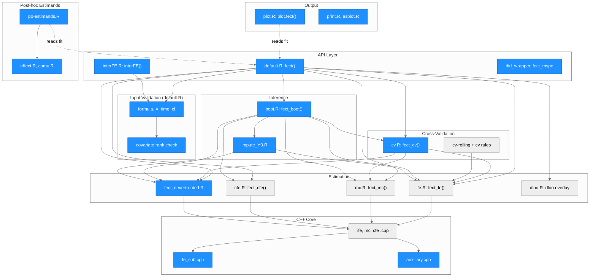
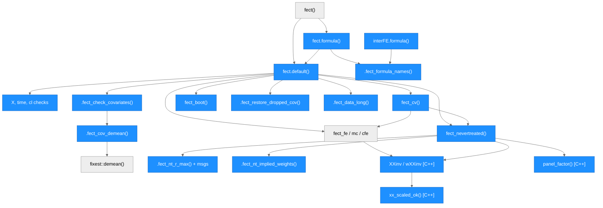
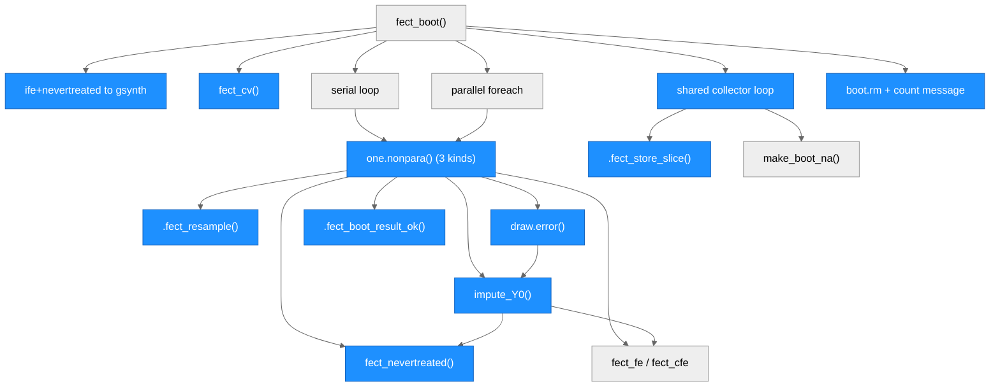
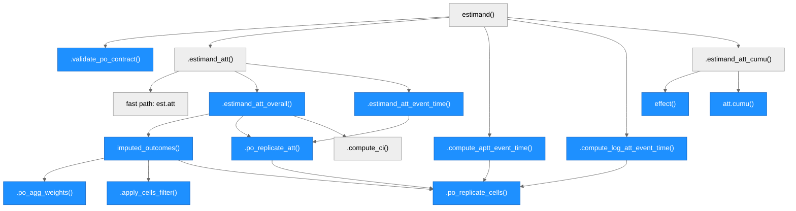
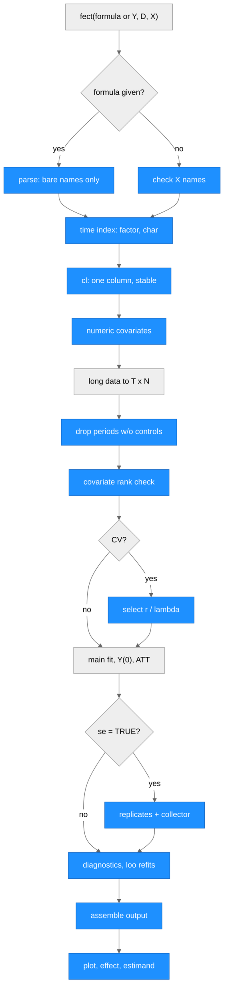

# Architecture — fect

> Generated by scriber for run `2026-09-24-fix246-correctness` on 2026-09-25 (fect 2.4.6, branch
> `fix/246-correctness`). Replaces the 2026-04-30 regeneration (v2.4.1, with manual v2.4.2 patches).
> Blue nodes and "yes" rows mark what this run changed: the correctness fixes A1-A7, B1-B9 (with
> B8b-B8e) and C1-C6 listed in `NEWS.md` under fect 2.4.7, with two amendments made after review:
> C5b (the trigger of the C++ `XXinv()` guard) and C4b (a warning for factor time indices).
>
> Updated on 2026-09-25 for branch `fix/246-followup` (run `2026-09-25-port-onto-151`), which adds five
> fixes on top of PR #151: B10-cfe, B11, B12, B13 and M1 (also in `NEWS.md` under 2.4.7). Rows, nodes
> and notes marked "follow-up" describe them; blue nodes include them.

## Overview

fect is an R package for causal panel analysis with binary treatments under parallel trends
(Fixed Effects Counterfactual Estimators). Its core abstraction is counterfactual imputation: fit an
outcome model on untreated cells, impute the missing potential outcomes Y(0) of treated cells, and
average the gaps Y - Y(0) into the ATT and its by-period, by-cohort and cumulative summaries. The
package is an R/C++ hybrid: R (`R/`, 36 files, about 34,500 lines) does input handling, data
reshaping, cross-validation, inference and output; C++ via Rcpp and RcppArmadillo (`src/`, 11 files
plus a header, about 5,000 lines) does the linear algebra (SVD, EM iterations, demeaning, factor
extraction). Estimators: two-way FE, interactive fixed effects (IFE, and gsynth, its never-treated
form), matrix completion (MC) and complex fixed effects (CFE). Inference: unit (cluster) bootstrap,
jackknife, and a parametric bootstrap for the gsynth setting. Post-hoc estimands (cumulative ATT,
APTT, log-ATT) are computed from the saved replicate draws. Key dependencies: fixest (initial
fits, covariate demeaning), MASS (`ginv`), future / doFuture / doRNG / foreach (parallel
bootstrap), ggplot2 and GGally (plots), mvtnorm (parametric errors). Version 2.4.7 (unreleased).

---

## Module Structure

```mermaid
%%{init: {'theme': 'neutral'}}%%
graph TD
    subgraph API["API Layer"]
        A1["default.R: fect()"]
        A2["interFE.R: interFE()"]
        A3["did_wrapper, fect_mspe"]
    end

    subgraph Val["Input Validation (default.R)"]
        V1["formula, X, time, cl"]
        V2["covariate rank check"]
    end

    subgraph Est["Estimation"]
        E1["fe.R: fect_fe()"]
        E2["mc.R: fect_mc()"]
        E3["cfe.R: fect_cfe()"]
        E4["fect_nevertreated.R"]
        E5["dloo.R: dloo overlay"]
    end

    subgraph CV["Cross-Validation"]
        K1["cv.R: fect_cv()"]
        K2["cv-rolling + cv rules"]
    end

    subgraph Inf["Inference"]
        I1["boot.R: fect_boot()"]
        I2["impute_Y0.R"]
    end

    subgraph Post["Post-hoc Estimands"]
        P1["po-estimands.R"]
        P2["effect.R, cumu.R"]
    end

    subgraph Out["Output"]
        O1["plot.R: plot.fect()"]
        O2["print.R, esplot.R"]
    end

    subgraph Cpp["C++ Core"]
        C1["ife, mc, cfe .cpp"]
        C2["fe_sub.cpp"]
        C3["auxiliary.cpp"]
    end

    A1 --> V1
    A2 --> V1
    V1 --> V2
    A1 --> K1
    A1 --> E1
    A1 --> E2
    A1 --> E3
    A1 --> E4
    A1 --> E5
    A1 --> I1
    K1 --> E1
    K1 --> E2
    K1 --> E4
    K2 --> E1
    I1 --> K1
    I1 --> E1
    I1 --> E2
    I1 --> E3
    I1 --> E4
    I1 --> I2
    I2 --> E1
    I2 --> E4
    P1 --> P2
    P1 -.->|"reads fit"| A1
    O1 -.->|"reads fit"| A1
    E1 --> C1
    E2 --> C1
    E3 --> C1
    E4 --> C1
    C1 --> C2
    C1 --> C3

    style A1 fill:#1e90ff,stroke:#1565c0,color:#fff
    style A2 fill:#1e90ff,stroke:#1565c0,color:#fff
    style A3 fill:#1e90ff,stroke:#1565c0,color:#fff
    style V1 fill:#1e90ff,stroke:#1565c0,color:#fff
    style V2 fill:#1e90ff,stroke:#1565c0,color:#fff
    style E4 fill:#1e90ff,stroke:#1565c0,color:#fff
    style K1 fill:#1e90ff,stroke:#1565c0,color:#fff
    style I1 fill:#1e90ff,stroke:#1565c0,color:#fff
    style I2 fill:#1e90ff,stroke:#1565c0,color:#fff
    style P1 fill:#1e90ff,stroke:#1565c0,color:#fff
    style P2 fill:#1e90ff,stroke:#1565c0,color:#fff
    style O1 fill:#1e90ff,stroke:#1565c0,color:#fff
    style O2 fill:#1e90ff,stroke:#1565c0,color:#fff
    style C2 fill:#1e90ff,stroke:#1565c0,color:#fff
    style C3 fill:#1e90ff,stroke:#1565c0,color:#fff
```

> One unified diagram. The "Input Validation" layer is a set of helpers inside `R/default.R` (new in
> this run, except the older `index`/`W`/`group.fe` checks). `O2` is blue because `print.R` changed;
> `esplot.R` did not. `A3` is blue for the follow-up M1 (`fect_mspe.R`); `did_wrapper.R` did not change.

### Module Reference

| Module / File | Layer | Purpose | Key Exports | Changed in this run |
| --- | --- | --- | --- | --- |
| `R/default.R` (4,140 lines) | API + Validation | `fect()` generic, formula and default methods: input checks, reshaping to T x N matrices, CV / fit / bootstrap routing, diagnostics, output assembly | `fect()` | yes: A2 (stores `vartype`), A6 (`cl` checks, parametric warning), B5 (`wgt.implied` dimnames), B7, B8, B8b-d (loo refit arguments), B9, C1-C6, C4b; follow-up: B10-cfe (`dloo` with never-treated fitting stops in the argument checks), B13 (stores the `W.agg` matrix) |
| `R/interFE.R` (539) | API | Standalone interactive fixed effects estimator | `interFE()` | yes: C1, C2 (formula parser, `X` with formula), C6 (absorbed-covariate labels) |
| `R/did_wrapper.R` (659), `R/fect_mspe.R` (376) | API | DID estimator wrappers; MSPE model comparison | `did_wrapper()`, `fect_mspe()` | follow-up: M1 (`fect_mspe()` refits no longer pass the call's `Y`, `D`, `X`; the rebuilt formula carries them) |
| `R/po-estimands.R` (2,205) | Post-hoc | `imputed_outcomes()` long-form accessor and `estimand()` dispatcher; replicate alignment helpers | `estimand()`, `imputed_outcomes()` | yes: A1 (`.po_replicate_cells()`, `.po_replicate_att()`, `cells` scoping), A6 (slot contract allows padded arrays); follow-up: B13 (`.po_agg_weights()`) |
| `R/effect.R` (422), `R/cumu.R` (239) | Post-hoc | Cumulative / subgroup effects (soft-deprecated) | `effect()`, `att.cumu()` | yes: A2 (stored `vartype`, `drop = FALSE`, parametric normal CI in `att.cumu()`), A6 (replicate width); follow-up: B11 (running sum of the per-period ATTs) |
| `R/fe.R` (959), `R/mc.R` (809), `R/cfe.R` (1,175) | Estimation | IFE / FE, matrix completion, complex FE fits | internal | no |
| `R/fect_nevertreated.R` (3,592) | Estimation | Never-treated estimators (gsynth, IFE and CFE with `time.component.from = "nevertreated"`), their CV, implied weights | internal | yes: A7 (degenerate solves stop), B1 (`"pc"`), B2 (CV cap), B3 (skip messages), B4 (`W.cvfit`), B5 (`.fect_nt_implied_weights()`); follow-up: B12 (one treated unit in the CFE branch) |
| `R/dloo.R` (711) | Estimation | Double leave-one-out pre-trend overlay (closed form, no refits) | internal | no |
| `R/cv.R` (2,067) | CV | `fect_cv()`: selection of `r` / `lambda`; delegates never-treated CV to `fect_nevertreated()` | internal | yes: B1 (`"pc"` table), B4 (`W.in.fit` forwarded), B8 (`loading.bound` arguments) |
| `R/cv-rolling.R` (403), `R/cv-rule-helpers.R` (127), `R/cv-helpers.R` (554), `R/cv_binary.R` (441) | CV | Rolling CV, 1se / min / 1pct rules, fold helpers, binary CV | `r.cv.rolling()` | no |
| `R/boot.R` (4,986) | Inference | `fect_boot()`: bootstrap, jackknife and parametric replicates, shared collector, SEs and CIs | internal | yes: A3-A7, B8 (bounds in CV and parametric draws), B8e (ife + never-treated routing); follow-up: B10-cfe (cfe + never-treated replicates) |
| `R/impute_Y0.R` (246) | Inference | Y(0) imputer used by the parametric bootstrap | internal | yes: A4 (`W.in.fit`), B8 (`loading.bound` arguments) |
| `R/valid_controls.R` (34), `R/permutation.R` (264) | Inference | Control screening for the parametric bootstrap; permutation test | internal | no |
| `R/diagtest.R` (233), `R/fittest.R` (636), `R/fect_sens.R` (232), `R/fect_iden.R` (224) | Diagnostics | Pre-trend / placebo / carryover / equivalence tests; sensitivity; identification | `fect_sens()`, `fect_iden()` | no |
| `R/plot.R` (5,312) | Output | `plot.fect()`, 14+ plot types | `plot.fect()` | yes: B6 (NULL-safe `vartype` tests, factors-plot labels) |
| `R/print.R` (147) | Output | S3 print methods | `print.fect()` | yes: A6 (no "Cluster SE" line for parametric and jackknife fits) |
| `R/esplot.R` (1,229), `R/theme-helpers.R` (42), `R/plot_return.R` (9) | Output | Event-study plots, theme, plot-return class | `esplot()` | no |
| `R/support.R` (733), `R/score.R` (105), `R/getcohort.R` (264), `R/loading_bound.R` (318), `R/state.R` (7), `R/RcppExports.R` (191) | Utilities | Initial fits, scores, cohorts, simplex projection of loadings, session state, Rcpp bindings | `get.cohort()` | no |
| `src/fe_sub.cpp` (307) | C++ | `panel_factor()`, `panel_FE()`, `Y_demean()`, `panel_beta()` | internal | yes: B2 (`panel_factor()` clamps r at min(T, N)) |
| `src/auxiliary.cpp` (455) | C++ | EM helpers, `XXinv()`, `wXXinv()` | internal | yes: C5, C5b (X'X that has full rank after scaling its columns to unit diagonal is inverted as before, whatever the covariates' units; otherwise a scaled generalized inverse instead of an error) |
| `src/ife.cpp` (546), `src/ife_sub.cpp` (617), `src/mc.cpp` (230), `src/cfe.cpp` (210), `src/cfe_sub.cpp` (588), `src/binary_*.cpp` | C++ | IFE, MC, CFE and probit cores | internal | no |

---

## Function Call Graph

### 1. Entry, input validation and the main fit

```mermaid
%%{init: {'theme': 'neutral'}}%%
graph TD
    F1["fect()"]
    F2["fect.formula()"]
    F3["fect.default()"]
    H1[".fect_formula_names()"]
    H2["X, time, cl checks"]
    H3[".fect_check_covariates()"]
    H4[".fect_cov_demean()"]
    FX["fixest::demean()"]
    CV["fect_cv()"]
    FE["fect_fe / mc / cfe"]
    NT["fect_nevertreated()"]
    N1[".fect_nt_r_max() + msgs"]
    N2[".fect_nt_implied_weights()"]
    BT["fect_boot()"]
    R1[".fect_restore_dropped_cov()"]
    R2[".fect_data_long()"]
    IF["interFE.formula()"]
    XX["XXinv / wXXinv [C++]"]
    XS["xx_scaled_ok() [C++]"]
    PF["panel_factor() [C++]"]

    F1 --> F2
    F1 --> F3
    F2 --> H1
    F2 --> F3
    IF --> H1
    F3 --> H2
    F3 --> H3
    H3 --> H4
    H4 --> FX
    F3 --> CV
    F3 --> FE
    F3 --> NT
    F3 --> BT
    F3 --> R1
    F3 --> R2
    CV --> NT
    CV --> FE
    NT --> N1
    NT --> N2
    FE --> XX
    NT --> XX
    XX --> XS
    NT --> PF

    style F2 fill:#1e90ff,stroke:#1565c0,color:#fff
    style F3 fill:#1e90ff,stroke:#1565c0,color:#fff
    style H1 fill:#1e90ff,stroke:#1565c0,color:#fff
    style H2 fill:#1e90ff,stroke:#1565c0,color:#fff
    style H3 fill:#1e90ff,stroke:#1565c0,color:#fff
    style H4 fill:#1e90ff,stroke:#1565c0,color:#fff
    style CV fill:#1e90ff,stroke:#1565c0,color:#fff
    style NT fill:#1e90ff,stroke:#1565c0,color:#fff
    style N1 fill:#1e90ff,stroke:#1565c0,color:#fff
    style N2 fill:#1e90ff,stroke:#1565c0,color:#fff
    style BT fill:#1e90ff,stroke:#1565c0,color:#fff
    style R1 fill:#1e90ff,stroke:#1565c0,color:#fff
    style R2 fill:#1e90ff,stroke:#1565c0,color:#fff
    style IF fill:#1e90ff,stroke:#1565c0,color:#fff
    style XX fill:#1e90ff,stroke:#1565c0,color:#fff
    style XS fill:#1e90ff,stroke:#1565c0,color:#fff
    style PF fill:#1e90ff,stroke:#1565c0,color:#fff
```

### 2. Bootstrap: replicates and the shared collector

```mermaid
%%{init: {'theme': 'neutral'}}%%
graph TD
    BT["fect_boot()"]
    RT["ife+nevertreated to gsynth"]
    CV["fect_cv()"]
    SE["serial loop"]
    PA["parallel foreach"]
    ON["one.nonpara() (3 kinds)"]
    RS[".fect_resample()"]
    DE["draw.error()"]
    IY["impute_Y0()"]
    OK[".fect_boot_result_ok()"]
    CO["shared collector loop"]
    SS[".fect_store_slice()"]
    MN["make_boot_na()"]
    RM["boot.rm + count message"]
    NT["fect_nevertreated()"]
    FE["fect_fe / fect_cfe"]

    BT --> RT
    BT --> CV
    BT --> SE
    BT --> PA
    SE --> ON
    PA --> ON
    ON --> RS
    ON --> DE
    ON --> IY
    ON --> OK
    ON --> NT
    ON --> FE
    DE --> IY
    IY --> NT
    IY --> FE
    BT --> CO
    CO --> SS
    CO --> MN
    BT --> RM

    style RT fill:#1e90ff,stroke:#1565c0,color:#fff
    style ON fill:#1e90ff,stroke:#1565c0,color:#fff
    style RS fill:#1e90ff,stroke:#1565c0,color:#fff
    style DE fill:#1e90ff,stroke:#1565c0,color:#fff
    style IY fill:#1e90ff,stroke:#1565c0,color:#fff
    style OK fill:#1e90ff,stroke:#1565c0,color:#fff
    style CO fill:#1e90ff,stroke:#1565c0,color:#fff
    style SS fill:#1e90ff,stroke:#1565c0,color:#fff
    style RM fill:#1e90ff,stroke:#1565c0,color:#fff
    style CV fill:#1e90ff,stroke:#1565c0,color:#fff
    style NT fill:#1e90ff,stroke:#1565c0,color:#fff
```

### 3. Post-hoc estimands: replicate alignment

```mermaid
%%{init: {'theme': 'neutral'}}%%
graph TD
    ES["estimand()"]
    VC[".validate_po_contract()"]
    EA[".estimand_att()"]
    FP["fast path: est.att"]
    OV[".estimand_att_overall()"]
    ET[".estimand_att_event_time()"]
    AP[".compute_aptt_event_time()"]
    LA[".compute_log_att_event_time()"]
    CU[".estimand_att_cumu()"]
    EF["effect()"]
    AC["att.cumu()"]
    IO["imputed_outcomes()"]
    AW[".po_agg_weights()"]
    CF[".apply_cells_filter()"]
    RA[".po_replicate_att()"]
    RC[".po_replicate_cells()"]
    CI[".compute_ci()"]

    ES --> VC
    ES --> EA
    ES --> AP
    ES --> LA
    ES --> CU
    EA --> FP
    EA --> OV
    EA --> ET
    OV --> IO
    IO --> AW
    IO --> CF
    IO --> RC
    OV --> RA
    ET --> RA
    RA --> RC
    AP --> RC
    LA --> RC
    OV --> CI
    CU --> EF
    CU --> AC

    style VC fill:#1e90ff,stroke:#1565c0,color:#fff
    style OV fill:#1e90ff,stroke:#1565c0,color:#fff
    style ET fill:#1e90ff,stroke:#1565c0,color:#fff
    style AP fill:#1e90ff,stroke:#1565c0,color:#fff
    style LA fill:#1e90ff,stroke:#1565c0,color:#fff
    style IO fill:#1e90ff,stroke:#1565c0,color:#fff
    style AW fill:#1e90ff,stroke:#1565c0,color:#fff
    style CF fill:#1e90ff,stroke:#1565c0,color:#fff
    style RA fill:#1e90ff,stroke:#1565c0,color:#fff
    style RC fill:#1e90ff,stroke:#1565c0,color:#fff
    style EF fill:#1e90ff,stroke:#1565c0,color:#fff
    style AC fill:#1e90ff,stroke:#1565c0,color:#fff
```

### Function Reference

| Function | Defined In | Called By | Calls | Changed | Purpose |
| --- | --- | --- | --- | --- | --- |
| `fect()` | `R/default.R` | user | `fect.formula()`, `fect.default()` | no | S3 generic |
| `fect.formula()` | `R/default.R` | `fect()` | `.fect_formula_names()`, `fect.default()` | yes (C1, C2) | Parses the formula (bare names only); stops when `X` is also given |
| `.fect_formula_names()` | `R/default.R` | `fect.formula()`, `interFE.formula()` | — | new (C1) | Returns outcome and right-hand-side names; accepts and ignores intercept terms; names every bad term |
| `fect.default()` | `R/default.R` | `fect()`, `fect.formula()` | checks below, `fect_cv()`, estimators, `fect_boot()`, `diagtest()` | yes | Workhorse; see Data Flow for the order of checks |
| `.fect_check_covariates()` | `R/default.R` | `fect.default()` (step 7b) | `.fect_cov_demean()`, `qr()` | new (C5, C6) | Finds covariates with no variation on the estimation cells, absorbed by the fixed effects, or aliased (lm's rule, tol 1e-7); returns the positions to drop and one warning |
| `.fect_cov_demean()` | `R/default.R` | `.fect_check_covariates()` | `fixest::demean()` | new (C5, C6) | Removes the model's fixed effects from the covariates on the estimation cells |
| `.fect_restore_dropped_covariates()` | `R/default.R` | `fect.default()` (output) | — | new (C5, C6) | Re-inserts NA rows for dropped covariates in `beta`, `est.beta`, `beta.boot` (and binary `marginal`) |
| `.fect_data_long()` | `R/default.R` | `fect.default()` (output) | — | new (C4) | `data.long` with a factor time column in level order when the time index was a factor whose levels are not increasing numbers |
| `interFE.formula()` | `R/interFE.R` | `interFE()` | `.fect_formula_names()`, `interFE.default()` | yes (C1, C2) | Same parser; stops on `X` with a formula |
| `interFE.default()` | `R/interFE.R` | `interFE()` | C++ `inter_fe()` | yes (C6) | Stops on FE-absorbed covariates with correct labels, only for fixed effects in the model |
| `fect_cv()` | `R/cv.R` | `fect.default()`, `fect_boot()` | `fect_fe()`, `fect_mc()`, `fect_nevertreated()` | yes (B1, B4, B8) | CV of `r` / `lambda`; forwards `W.in.fit` and `loading.bound` to never-treated CV |
| `fect_nevertreated()` | `R/fect_nevertreated.R` | `fect.default()`, `fect_cv()`, `fect_boot()`, `impute_Y0()` | `panel_factor()`, `.fect_nt_*()` helpers, simplex projection | yes (A7, B1-B5; follow-up B12) | Never-treated IFE / CFE fits and CV; `r.cv <- r.pc` under `"pc"`; CV range capped at `Nco - 1`; `W.cvfit`; `stop()` instead of 3-field early returns; the CFE helper `.estimate_alpha()` keeps a one-column matrix (`drop = FALSE`), so one treated unit works |
| `.fect_nt_r_max()`, `.fect_nt_cap_message()`, `.fect_nt_no_cv_message()` | `R/fect_nevertreated.R` | `fect_nevertreated()` | — | new (B2, B3) | Cap and messages for the searched range of `r` |
| `.fect_nt_implied_weights()` | `R/fect_nevertreated.R` | `fect_nevertreated()` | `MASS::ginv()` | new (B5) | `ginv(t(Lco)) %*% t(Ltr)` (Nco x Ntr), NULL on failure |
| `fect_boot()` | `R/boot.R` | `fect.default()` (se = TRUE, loo refits) | `fect_cv()`, `one.nonpara()`, `draw.error()`, collector | yes (A3-A7, B8, B8e; follow-up B10-cfe) | Replicates, collector, `boot.rm`, SEs / CIs |
| `one.nonpara()` (binary parametric, parametric, nonparametric) | `R/boot.R` (closures) | serial loop, parallel `foreach` | `.fect_resample()`, `impute_Y0()`, estimators, `.fect_boot_result_ok()` | yes (A3, A4, A5, A7, B8; follow-up B10-cfe) | One replicate; parametric: `Y.boot / norm.para[1]` before refit (A3), `W[, id.boot]` (A4); nonparametric: cfe + never-treated replicates refit `fect_nevertreated(method = "cfe")`, like the point fit (B10-cfe) |
| `.fect_resample()` | `R/boot.R` | replicate functions, `draw.error()` | `sample.int()` | new (A5) | `x[sample.int(length(x), size, replace)]`: same draws as `sample()` for length > 1, literal for length 1 |
| `.fect_boot_result_ok()` | `R/boot.R` | replicate functions | — | new (A7) | Rejects replicate results of the wrong shape (counted as failed) |
| `.fect_store_slice()` | `R/boot.R` | collector loop | — | new (A6) | Stores a T x w replicate in a T x W x B array, padding with NA and widening when w > W |
| `impute_Y0()` | `R/impute_Y0.R` | `fect_boot()` (parametric) | `fect_nevertreated()`, `fect_fe()`, `fect_cfe()` | yes (A4, B8) | Forwards `W.in.fit`, `loading.bound`, `gamma.loading`, `gamma.loading.grid` |
| `estimand()` | `R/po-estimands.R` | user | `.estimand_*()` / `.compute_*()` | yes (A1) | Typed dispatcher; replicate paths read through `.po_replicate_cells()` |
| `.po_replicate_cells()` | `R/po-estimands.R` | `imputed_outcomes()`, `.po_replicate_att()`, APTT, log-ATT | — | new (A1) | Maps a T x N cell mask into replicate b through `colnames.boot[[b]]`; returns the draws and their source cells |
| `.po_replicate_att()` | `R/po-estimands.R` | overall and event-time ATT | `.po_replicate_cells()` | new (A1) | Per-replicate mean; empty replicate gives NA |
| `.validate_po_contract()` | `R/po-estimands.R` | `estimand()`, `imputed_outcomes()` | — | yes (A6) | Accepts arrays wider than N when `colnames.boot` gives each width |
| `.apply_cells_filter()` | `R/po-estimands.R` | `imputed_outcomes()` | `eval()` | yes (A1) | Evaluates a `cells` formula in `environment(cells)` |
| `imputed_outcomes()` | `R/po-estimands.R` | user, `.estimand_att_overall()` | `.po_replicate_cells()`, `.po_agg_weights()` | yes (A1; follow-up B13) | Replicate rows are each replicate's own cells; the `W.agg` column comes from `.po_agg_weights()` |
| `.po_agg_weights()` | `R/po-estimands.R` | `imputed_outcomes()` | — | new (follow-up B13) | TT x N aggregation weights: `fit[["W.agg", exact = TRUE]]`; for fit objects made before that slot existed, the TT x N matrix stored under the name "W" when `W.in.agg`; otherwise 1 |
| `effect()` | `R/effect.R` | user, `.compute_att_cumu_event_time()` | `getEffect()` | yes (A2, A6; follow-up B11) | Reads `x$vartype`; slices each replicate to its real width; `getEffect()` builds the cumulative series as the running sum of the per-period means, NA from an event time with no treated cell on |
| `att.cumu()` / `att.cumu.sub()` | `R/cumu.R` | user, `.compute_att_cumu_overall()` | — | yes (A2; follow-up B11) | Parametric fits: normal CI and p-value; `weighted = FALSE` (default): running sum, and a replicate missing an event time of the window is dropped; `weighted = TRUE`: the count-weighted number, identical to 5afa708; works on fits without SEs |
| `.build_rerun_args()` | `R/fect_mspe.R` (inside `fect_mspe()`) | `fect_mspe()` | — | yes (follow-up M1) | Arguments of each refit: the rebuilt formula plus the call's other arguments, without `Y`, `D`, `X` (#151's C2 stops on `X` given with a formula) |
| `plot.fect()` | `R/plot.R` | user | ggplot2 | yes (B6) | `identical(x$vartype, "parametric")`; factors-plot label positions |
| `print.fect()` | `R/print.R` | user | — | yes (A6) | No "Cluster SE" line for parametric and jackknife fits (they ignore `cl`) |
| `panel_factor()` | `src/fe_sub.cpp` | C++ IFE cores | Armadillo SVD | yes (B2) | `r_use = min(r, T, N)` |
| `XXinv()`, `wXXinv()` | `src/auxiliary.cpp` | C++ cores | `xx_scaled_ok()`, Armadillo | yes (C5, C5b) | Build X'X (weighted in `wXXinv()`) as before; if it has full rank after column scaling, return `inv()` / `inv_sympd()` of the unscaled X'X, as at 412d7ae; otherwise `D pinv(D X'X D) D`, a symmetric generalized inverse; X'X with non-finite entries takes the old path |
| `xx_scaled_ok()` | `src/auxiliary.cpp` (static) | `XXinv()`, `wXXinv()` | `arma::rcond()` | new (C5b) | Scales X'X to unit diagonal, `D = diag(1 / sqrt(diag(X'X)))` (1 for an all-zero covariate); true when every diagonal entry is positive and rcond of the scaled matrix > 1e-12 |

---

## Data Flow

```mermaid
%%{init: {'theme': 'neutral'}}%%
graph TD
    IN["fect(formula or Y, D, X)"]
    FQ{"formula given?"}
    PF["parse: bare names only"]
    PX["check X names"]
    TI["time index: factor, char"]
    CL["cl: one column, stable"]
    NC["numeric covariates"]
    MX["long data to T x N"]
    DP["drop periods w/o controls"]
    RK["covariate rank check"]
    CQ{"CV?"}
    CVB["select r / lambda"]
    FIT["main fit, Y(0), ATT"]
    SQ{"se = TRUE?"}
    BOOT["replicates + collector"]
    DG["diagnostics, loo refits"]
    AS["assemble output"]
    PH["plot, effect, estimand"]

    IN --> FQ
    FQ -- yes --> PF
    FQ -- no --> PX
    PF --> TI
    PX --> TI
    TI --> CL
    CL --> NC
    NC --> MX
    MX --> DP
    DP --> RK
    RK --> CQ
    CQ -- yes --> CVB
    CQ -- no --> FIT
    CVB --> FIT
    FIT --> SQ
    SQ -- yes --> BOOT
    SQ -- no --> DG
    BOOT --> DG
    DG --> AS
    AS --> PH

    style PF fill:#1e90ff,stroke:#1565c0,color:#fff
    style PX fill:#1e90ff,stroke:#1565c0,color:#fff
    style TI fill:#1e90ff,stroke:#1565c0,color:#fff
    style CL fill:#1e90ff,stroke:#1565c0,color:#fff
    style NC fill:#1e90ff,stroke:#1565c0,color:#fff
    style DP fill:#1e90ff,stroke:#1565c0,color:#fff
    style RK fill:#1e90ff,stroke:#1565c0,color:#fff
    style CVB fill:#1e90ff,stroke:#1565c0,color:#fff
    style BOOT fill:#1e90ff,stroke:#1565c0,color:#fff
    style DG fill:#1e90ff,stroke:#1565c0,color:#fff
    style AS fill:#1e90ff,stroke:#1565c0,color:#fff
    style PH fill:#1e90ff,stroke:#1565c0,color:#fff
```

| Step | Where | What happens (2.4.7) |
| --- | --- | --- |
| parse | `fect.formula()`, `.fect_formula_names()` | Outcome, treatment, covariates from bare names; `X` with a formula stops (C1, C2) |
| check X names | `fect.default()` | Duplicates, `X` naming Y or D, missing columns stop (C2) |
| time index | `fect.default()` right after `time <- index[2]` | Factor: increasing numeric levels become numbers, other levels become positions with `time.labels`, with a warning when the levels are numbers out of numeric order (C4b); character must parse as numbers (C4) |
| cl | `fect.default()` | One column name that exists; with the cluster bootstrap, constant within units and at least two clusters (A6) |
| numeric covariates | `fect.default()` after the column subset | Logical to 0/1; factor, character, Date stop (C3) |
| drop periods | `fect.default()` step 2 | Periods with no control are dropped; if no treated cell is left, stop (B7) |
| rank check | `fect.default()` step 7b | `.fect_check_covariates()` on the estimation cells; dropped covariates leave `X` before every later fit (C5, C6) |
| select r / lambda | `fect_cv()` / `fect_nevertreated()` | `"pc"` rule, CV cap, `W.agg` kept out, bounds honoured (B1-B4, B8); serial seed as `se = FALSE` (B9) |
| replicates | `fect_boot()` | Routing (B8e), replicate checks (A7), resampling (A5), parametric scale and weights (A3, A4), collector with padding (A6), count message; cfe + never-treated replicates use the never-treated model (follow-up B10-cfe) |
| loo refits | `fect.default()` loo block | Refits keep `loading.bound`, `time.component.from`, `para.error` (B8b-d); their replicates follow the routing above (follow-up B10-cfe) |
| assemble | `fect.default()` output | NA rows for dropped covariates, `wgt.implied` dimnames, `remove.id`, `vartype`, labelled `rawtime` / `data.long`; the `W.agg` matrix when `W` or `W.agg` weights the aggregation (follow-up B13) |
| post-hoc | `po-estimands.R`, `effect.R`, `cumu.R`, `plot.R` | Replicates read through `colnames.boot` (A1, A6); stored `vartype` (A2); NULL-safe plots (B6); cumulative ATT as a running sum (follow-up B11) |

---

## Contracts introduced or tightened in 2.4.7

### keep.sims arrays and `colnames.boot`

With `keep.sims = TRUE`, `fect_boot()` stores `eff.boot`, `D.boot`, `I.boot` as `TT x W x B` arrays and
`colnames.boot` as a list of length `B`.

- `colnames.boot[[b]]` holds the original column positions (1..N) of replicate b's units, in the
  order of the replicate's columns. Case bootstrap: the drawn units (a unit drawn twice appears
  twice). Parametric: `c(id.tr, fake.co)`, treated units first. Jackknife: `(1:N)[-j]`.
- `W = N` for the case and parametric bootstraps, `N - 1` for the jackknife. For the cluster
  bootstrap, replicates have varying width; `.fect_store_slice()` pads each slice with NA to the
  widest replicate (widening the array when needed; an all-NA failed replicate never widens it).
  `length(colnames.boot[[b]])` is replicate b's real width.
- Readers must map through `colnames.boot`: `.po_replicate_cells()` (estimand, imputed_outcomes),
  `effect()` (slices to the real width), `.validate_po_contract()` (accepts `W > N` only with
  `colnames.boot`). `plot.R`'s parametric `id` path reads the first `Ntr` columns, which is correct
  because parametric replicates put the treated units first.
- `B` is the number of replicates kept: failed replicates are removed by `boot.rm`, and a message
  reports `k of B ... replicates failed and were dropped`.

### Estimand replicate alignment

`.po_replicate_cells(fit, cell_mask, b)` takes a `TT x N` logical mask in original coordinates and
returns replicate b's draws for those cells (`eff`) and their source cells (`orig`, linear indices
into `Y.dat`, `D.dat`, ...). A unit drawn k times contributes k copies; an undrawn unit none. Every
non-jackknife replicate path uses it: overall and event-time ATT (via `.po_replicate_att()`),
APTT (per-replicate numerator and denominator), log-ATT (per-cell instability share), and
`imputed_outcomes(replicates = TRUE)`. Invariant: with the treated-cell mask, the per-replicate
mean equals `att.avg.boot[b]`, so `estimand(fit, "att", "overall")$se` equals `est.avg`'s SE for
unweighted fits. Jackknife paths keep their own column-drop mapping.

### Input validation layer

All checks run in `fect.formula()` / `fect.default()` before any reshaping, except the rank check,
which needs the estimation cells and so runs at step 7b. Each stop is `call. = FALSE` and names the
offending term, column or unit. `interFE()` shares the formula parser and the `X` rule but keeps
its own absorbed-covariate stops (no drop policy there).

### Covariate rank check (step 7b)

`.fect_check_covariates(X, M.est, force, Xname, extra.fe)`: `M.est` is the untreated observed cells
(`II == 1`), restricted to never-treated units when `time.component.from = "nevertreated"`. Order of
checks: (1) no variation on `M.est` (centred norm <= 1e-12 x max(1, norm)); (2) absorbed by the
model's fixed effects (norm after `fixest::demean()` <= 1e-8 x centred norm; the fixed effect is
named when unit or time alone absorbs it; cfe extra fixed effects included); (3) aliased among the
rest (`qr(tol = 1e-7)` pivots, keeping the earlier column as `lm()` does). Dropped covariates are
removed from `X` before the main fit, CV, bootstrap, loo refits, permutation and dloo, so estimates
equal those of the fit without them; `.fect_restore_dropped_covariates()` re-inserts NA rows at
output. The C++ guard below is a second line for rank-deficient X'X that this check cannot see, such
as a bootstrap replicate whose covariates happen to be collinear. Fits whose X'X has full rank after
scaling its columns take the old code path byte for byte, whatever the covariates' units.

### C++ guard for X'X (`XXinv()`, `wXXinv()`; C5, C5b)

Every C++ core that estimates covariate coefficients (fe, ife, gsynth, mc, cfe, the binary cores;
main fit and every replicate) inverts X'X through `XXinv()` or its weighted twin `wXXinv()`.

1. X'X is built exactly as at 412d7ae. If it has a non-finite entry, it is inverted as at 412d7ae.
2. `xx_scaled_ok()` scales it to unit diagonal: `xs = D X'X D`, `D = diag(1 / sqrt(diag(X'X)))`
   (the correlation-scaled X'X). An all-zero covariate gets scale 1, so its row and column of `xs`
   stay 0.
3. If every diagonal entry of X'X is positive and `rcond(xs) > 1e-12`, the unscaled X'X is inverted
   with `inv()` (`XXinv()`) or `inv_sympd()` (`wXXinv()`), as at 412d7ae.
4. Otherwise (exact or near-exact collinearity, or an all-zero covariate) the result is
   `D pinv(xs) D`: a symmetric generalized inverse G of X'X (`X'X G X'X = X'X`), with a zero row
   and column for an all-zero covariate. At 412d7ae, `inv()` on such a matrix either stopped with
   "inv(): matrix is singular" or returned an inaccurate inverse that changed the estimates.

The test is on `xs`, not on X'X, because the rcond of the raw X'X depends on the covariates' units:
two columns whose scales differ by a factor s give an rcond of about 1/s^2. A test on the raw X'X
treats a full-rank fit with one covariate in large units (GDP in dollars, x 1e8) as singular, and
`pinv()` then zeroes the small-scale covariate. The first version of this guard did that (reviewer
STOP, fixed as C5b); keep any new trigger unit-free.

### Shared collector loop (R/boot.R)

The serial path only fills `boot.out[[j]] <- one.nonpara(boot.seq[j])` in order (RNG use as
before); one loop after the `if (do_parallel_boot)` block stores every replicate for both paths.
Each replicate is stored inside `tryCatch`; if a result cannot be stored (odd shape), the replicate
is replaced by `make_boot_na()` and stored again (a second failure is a bug and re-raises). All
slots are written by index (`colnames.boot`, `eff.off.boot` are preallocated lists), so a replicate
can be rewritten safely. Add any new per-replicate slot inside this loop.

### Implied weights (`wgt.implied`)

`.fect_nt_implied_weights()` computes `ginv(t(Lco)) %*% t(Ltr)` = `Lco (Lco'Lco)^-1 Ltr'` (Xu 2017),
Nco x Ntr; the simplex path stores `t(W_tr)`, also Nco x Ntr. `fect.default()` sets dimnames
(control ids x treated ids). `t(lambda.co) %*% wgt.implied == t(lambda.tr)`; with time fixed
effects the unbounded columns sum to zero (control loadings are centred). NULL when r = 0.

### cfe + never-treated replicates (follow-up B10-cfe)

The point fit of `method = "cfe"` with `time.component.from = "nevertreated"` is
`fect_nevertreated(method = "cfe")`, and so are its parametric refits (`impute_Y0()`). The
nonparametric `one.nonpara()` has a branch for the same case, placed before the plain `cfe` branch,
so case-bootstrap and jackknife replicates, including those inside the `loo` refits, use that
estimator too. The parallel loop's trimmed closure keeps `time.component.from`, which the branch
reads. `dloo = TRUE` with never-treated fitting stops in `fect.default()`'s argument checks, after
the `vartype` and `method` checks and before the bootstrap.

### Cumulative ATT (follow-up B11)

At event time k the cumulative ATT is the running sum of the per-period ATTs (`fit$att`) from the
window's first event time to k. `getEffect()` (so `effect(cumu = TRUE)` and
`estimand("att.cumu", "event.time")`) and `att.cumu.sub()` (so `att.cumu()` with its default
`weighted = FALSE` and `estimand("att.cumu", "overall")`) compute it the same way for the point
estimate and for each replicate. A replicate with no treated cell at one of the window's event times
gives NA and is dropped (`na.rm`) in both, so their bootstrap and parametric SEs agree.
`att.cumu(weighted = TRUE)` keeps the count-weighted number (L times the mean effect over the
window's treated cells) with its old replicate rescaling, identical to 5afa708. Known gap, not
changed here: for jackknife fits `att.cumu()` does not scale the replicate spread by sqrt(N - 1) as
`effect()` does, so their S.E. differ from the second row on.

### Aggregation weights `fit$W.agg` (follow-up B13)

`fect.default()` stores the TT x N aggregation weights as `output$W.agg` only when `W` or `W.agg`
weights the aggregation. Read it with `fit[["W.agg", exact = TRUE]]`: on a fit without the slot,
`fit$W.agg` partially matches the string slot `W.agg.col`. The estimators' own copy of the matrix
sits under the name "W", after the column-name slot of the same name, where extraction by name
cannot reach it; `.po_agg_weights()` falls back to it for fit objects made before the slot existed.

---

## Architectural Patterns

- **S3 dispatch with a formula interface**: `fect()` and `interFE()` dispatch to formula and default
  methods. The formula methods only parse (through the shared `.fect_formula_names()`) and call
  the default method with column names.
- **R/C++ layering**: numerically heavy steps (SVD, EM, demeaning) live in C++; R handles control
  flow, validation and output assembly. Guards against degenerate input exist on both sides (R rank
  check; C++ `panel_factor()` clamp and the `XXinv()` generalized-inverse fallback, whose trigger
  does not depend on the covariates' units).
- **Method-agnostic pipeline**: `fect.default()` runs one pipeline (validate, reshape, CV, fit,
  bootstrap, diagnostics, assemble); method-specific logic sits in `fect_fe()`, `fect_mc()`,
  `fect_cfe()` and `fect_nevertreated()`.
- **Matrix-oriented data**: panels become `TT x N` matrices and `TT x N x p` covariate arrays early;
  masks (`II`, estimation cells, treated cells) drive every later step.
- **Replicates addressed through a column map**: bootstrap replicates are refits on resampled panels;
  their columns are addressed through `colnames.boot`, never by the original positions. Arrays can be
  wider than N (cluster bootstrap), padded with NA.
- **Fail-soft replicates, loud main fits**: a replicate that fails or returns an odd shape is dropped
  and counted; the same condition in the main fit stops with a message that says what to change.
- **Serial and parallel twins share one collector**: only replicate generation differs between the
  serial loop and the parallel `foreach` / `future` path.
- **Resolved settings are stored on the fit**: `vartype`, `para.error`, `loading.bound`,
  `gamma.loading`, `method` (ife + never-treated reports `"gsynth"`), `remove.id`; post-hoc
  functions read these slots, not `x$call`.
- **Refits inherit the fit's settings**: CV, bootstrap replicates, parametric draws and loo refits
  receive the same `loading.bound`, `time.component.from`, `para.error` and weight roles as the main
  fit.
- **Two-tier post-hoc estimand surface (v2.4.0)**: `imputed_outcomes()` (cell-level long form) and
  `estimand()` (typed dispatcher); `effect()` / `att.cumu()` are soft-deprecated and back
  `estimand("att.cumu")`.
- **Rolling-window CV and the 1-SE rule (v2.3.0)**: default CV design and selection rule;
  `criterion = "pc"` bypasses the rule and picks the lowest PC.
- **Per-role weights (v2.3.1)**: `W.est` (fit) and `W.agg` (aggregation); since this run `W.agg`
  never reaches the fit or the CV scores, and weights reach the parametric bootstrap. The
  follow-up stores the aggregation weights on the fit as `W.agg` (B13).

---

## Notes

- `R/polynomial.R` was removed in 2.4.5; the 2026-04-30 version of this file still listed it.
- `dloo` (R/dloo.R, 2.4.7) is a closed-form overlay on the in-sample fit; it is not part of this run's
  changes but uses the reduced covariate set after the rank check.
- Binary (probit) fits do not run on 412d7ae or on this branch (`BiInitialFit()` predicts from a
  NULL model); the binary branches of the rank check and B8e routing are untested end to end.
- `beta_iter()` (`src/ife_sub.cpp`) is the covariate loop of `inter_fe()`, the factor-model core
  for complete panels (never-treated fits such as gsynth when the control panel has no missing
  cell, and `interFE()`). It stops when the absolute change in beta falls below the tolerance. When
  every covariate is in very large units, beta is tiny and the loop stops after one or a few
  iterations, so these estimates can depend on the covariates' units (simgsynth, `Y ~ D + X1`,
  gsynth, r = 2: att.avg 4.8654 with X1, 4.9664 with X1 x 1e8). This predates the run (412d7ae
  gives the same numbers) and is left as is: a relative rule would change the numbers of every such
  covariate fit. `fe_ad_covar_iter()` stops on the relative change of the fit and does not have
  this problem.
- `boot.R` (4,934 lines), `plot.R` (5,312) and `default.R` (4,121) remain the largest files; the
  shared collector loop removed one of `boot.R`'s duplicated blocks.
- Vignettes are a Quarto book under `vignettes/` (build-ignored in the package tarball); chapters
  01-11 plus cheatsheet, changelog (`bb-updates.Rmd`) and references.
- Ten bundled datasets (`simdata`, `simgsynth`, `sim_base`, `sim_gsynth`, `sim_linear`, `sim_region`,
  `sim_trend`, `turnout`, `gs2020`, `hh2019`). NAMESPACE exports 14 functions and registers 8 S3
  methods.
