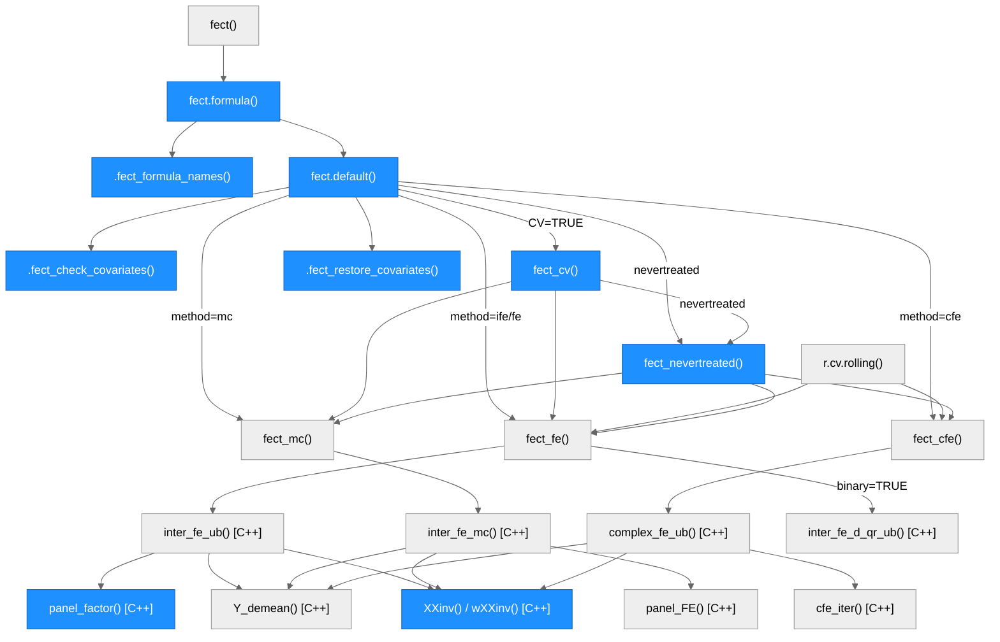
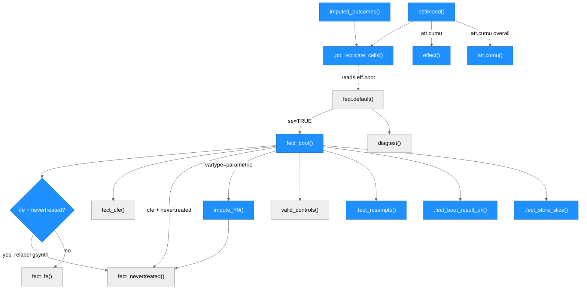
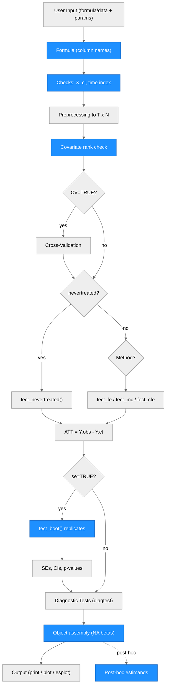

# Architecture — fect

> Generated by scriber for run `2026-04-30-architecture-regen-v241` on 2026-04-30.
> Manual v2.4.2 patches applied 2026-05-01 (warm-start C++ infrastructure;
> ci.method extensions) and 2026-05-02 (CFE `fit_init` plumbing on
> `complex_fe_ub` + `cfe_iter`, dormant).
> Updated 2026-09-25 by scriber for run `2026-09-24-fix246-correctness` (fect 2.4.6
> correctness fixes A1-A7, B1-B13, C1-C6): new internal helpers, the replicate-cell
> mapping in `po-estimands.R`, the never-treated routing in `fect_boot()`, the input
> checks in `support.R`, and the pseudo-inverse fallback in `auxiliary.cpp`. Blue
> nodes and the "This run" columns mark what that run changed.

## Overview

fect is an R package for estimating causal effects in panel data using counterfactual imputation methods (Fixed Effects Counterfactual Estimators). It targets causal panel analysis with binary treatments under the parallel trends assumption, supporting treatment switching and limited carryover effects. The core abstraction is counterfactual imputation: impute missing potential outcomes Y(0) for treated units using control units, then compute the Average Treatment Effect on the Treated (ATT) as the gap between observed and imputed outcomes. The package is an R/C++ hybrid using Rcpp and RcppArmadillo for numerically intensive linear algebra (SVD, EM iterations, matrix factorization). Key external dependencies include fixest (initial FE regression and within-transformation of covariates), ggplot2 (visualization), doParallel/doFuture/future.apply (parallel bootstrap), MASS (generalized inverse), and mvtnorm (multivariate normal draws). Estimation methods include FE (fixed effects), IFE (interactive fixed effects / factor model), MC (matrix completion via nuclear norm regularization), CFE (complex fixed effects with structured covariates), the gsynth estimator (factors from never-treated units), and wrappers for modern DID estimators. Version 2.4.6 (development). References: Liu, Wang, and Xu (2024); Chiu et al. (2026).

---

## Module Structure

```mermaid
%%{init: {'theme': 'neutral'}}%%
graph TD
    subgraph API["API Layer"]
        A1["default.R — fect() entry"]
        A2["interFE.R — interFE()"]
        A3["did_wrapper.R — DID wraps"]
        A4["fect_mspe.R — MSPE comp"]
        A5["po-estimands.R — estimand()"]
    end

    subgraph Est["Estimation Layer"]
        E1["fe.R — fect_fe() IFE"]
        E2["mc.R — fect_mc() MC"]
        E3["cfe.R — fect_cfe() CFE"]
        E4["fect_nevertreated.R"]
    end

    subgraph CV["Cross-Validation"]
        V1["cv.R — fect_cv()"]
        V2["cv_binary.R — binary CV"]
        V3["cv-rolling.R — r.cv.rolling()"]
        V4["cv-rule-helpers.R — 1se/min/1pct"]
        V5["cv-helpers.R — cluster + method"]
    end

    subgraph Inf["Inference Layer"]
        I1["boot.R — fect_boot()"]
        I2["impute_Y0.R — dispatcher"]
        I3["valid_controls.R — para bootstrap"]
    end

    subgraph Diag["Diagnostics & Sensitivity"]
        D1["diagtest.R — pre-trend"]
        D2["fittest.R — fitness test"]
        D3["fect_sens.R — sensitivity"]
        D4["fect_iden.R — identification"]
        D5["dloo.R — double LOO"]
    end

    subgraph Viz["Visualization Layer"]
        P1["plot.R — plot.fect()"]
        P2["esplot.R — esplot()"]
        P3["theme-helpers.R — modern theme"]
        P4["plot_return.R — return class"]
    end

    subgraph Cpp["C++ Core (RcppArmadillo)"]
        C1["ife.cpp / ife_sub.cpp"]
        C2["mc.cpp"]
        C3["cfe.cpp / cfe_sub.cpp"]
        C4["fe_sub.cpp — shared utils"]
        C5["auxiliary.cpp — EM helpers"]
        C6["binary_*.cpp — probit"]
    end

    subgraph Util["Support & Data"]
        U1["support.R — helpers, checks"]
        U3["effect.R / cumu.R — deprecated"]
        U4["score.R / permutation.R"]
        U5["getcohort.R — cohorts"]
        U6["print.R — S3 print"]
        U7["loading_bound.R — simplex proj"]
    end

    A1 --> E1
    A1 --> E2
    A1 --> E3
    A1 --> E4
    A1 --> V1
    A1 --> I1
    A1 --> D1
    A1 --> D5
    A1 --> P1
    A1 --> U1
    A2 --> U1
    A5 -.->|"post-hoc"| A1
    A5 --> U3
    V1 --> E1
    V1 --> E2
    V1 --> E4
    V1 --> V4
    V1 --> V5
    V3 --> V4
    V3 --> V5
    I1 --> E1
    I1 --> E2
    I1 --> E3
    I1 --> E4
    I1 --> I2
    I1 --> I3
    I1 --> V5
    I2 --> E4
    E1 --> C1
    E2 --> C2
    E3 --> C3
    E4 --> U7
    C1 --> C4
    C2 --> C4
    C3 --> C4
    C1 --> C5
    E1 --> U1
    E2 --> U1
    E3 --> U1
    P1 --> P3
    P2 --> P3
    E4 --> V5

    style A1 fill:#1e90ff,stroke:#1565c0,color:#fff
    style A2 fill:#1e90ff,stroke:#1565c0,color:#fff
    style A4 fill:#1e90ff,stroke:#1565c0,color:#fff
    style A5 fill:#1e90ff,stroke:#1565c0,color:#fff
    style E4 fill:#1e90ff,stroke:#1565c0,color:#fff
    style V1 fill:#1e90ff,stroke:#1565c0,color:#fff
    style I1 fill:#1e90ff,stroke:#1565c0,color:#fff
    style I2 fill:#1e90ff,stroke:#1565c0,color:#fff
    style P1 fill:#1e90ff,stroke:#1565c0,color:#fff
    style U1 fill:#1e90ff,stroke:#1565c0,color:#fff
    style U3 fill:#1e90ff,stroke:#1565c0,color:#fff
    style U6 fill:#1e90ff,stroke:#1565c0,color:#fff
    style C4 fill:#1e90ff,stroke:#1565c0,color:#fff
    style C5 fill:#1e90ff,stroke:#1565c0,color:#fff
```

### Module Reference

| Module / File | Layer | Purpose | Key Exports | This run (2.4.6 fixes) |
| --- | --- | --- | --- | --- |
| `R/default.R` (3,912 lines) | API | Main entry point, parameter validation, method routing; `W.est`/`W.agg` per-role weights (v2.3.1), `carryover.rm` (v2.3.3), `dloo` flags (v2.4.6) | `fect()`, `fect.formula()`, `fect.default()` | yes: formula terms must be column names (C1), `X` checks (C2), non-numeric covariates stop (C3), factor/character time index (C4), covariate rank check and NA re-insertion (C5/C6), `cl` validation (A6), stored `vartype` (A2), period-drop stop (B7), CV-fold seeding and `remove.id` (B9), dloo + never-treated stop and loo refit arguments (B10, B8b), `wgt.implied` dimnames (B5), `W.agg` slot (B13) |
| `R/interFE.R` (542 lines) | API | Standalone interactive fixed effects estimator | `interFE()` | yes: formula terms must be column names and `X` not with a formula (C1/C2); absorbed-covariate messages name the right fixed effect (C6) |
| `R/did_wrapper.R` (659 lines) | API | Modern DID estimator wrappers (did, DIDmultiplegtDYN) | `did_wrapper()` | no |
| `R/fect_mspe.R` (376 lines) | API | MSPE computation for model comparison | `fect_mspe()` | yes: the refit drops the call's `Y`/`D`/`X` (the formula carries them), so string-interface fits pass the C2 check |
| `R/po-estimands.R` (2,196 lines) | API | Two-tier post-hoc estimand layer: long-form imputed PO data (`imputed_outcomes()`) and typed estimands (`estimand()`); `vartype` `"parametric"` (v2.4.1); `ci.method` per-type defaults (v2.4.2) | `estimand()`, `imputed_outcomes()` | yes: each replicate read through `colnames.boot` (`.po_replicate_cells()`, A1); `cells` formula scoping (A1); contract allows NA-padded cluster arrays (A6); exact `W.agg` read (`.po_agg_weights()`, B13) |
| `R/fe.R` (959 lines) | Estimation | Interactive Fixed Effects / factor model estimation | `fect_fe()` | no |
| `R/mc.R` (809 lines) | Estimation | Matrix Completion via nuclear norm regularization | `fect_mc()` | no |
| `R/cfe.R` (1,175 lines) | Estimation | Complex Fixed Effects with structured covariates | `fect_cfe()` | no |
| `R/fect_nevertreated.R` (3,559 lines) | Estimation | Never-treated estimator (gsynth, IFE and CFE with `time.component.from = "nevertreated"`); PSOCK cluster helper (v2.3.3) | `fect_nevertreated()` | yes: `criterion = "pc"` uses argmin PC (B1); CV range capped at Nco - 1 (B2); skip message by cause (`.fect_nt_cv_skip_message()`, B3); `W.agg` kept out of the fit and CV (B4); `wgt.implied` = Xu (2017) formula, Nco x Ntr (B5); degenerate fits `stop()` instead of returning a partial list (A7); one treated unit in CFE (B12) |
| `R/cv.R` (2,071 lines) | Cross-Validation | Hyperparameter selection (r, lambda) via MSPE/PC; rolling default, 1-SE rule, per-fold scoring | `fect_cv()` | yes: `"pc"` column set (B1); `W.in.fit` passed on (B4); `loading.bound` arguments (B8) |
| `R/cv_binary.R` (441 lines) | Cross-Validation | Cross-validation for binary/probit models | `fect_cv_binary()` | no |
| `R/cv-rolling.R` (403 lines) | Cross-Validation | Standalone rolling-window CV; per-fold unit sampling | `r.cv.rolling()` | no |
| `R/cv-rule-helpers.R` (127 lines) | Cross-Validation | CV rule selection: 1-SE (default), min, 1pct rules; per-fold SE computation | (internal) | no |
| `R/cv-helpers.R` (554 lines) | Cross-Validation | Shared CV helpers: `.fect_make_future_cluster()`, `.fect_normalize_cv_method()`, per-fold scoring | (internal) | no |
| `R/boot.R` (5,099 lines) | Inference | Bootstrap/jackknife/parametric inference with parallel PSOCK retry-with-backoff | `fect_boot()` | yes: never-treated ife/fe relabelled to the gsynth estimator and a never-treated CFE replicate branch (B10); `.fect_resample()` (A5); `.fect_store_slice()` for varying-width cluster replicates (A6); `.fect_boot_result_ok()` and collector `tryCatch` (A7); dropped-replicate count message (A5/A7); parametric replicates rescaled under `normalize` (A3), weighted (A4), bounded loadings (B8) |
| `R/impute_Y0.R` (245 lines) | Inference | Y0 imputer for the parametric bootstrap; picks the fitter by (method, predictive) | (internal) | yes: `W.in.fit` (A4) and `loading.bound`/`gamma.loading` arguments (B8) passed on |
| `R/valid_controls.R` (34 lines) | Inference | Control screening helper for parametric bootstrap | (internal) | no |
| `R/diagtest.R` (233 lines) | Diagnostics | Pre-trend F-test, equivalence (TOST), placebo, carryover tests | `diagtest()` | no |
| `R/dloo.R` (711 lines) | Diagnostics | Double (cohort-wise) leave-one-out pre-trend placebos in closed form (new in 2.4.6) | (internal) | no |
| `R/fittest.R` (636 lines) | Diagnostics | Fitness/wild bootstrap test | `fect_test()` | no |
| `R/fect_sens.R` (232 lines) | Diagnostics | Sensitivity analysis via HonestDiDFEct | `fect_sens()` | no |
| `R/fect_iden.R` (224 lines) | Diagnostics | Identification analysis | `fect_iden()` | no |
| `R/plot.R` (5,311 lines) | Visualization | ggplot2 plotting (14 plot types); modern visual defaults (v2.3.2) | `plot.fect()` | yes: `vartype` comparisons safe when `se = FALSE`; factors plot labels for a non-numeric time index (B6) |
| `R/esplot.R` (1,229 lines) | Visualization | Standalone event-study plots | `esplot()` | no |
| `R/theme-helpers.R` (42 lines) | Visualization | Shared modern-theme constants and `.modern_theme()` builder | (internal) | no |
| `R/plot_return.R` (9 lines) | Visualization | Plot return object class definition | (internal) | no |
| `R/support.R` (983 lines) | Utilities | Data manipulation, initial FE fit via fixest, helper functions | `get_term()`, `align_beta0()` | yes: `.fect_formula_names()` (C1), `.fect_check_covariates()` (C5/C6), `.fect_restore_covariates()` (C5) |
| `R/effect.R` (423 lines) | Utilities | Cumulative and subgroup effects; **soft-deprecated v2.4.0** | `effect()` | yes: variance type read from the fit and `drop = FALSE` (A2); per-replicate width (A6); running-sum cumulative ATT (B11) |
| `R/cumu.R` (239 lines) | Utilities | Cumulative ATT over a window; **soft-deprecated v2.4.0** | `att.cumu()` | yes: normal interval for parametric fits (A2); `weighted = FALSE` default = running sum, validated, runs without SEs (B11) |
| `R/score.R` (105 lines) | Utilities | Score-based inference | (internal) | no |
| `R/permutation.R` (264 lines) | Utilities | Permutation test for treatment effects | (internal) | no |
| `R/getcohort.R` (264 lines) | Utilities | Treatment cohort identification | `get.cohort()` | no |
| `R/print.R` (147 lines) | Utilities | S3 print methods for fect and interFE objects | `print.fect()`, `print.interFE()` | yes: "Cluster SE" not printed for parametric or jackknife fits (A6) |
| `R/loading_bound.R` (318 lines) | Utilities | Entropy-regularized simplex projection of treated factor loadings (GSC bounded loadings) | (internal) | no |
| `R/state.R` (7 lines) | Utilities | Package-local session state (`.fect_state`) for once-per-session notices | (internal) | no |
| `R/RcppExports.R` (191 lines) | Utilities | Auto-generated Rcpp function bindings | (auto-generated) | no |
| `src/ife.cpp` (546 lines) | C++ Core | IFE algorithm: `inter_fe()`, `inter_fe_ub()`, `inter_fe_d()` | (Rcpp exports) | no |
| `src/ife_sub.cpp` (617 lines) | C++ Core | IFE sub-routines: SVD factor estimation, EM iterations | (internal) | no |
| `src/mc.cpp` (230 lines) | C++ Core | Matrix completion: `inter_fe_mc()`, nuclear norm penalization | (Rcpp exports) | no |
| `src/cfe.cpp` (210 lines) | C++ Core | Complex FE: `complex_fe_ub()`; optional `fit_init` (dormant) | (Rcpp exports) | no |
| `src/cfe_sub.cpp` (588 lines) | C++ Core | Complex FE sub-routines: `cfe_iter()`, structured covariates | (internal) | no |
| `src/fe_sub.cpp` (306 lines) | C++ Core | Shared FE utilities: `Y_demean()`, `panel_beta()`, `panel_factor()`, `panel_FE()` | (internal) | yes: `panel_factor()` clamps r to min(r, T, N) (B2; the 480a7b8 clamp lost in merge 0916d5c) |
| `src/binary_sub.cpp` (539 lines) | C++ Core | Probit model sub-routines for binary outcomes | (internal) | no |
| `src/binary_qr.cpp` (347 lines) | C++ Core | QR-based probit estimation | (internal) | no |
| `src/binary_svd.cpp` (302 lines) | C++ Core | SVD-based probit estimation | (internal) | no |
| `src/auxiliary.cpp` (421 lines) | C++ Core | EM helpers, `XXinv()`/`wXXinv()`, matrix utilities | (internal) | yes: `XXinv()`/`wXXinv()` switch to `pinv()` when rcond(X'X) is at most 1e-12 (`xx_keep_inverse()`, `XX_RCOND_MIN`); well-conditioned or non-finite X'X keep the old inverse (C5) |
| `src/fect.h` (60 lines) | C++ Core | Header file with all C++ function declarations | (header) | no |

---

## Function Call Graph

### Main Estimation Pipeline

```mermaid
%%{init: {'theme': 'neutral'}}%%
graph TD
    F1["fect()"]
    F2["fect.formula()"]
    FN[".fect_formula_names()"]
    F3["fect.default()"]
    CC[".fect_check_covariates()"]
    F4["fect_cv()"]
    F5["fect_fe()"]
    F6["fect_mc()"]
    F7["fect_cfe()"]
    F8["fect_nevertreated()"]
    F9["r.cv.rolling()"]
    RC[".fect_restore_covariates()"]
    C1["inter_fe_ub() [C++]"]
    C2["inter_fe_mc() [C++]"]
    C3["complex_fe_ub() [C++]"]
    C4["inter_fe_d_qr_ub() [C++]"]
    S1["panel_factor() [C++]"]
    S2["panel_FE() [C++]"]
    S3["Y_demean() [C++]"]
    S4["cfe_iter() [C++]"]
    XX["XXinv() / wXXinv() [C++]"]

    style F2 fill:#1e90ff,stroke:#1565c0,color:#fff
    style FN fill:#1e90ff,stroke:#1565c0,color:#fff
    style F3 fill:#1e90ff,stroke:#1565c0,color:#fff
    style CC fill:#1e90ff,stroke:#1565c0,color:#fff
    style F4 fill:#1e90ff,stroke:#1565c0,color:#fff
    style F8 fill:#1e90ff,stroke:#1565c0,color:#fff
    style RC fill:#1e90ff,stroke:#1565c0,color:#fff
    style S1 fill:#1e90ff,stroke:#1565c0,color:#fff
    style XX fill:#1e90ff,stroke:#1565c0,color:#fff

    F1 --> F2
    F2 --> FN
    F2 --> F3
    F3 --> CC
    F3 -->|"CV=TRUE"| F4
    F3 -->|"method=ife/fe"| F5
    F3 -->|"method=mc"| F6
    F3 -->|"method=cfe"| F7
    F3 -->|"nevertreated"| F8
    F3 --> RC
    F4 --> F5
    F4 --> F6
    F4 -->|"nevertreated"| F8
    F9 --> F5
    F9 --> F7
    F8 --> F5
    F8 --> F6
    F8 --> F7
    F5 --> C1
    F5 -->|"binary=TRUE"| C4
    F6 --> C2
    F7 --> C3
    C1 --> S1
    C1 --> S3
    C1 --> XX
    C2 --> XX
    C3 --> XX
    C2 --> S2
    C2 --> S3
    C3 --> S4
    C3 --> S3
```

### Inference, Diagnostics, and Post-hoc Estimands

```mermaid
%%{init: {'theme': 'neutral'}}%%
graph TD
    F3["fect.default()"]
    B1["fect_boot()"]
    BR{"ife + nevertreated?"}
    B2["impute_Y0()"]
    B3["valid_controls()"]
    B4[".fect_resample()"]
    B5[".fect_boot_result_ok()"]
    B6[".fect_store_slice()"]
    F5["fect_fe()"]
    F7["fect_cfe()"]
    F8["fect_nevertreated()"]
    D1["diagtest()"]
    PE1["estimand()"]
    PE2["imputed_outcomes()"]
    PE3[".po_replicate_cells()"]
    EF["effect()"]
    AC["att.cumu()"]

    style B1 fill:#1e90ff,stroke:#1565c0,color:#fff
    style BR fill:#1e90ff,stroke:#1565c0,color:#fff
    style B2 fill:#1e90ff,stroke:#1565c0,color:#fff
    style B4 fill:#1e90ff,stroke:#1565c0,color:#fff
    style B5 fill:#1e90ff,stroke:#1565c0,color:#fff
    style B6 fill:#1e90ff,stroke:#1565c0,color:#fff
    style PE1 fill:#1e90ff,stroke:#1565c0,color:#fff
    style PE2 fill:#1e90ff,stroke:#1565c0,color:#fff
    style PE3 fill:#1e90ff,stroke:#1565c0,color:#fff
    style EF fill:#1e90ff,stroke:#1565c0,color:#fff
    style AC fill:#1e90ff,stroke:#1565c0,color:#fff

    F3 -->|"se=TRUE"| B1
    F3 --> D1
    B1 --> BR
    BR -->|"yes: relabel gsynth"| F8
    BR -->|"no"| F5
    B1 --> F7
    B1 -->|"cfe + nevertreated"| F8
    B1 -->|"vartype=parametric"| B2
    B2 --> F8
    B1 --> B3
    B1 --> B4
    B1 --> B5
    B1 --> B6
    PE1 --> PE3
    PE2 --> PE3
    PE1 -->|"att.cumu"| EF
    PE1 -->|"att.cumu overall"| AC
    PE3 -.->|"reads eff.boot"| F3
```

### Function Reference

| Function | Defined In | Called By | Calls | This run | Purpose |
| --- | --- | --- | --- | --- | --- |
| `fect()` | `R/default.R` | user / exported | `UseMethod("fect")` | no | S3 generic entry point for counterfactual estimation |
| `fect.formula()` | `R/default.R` | `fect()` | `.fect_formula_names()`, `fect.default()` | yes (C1, C2) | Read the formula (column names only), stop when `X` is also given, delegate to the default method |
| `fect.default()` | `R/default.R` | `fect.formula()`, user | `fect_cv()`, `fect_fe()`, `fect_mc()`, `fect_cfe()`, `fect_nevertreated()`, `fect_boot()`, `.fect_check_covariates()`, `.fect_restore_covariates()`, `diagtest()` | yes (A2, A6, B5, B7-B10, B8b, B13, C2-C6) | Workhorse: validation, preprocessing, method routing, inference, diagnostics, output assembly |
| `.fect_formula_names()` | `R/support.R` | `fect.formula()`, `interFE.formula()` | — | yes (new, C1) | Outcome and right-hand-side names of a formula; accepts intercept terms; stops on any other non-name term |
| `.fect_check_covariates()` | `R/support.R` | `fect.default()` | `fixest::demean()`, `qr()` | yes (new, C5/C6) | On the cells used to fit the model: covariates without variation, absorbed by the fixed effects, or linearly dependent (pivoted QR, `lm()`'s rule); returns the columns to drop and one warning |
| `.fect_restore_covariates()` | `R/support.R` | `fect.default()` | — | yes (new, C5) | Re-inserts NA rows for dropped covariates in `beta`, `est.beta`, `beta.boot`, the covariate array and the binary marginal effects |
| `fect_fe()` | `R/fe.R` | `fect.default()`, `fect_cv()`, `fect_boot()`, `r.cv.rolling()` | `inter_fe_ub()`, `inter_fe_d_qr_ub()` (C++) | no | IFE estimation (factor model with r latent factors) |
| `fect_mc()` | `R/mc.R` | `fect.default()`, `fect_cv()`, `fect_boot()` | `inter_fe_mc()` (C++) | no | Matrix completion estimation |
| `fect_cfe()` | `R/cfe.R` | `fect.default()`, `fect_boot()`, `r.cv.rolling()` | `complex_fe_ub()` (C++) | no | Complex FE with structured covariates (Z, Q, gamma, kappa) |
| `fect_nevertreated()` | `R/fect_nevertreated.R` | `fect.default()`, `fect_cv()`, `fect_boot()`, `impute_Y0()` | `fect_fe()`, `fect_mc()`, `fect_cfe()`, `.fect_nt_cv_skip_message()`, `.fect_make_future_cluster()` | yes (A7, B1-B5, B12) | Never-treated estimator: time components and factors from never-treated units, loadings of treated units from their pre-treatment periods |
| `.fect_nt_cv_skip_message()` | `R/fect_nevertreated.R` | `fect_nevertreated()` | — | yes (new, B3) | States why cross-validation of r is skipped (one candidate, capped range, or too few pre-treatment records) |
| `fect_cv()` | `R/cv.R` | `fect.default()`, `fect_boot()` | `fect_fe()`, `fect_mc()`, `fect_nevertreated()`, `.fect_apply_cv_rule()` | yes (B1, B4, B8) | Cross-validation to select r (IFE) or lambda (MC) |
| `r.cv.rolling()` | `R/cv-rolling.R` | user / exported | `fect_fe()`, `fect_cfe()`, `.fect_apply_cv_rule()` | no | Standalone rolling-window CV for rank selection |
| `fect_boot()` | `R/boot.R` | `fect.default()` | `fect_fe()`, `fect_mc()`, `fect_cfe()`, `fect_nevertreated()`, `impute_Y0()`, `valid_controls()`, `.fect_resample()`, `.fect_boot_result_ok()`, `.fect_store_slice()` | yes (A3-A7, B8, B10) | Bootstrap/jackknife/parametric inference; with `time.component.from = "nevertreated"` the point fit and every replicate use `fect_nevertreated()` |
| `.fect_resample()` | `R/boot.R` | `fect_boot()` replicate functions | `sample.int()` | yes (new, A5) | Draws from a vector of unit indices safely when it has length 1; same draws as `sample()` otherwise |
| `.fect_store_slice()` | `R/boot.R` | `fect_boot()` collectors | — | yes (new, A6) | Stores a replicate matrix in a TT x W x B array, NA-padding and widening for cluster replicates of varying width |
| `.fect_boot_result_ok()` | `R/boot.R` | `fect_boot()` replicate functions | — | yes (new, A7) | Rejects replicate results whose fields cannot be collected (they are dropped and counted) |
| `impute_Y0()` | `R/impute_Y0.R` | `fect_boot()` | `fect_nevertreated()`, `fect_fe()`, `fect_cfe()` | yes (A4, B8) | Y0 imputer for the parametric bootstrap; now passes `W.in.fit` and the loading-bound arguments |
| `valid_controls()` | `R/valid_controls.R` | `fect_boot()` | — | no | Screen control units before the parametric bootstrap |
| `interFE()` | `R/interFE.R` | user / exported | `.fect_formula_names()`, `inter_fe()` (C++) | yes (C1, C2, C6) | Standalone interactive fixed effects estimator |
| `did_wrapper()` | `R/did_wrapper.R` | user / exported | `fixest::feols()`, `did::att_gt()` | no | Modern DID estimator wrappers |
| `plot.fect()` | `R/plot.R` | user / exported | ggplot2, `.modern_theme()` | yes (B6) | 14 plot types |
| `esplot()` | `R/esplot.R` | user / exported | ggplot2, `.modern_theme()` | no | Standalone event-study plot |
| `estimand()` | `R/po-estimands.R` | user / exported | `imputed_outcomes()`, `.po_replicate_cells()`, `effect()`, `att.cumu()`, `.compute_ci()` | yes (A1) | Typed estimands: `att`, `att.cumu`, `aptt`, `log.att`; each replicate read from its own cells |
| `imputed_outcomes()` | `R/po-estimands.R` | user / exported; `estimand()` | `.po_replicate_cells()`, `.po_agg_weights()` | yes (A1, B13) | Long-form cell-level imputed outcomes; with `replicates = TRUE`, each replicate's own treated cells |
| `.po_replicate_cells()` | `R/po-estimands.R` | `estimand()` paths, `imputed_outcomes()` | — | yes (new, A1) | Maps a T x N cell mask into replicate b through `colnames.boot[[b]]`; returns the replicate's draws and their source cells |
| `.po_mean_or_na()` | `R/po-estimands.R` | `estimand()` paths | — | yes (new, A1) | Mean of a replicate's draws, NA (not NaN) when it holds no cell |
| `.po_agg_weights()` | `R/po-estimands.R` | `imputed_outcomes()` | — | yes (new, B13) | Aggregation weights from the exact `W.agg` slot (falls back for older fit objects) |
| `effect()` | `R/effect.R` | user / exported; `estimand("att.cumu", "event.time")` | `getEffect()` | yes (A2, A6, B11) | Cumulative or subgroup effects; soft-deprecated v2.4.0 |
| `att.cumu()` | `R/cumu.R` | user / exported; `estimand("att.cumu", "overall")` | `att.cumu.sub()` | yes (A2, B11) | Cumulative ATT over a window; soft-deprecated v2.4.0 |
| `get.cohort()` | `R/getcohort.R` | user / exported | — | no | Treatment cohort identification |
| `fect_mspe()` | `R/fect_mspe.R` | user / exported | `fect()` | yes (C2) | MSPE computation for model comparison |
| `fect_sens()` | `R/fect_sens.R` | user / exported | HonestDiDFEct functions | no | Sensitivity analysis |
| `fect_iden()` | `R/fect_iden.R` | user / exported | — | no | Identification analysis |
| `diagtest()` | `R/diagtest.R` | `fect.default()` | — | no | Pre-trend, placebo, carryover, equivalence tests |
| `inter_fe_ub()` | `src/ife.cpp` | `fect_fe()` | `panel_factor()`, `fe_ub()`, `Y_demean()`, `XXinv()` | no | C++ IFE with unbalanced panels (EM algorithm) |
| `inter_fe_mc()` | `src/mc.cpp` | `fect_mc()` | `panel_FE()`, `Y_demean()`, `XXinv()` | no | C++ matrix completion with nuclear norm |
| `complex_fe_ub()` | `src/cfe.cpp` | `fect_cfe()` | `cfe_iter()`, `Y_demean()`, `XXinv()` | no | C++ complex FE estimation |
| `panel_factor()` | `src/fe_sub.cpp` | `inter_fe_ub()`, others | SVD routines | yes (B2) | Extract latent factors via SVD; at most min(T, N) factors |
| `XXinv()` / `wXXinv()` | `src/auxiliary.cpp` | IFE, MC, CFE and binary C++ routines (with covariates) | `inv()` / `inv_sympd()`, `pinv()` | yes (C5) | (X'X)^-1; pseudo-inverse when X'X is singular |
| `panel_FE()` | `src/fe_sub.cpp` | `inter_fe_mc()`, others | soft-thresholding | no | Nuclear norm regularization / soft-thresholding |
| `Y_demean()` | `src/fe_sub.cpp` | most C++ estimators | (arma operations) | no | Remove unit and/or time fixed effects |

---

## Data Flow

```mermaid
%%{init: {'theme': 'neutral'}}%%
graph TD
    IN["User Input (formula/data + params)"]
    FP["Formula (column names)"]
    PV["Checks: X, cl, time index"]
    DP["Preprocessing to T x N"]
    CK["Covariate rank check"]
    CV{"CV=TRUE?"}
    CVR["Cross-Validation"]
    NT{"nevertreated?"}
    NTW["fect_nevertreated()"]
    MR{"Method?"}
    EST["fect_fe / fect_mc / fect_cfe"]
    ATT["ATT = Y.obs - Y.ct"]
    SE{"se=TRUE?"}
    BOOT["fect_boot() replicates"]
    SECI["SEs, CIs, p-values"]
    DIAG["Diagnostic Tests (diagtest)"]
    OBJ["Object assembly (NA betas)"]
    OUT["Output (print / plot / esplot)"]
    PE["Post-hoc estimands"]

    style FP fill:#1e90ff,stroke:#1565c0,color:#fff
    style PV fill:#1e90ff,stroke:#1565c0,color:#fff
    style CK fill:#1e90ff,stroke:#1565c0,color:#fff
    style BOOT fill:#1e90ff,stroke:#1565c0,color:#fff
    style OBJ fill:#1e90ff,stroke:#1565c0,color:#fff
    style PE fill:#1e90ff,stroke:#1565c0,color:#fff

    IN --> FP
    FP --> PV
    PV --> DP
    DP --> CK
    CK --> CV
    CV -- yes --> CVR
    CVR --> NT
    CV -- no --> NT
    NT -- yes --> NTW
    NT -- no --> MR
    MR --> EST
    NTW --> ATT
    EST --> ATT
    ATT --> SE
    SE -- yes --> BOOT
    BOOT --> SECI
    SECI --> DIAG
    SE -- no --> DIAG
    DIAG --> OBJ
    OBJ --> OUT
    OBJ -.->|"post-hoc"| PE
```

---

## Architectural Patterns

- **S3 Dispatch with Formula Interface**: `fect()` uses `UseMethod()` to support both formula and direct (Y, D, X) interfaces. `fect.formula()` reads the formula into variable names with `.fect_formula_names()`, which accepts only column names (plus ignored intercept terms), and `fect.default()` does the computation. Same pattern for `interFE()`. Since 2.4.6, a formula and `X` cannot both be given.

- **R/C++ Layered Computation**: All numerically intensive operations (SVD, EM iterations, demeaning, matrix factorization) are implemented in C++ via RcppArmadillo. R handles data wrangling, parameter validation, control flow, and result assembly. The boundary is at the estimation functions: R `fect_fe()` calls C++ `inter_fe_ub()`.

- **Method-Agnostic Pipeline**: `fect.default()` provides a single preprocessing, CV, estimation, inference, diagnostics pipeline. Method-specific logic is encapsulated in `fect_fe()`, `fect_mc()`, `fect_cfe()`, `fect_nevertreated()`. Adding a new estimation method requires only a new estimation function and a routing entry.

- **Matrix-Oriented Data Representation**: Panel data is converted from long-form data frames to T x N matrices early in `fect.default()`. Covariates become T x N x p arrays. All downstream computation operates on these matrix forms, enabling efficient C++ computation.

- **Covariates Checked Before Estimation (2.4.6)**: After all unit and period removals, `.fect_check_covariates()` examines the covariates on the cells used to fit the model: it removes the specified fixed effects (with `fixest::demean()`), drops covariates with no variation, absorbed by the fixed effects, or linearly dependent on earlier ones (pivoted QR, the rule `lm()` uses), and warns once. Everything downstream (fits, CV, bootstrap, loo refits) sees the reduced covariate array, so estimates equal those of the fit without the dropped columns; `.fect_restore_covariates()` puts NA rows back at the output stage. As a second guard, the C++ `XXinv()`/`wXXinv()` switch to a pseudo-inverse when X'X is singular.

- **One Estimator per `time.component.from` (2.4.6)**: With never-treated fitting, the point fit, the case-bootstrap and jackknife replicates, the parametric replicates and the loo refits all use `fect_nevertreated()`. `fect_boot()` relabels ife/fe + never-treated as the gsynth estimator (when there is no CV; CV fits are already routed by `fect_cv()`), and its non-parametric replicate function has a never-treated CFE branch.

- **Replicate-Cell Mapping for Post-hoc Estimands (2.4.6)**: Bootstrap replicate b stores its units in its own order (`colnames.boot[[b]]`: the drawn unit indices for the case bootstrap, treated units first for the parametric bootstrap). `.po_replicate_cells()` maps a cell mask of the original panel into each replicate through that order, so a unit drawn twice contributes twice and an undrawn unit not at all. With the cluster bootstrap, replicate arrays have varying widths and are NA-padded by `.fect_store_slice()`; readers slice each replicate to `length(colnames.boot[[b]])`.

- **Failed Replicates Are Dropped and Counted (2.4.6)**: Replicate functions validate their result with `.fect_boot_result_ok()`, and the collectors run inside `tryCatch()`, filling a failed slot with the fields of `make_boot_na()`. The existing `boot.rm` step drops those replicates, and `fect()` reports how many were dropped (a warning when fewer than two remain).

- **Two-Tier Tolerance**: Cross-validation uses a looser tolerance (`max(tol, 1e-3)`) for speed during hyperparameter search, while final estimation uses the user-specified tolerance for precision.

- **Parallel Bootstrap via foreach with PSOCK Retry**: `fect_boot()` uses `foreach` with `doParallel`/`doFuture` backends for parallel bootstrap replication. The shared `.fect_make_future_cluster()` helper (in `cv-helpers.R`) builds PSOCK clusters that propagate `.libPaths()` to workers. Workers load fect from the library (not from `load_all()`), so parallel runs need an installed build of the same commit. A retry-with-backoff loop re-submits failed bootstrap draws through a reduced-worker cluster, falling back to sequential execution for any remaining failures.

- **Counterfactual Imputation as Core Abstraction**: All methods share the same conceptual framework: impute Y(0) for treated units using untreated observations, compute ATT as the gap. FE uses additive fixed effects, IFE adds latent factors (F * L'), MC uses nuclear norm regularization, CFE adds structured covariates.

- **Never-Treated vs Not-Yet-Treated Estimation Samples**: "notyettreated" includes not-yet-treated observations (requiring EM for missing data); "nevertreated" uses only never-treated units to estimate time components and factors. `fect_nevertreated()` handles the latter, including the implied weights `wgt.implied` (Nco x Ntr; `t(lambda.co) %*% W = t(lambda.tr)`, Xu 2017) and the optional simplex bound on treated loadings.

- **Comprehensive Diagnostic Suite**: Built-in tests (F-test, TOST equivalence, placebo, carryover, leave-one-out and double leave-one-out pre-trends) allow users to check the parallel trends assumption. Sensitivity analysis via optional HonestDiDFEct integration.

- **Two-Tier Post-hoc Estimand Layer (v2.4.0)**: Alternative estimands (cumulative ATT, APTT, log-scale ATT, window-restricted ATT) are computed from the imputed potential outcomes rather than inside the fit. `imputed_outcomes()` returns the cell-level data as a long-form data frame with columns `id`, `time`, `event.time`, `cohort`, `treated`, `Y_obs`, `Y0_hat`, `eff`, `eff_debias`, `W.agg`. `estimand()` computes typed estimands (`type` in `"att"`, `"att.cumu"`, `"aptt"`, `"log.att"`) by `by` in `"event.time"`, `"cohort"`, `"calendar.time"`, `"overall"`. `effect()` and `att.cumu()` are soft-deprecated (v2.4.0) and still used by `estimand("att.cumu")`; since 2.4.6 the cumulative ATT is the running sum of the per-period ATTs in all three (`att.cumu(weighted = TRUE)` keeps the older count-weighted version).

- **Rolling-Window Cross-Validation (v2.3.0)**: The default CV method is rolling-window masking (`cv.method = "rolling"`, `cv.prop = 0.1`, `k = 20`), which excludes each sampled unit's held-out block and all later observations from training. The 1-SE rule is the default selection rule (`cv.rule = "1se"`). The standalone `r.cv.rolling()` export exposes rolling CV outside of `fect()`.

- **Per-Role Weight Arguments (v2.3.1) and Modern Visual Defaults (v2.3.2)**: `W.est` and `W.agg` split the single `W` argument into outcome-model fit weights and ATT aggregation weights (`W` sets both). Since 2.4.6 the fit stores the aggregation weights as a T x N `W.agg` matrix when they weight the averages, and `W.agg` given alone stays out of the never-treated fit and its CV. `plot.fect()` and `esplot()` use a modern visual default; `legacy.style = TRUE` restores the classic style.

---

## Notes

- FE is internally treated as IFE with `r = 0` (zero latent factors). The code sets `method = "ife"` when `method = "fe"` and `r = 0`.
- The `gsynth` method forces `time.component.from = "nevertreated"` and `em = FALSE`, matching the gsynth package. Since 2.4.6, `method = "ife"` or `"fe"` with `time.component.from = "nevertreated"` and `se = TRUE` is fitted and resampled as the gsynth estimator, and its `method` slot reads `"gsynth"`.
- `boot.R` (5,099 lines) and `plot.R` (5,311 lines) are the two largest files. Both could benefit from modular decomposition in future refactors.
- The `binary` option (probit models) is only available with `method = "ife"` and has dedicated C++ implementations (`binary_qr.cpp`, `binary_svd.cpp`, `binary_sub.cpp`). At 2.4.6 `binary = TRUE` fails in `BiInitialFit()` (a pre-existing bug, not fixed in the 2.4.6 correctness run).
- The package uses `fixest::feols()` for initial OLS regression to obtain starting values, and `fixest::demean()` for the covariate rank check.
- `R/polynomial.R` and the `sfe` argument were removed in 2.4.5.
- Vignettes are a Quarto book (`vignettes/_quarto.yml`) with 11 numbered chapters: getting started, FE, alternative estimands, IFE/MC, CFE, gsynth, inference, heterogeneous effects, panel diagnostics, sensitivity analysis, plots; plus a cheatsheet, the changelog and references. `vignettes/_common.R` runs `devtools::load_all("..")` when the book is rendered inside the source tree.
- 10 bundled datasets (`simdata`, `sim_base`, `sim_gsynth`, `sim_linear`, `sim_region`, `sim_trend`, `turnout`, `gs2020`, `hh2019`, `simgsynth`) support examples and testing.
- 14 exported functions and 8 S3 methods registered in NAMESPACE. New internal helpers from the 2.4.6 correctness run: `.po_replicate_cells()`, `.po_mean_or_na()`, `.po_agg_weights()` (po-estimands.R); `.fect_resample()`, `.fect_store_slice()`, `.fect_boot_result_ok()` (boot.R); `.fect_nt_cv_skip_message()` (fect_nevertreated.R); `.fect_formula_names()`, `.fect_check_covariates()`, `.fect_restore_covariates()` (support.R); `xx_keep_inverse()` and `XX_RCOND_MIN` (auxiliary.cpp, file-local). None is exported.
- Total R source: 34,729 lines across 36 files. Total C++ source: 4,924 lines across 11 files (plus header).
