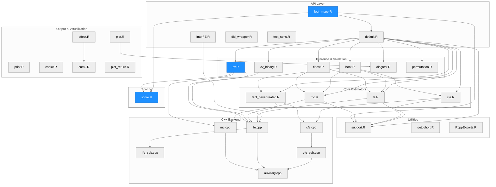
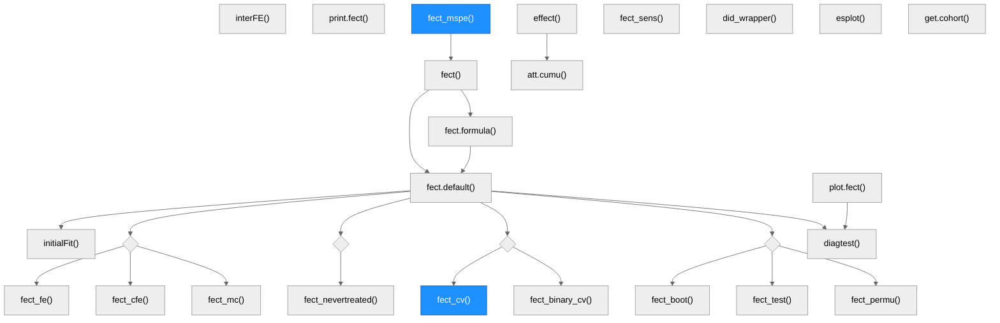
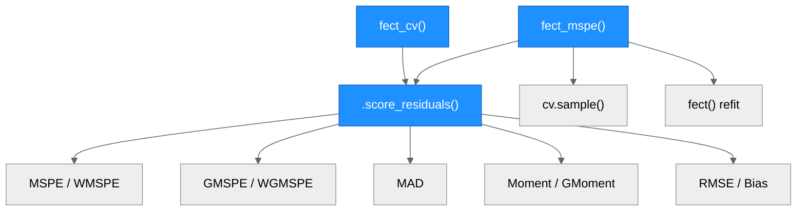
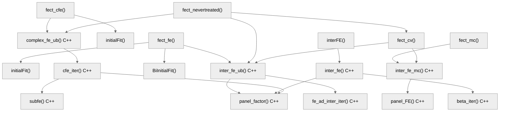
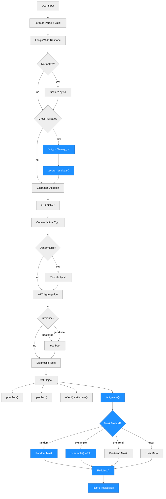

# Architecture — fect

> Generated by scribe for run `REQ-score-unify-001` on 2026-03-16. Previous: `REQ-test-gaps-001` (2026-03-16).

## Overview

**fect** (Fixed Effects Counterfactual Estimators) is an R package for causal inference in panel data with binary treatments under the parallel trends assumption. It estimates average treatment effects on the treated (ATT) by imputing counterfactual outcomes for treated units using one of several estimators: Fixed Effects (FE), Interactive Fixed Effects (IFE), Complex Fixed Effects (CFE), Matrix Completion (MC), and Generalized Synthetic Control (gsynth). The package supports staggered adoption, treatment reversals, limited carryover effects, and binary outcomes. Written in R for orchestration and C++ (Rcpp/RcppArmadillo) for matrix algebra, it depends on `fixest` for initial regression fits, `future`/`doFuture`/`parallelly` for parallel computing, and `ggplot2` for visualization.

---

## Module Structure

> One unified diagram grouping all R and C++ modules into seven layers. Blue-filled nodes were modified or created in this run. The new Scoring layer contains the shared `.score_residuals()` function used by both cv.R and fect_mspe.R. Edges show real dependency/call relationships between modules.

### Module Reference

| Module / File | Layer | Purpose | Key Exports | Changed |
| --- | --- | --- | --- | --- |
| `R/default.R` | API | Main entry point; formula parsing, input validation, data reshaping, method dispatch, normalization, bootstrap orchestration, diagnostics | `fect()`, `fect.formula()`, `fect.default()` | no |
| `R/interFE.R` | API | Standalone interactive fixed effects estimator for complete panels | `interFE()`, `interFE.formula()`, `interFE.default()` | no |
| `R/did_wrapper.R` | API | Unified wrapper for external DID estimators (did, DIDmultiplegtDYN) with event-study output | `did_wrapper()` | no |
| `R/fect_mspe.R` | API | MSPE diagnostics; hides observations, re-estimates, and scores with any of 9 criteria. Supports random, pre.trend, cv.sample, and user-provided masking. Replaces deleted fect_mspe_sim via `actual`/`control.only` params | `fect_mspe()` | **yes** |
| `R/fect_sens.R` | API | Sensitivity analysis via HonestDiDFEct (Rambachan-Roth bounds) | `fect_sens()` | no |
| `R/fe.R` | Estimator | FE and IFE estimator; computes counterfactuals, ATT, dynamic effects, cohort effects, calendar effects | `fect_fe()` (internal) | no |
| `R/cfe.R` | Estimator | Complex FE estimator; supports extra additive FEs, Z/gamma, Q/kappa, latent factors | `fect_cfe()` (internal) | no |
| `R/mc.R` | Estimator | Matrix completion estimator with nuclear norm regularization | `fect_mc()` (internal) | no |
| `R/fect_nevertreated.R` | Estimator | Nevertreated predictive routine for IFE and CFE; co-only estimation with three-layer projection and block coordinate descent for treated parameters | `fect_nevertreated()` (internal) | no |
| `R/boot.R` | Inference | Parametric and wild bootstrap, jackknife; parallel execution via future/doFuture | `fect_boot()` (internal) | no |
| `R/cv.R` | Inference | Cross-validation for r (factors) or lambda (regularization); 7 scoring criteria via `.score_residuals()` | `fect_cv()` (internal) | **yes** |
| `R/cv_binary.R` | Inference | Cross-validation for binary probit models | `fect_binary_cv()` (internal) | no |
| `R/fittest.R` | Inference | Wild bootstrap goodness-of-fit test for pre-trends | `fect_test()` (internal) | no |
| `R/diagtest.R` | Inference | Diagnostic tests: F-test, TOST equivalence, placebo, carryover | `diagtest()` (internal) | no |
| `R/permutation.R` | Inference | Block permutation test for treatment effect significance | `fect_permu()` (internal) | no |
| `R/score.R` | Scoring | Shared scoring function: computes MSPE, WMSPE, GMSPE, WGMSPE, MAD, Moment, GMoment, RMSE, Bias from residuals with optional observation weights, period weights, and normalization | `.score_residuals()` (internal) | **yes (new)** |
| `R/plot.R` | Output | S3 plot method; gap, equivalence, status, exit, factor, calendar, counterfactual, HTE plots | `plot.fect()` | no |
| `R/print.R` | Output | S3 print method; tabular display of ATT estimates | `print.fect()` | no |
| `R/esplot.R` | Output | Standalone event-study plot from user-supplied data frames | `esplot()` | no |
| `R/effect.R` | Output | Cumulative and subgroup treatment effects with optional plotting | `effect()` | no |
| `R/cumu.R` | Output | Cumulative ATT over a specified event window | `att.cumu()` (internal) | no |
| `R/plot_return.R` | Output | Print method for plot return objects (auto-renders the ggplot) | `print.fect_plot_return()` | no |
| `R/support.R` | Utilities | `get_term()` (event-time encoding), `initialFit()` / `BiInitialFit()` (initial regression via fixest), `align_beta0()`, `cv.sample()`, data manipulation helpers | (internal) | no |
| `R/getcohort.R` | Utilities | Constructs cohort variables (FirstTreat, Time_to_Treatment) from panel data | `get.cohort()` | no |
| `R/RcppExports.R` | Utilities | Auto-generated R-side bindings for all C++ functions | (internal) | no |
| `src/ife.cpp` | C++ | Core IFE solver: `inter_fe()`, `inter_fe_ub()` (unbalanced); EM-style iteration with factor extraction | (internal) | no |
| `src/ife_sub.cpp` | C++ | IFE subroutines: `fe_ad_iter()`, `fe_ad_inter_iter()`, `beta_iter()`, iterative demeaning | (internal) | no |
| `src/cfe.cpp` | C++ | CFE solver: `complex_fe_ub()` with block coordinate descent over extra FEs, Z/gamma, Q/kappa, factors | (internal) | no |
| `src/cfe_sub.cpp` | C++ | CFE iteration subroutine: `cfe_iter()` | (internal) | no |
| `src/fe_sub.cpp` | C++ | FE subroutines: `subfe()` for sub-fixed-effects, `IND()` for indicator matrices | (internal) | no |
| `src/mc.cpp` | C++ | Matrix completion solver: `inter_fe_mc()` with soft-thresholding of singular values | (internal) | no |
| `src/auxiliary.cpp` | C++ | Matrix utilities: `crossprod()`, `E_adj()`, `panel_beta()`, `panel_factor()`, `panel_FE()`, `Y_demean()`, `fe_add()` | (internal) | no |
| `src/binary_qr.cpp` | C++ | Binary probit estimator via QR decomposition | (internal) | no |
| `src/binary_svd.cpp` | C++ | Binary probit estimator via SVD | (internal) | no |
| `src/binary_sub.cpp` | C++ | Binary probit subroutines | (internal) | no |
| `src/fect.h` | C++ | Header file declaring all C++ function signatures | (internal) | no |
| `data/` | Data | Bundled datasets: `simdata`, `simgsynth`, `turnout`, `hh2019`, `gs2020` | (exported) | no |
| `tests/testthat/` | Tests | Test suite: factors-from refactor (208), utility functions (51), score unification (84) | (test) | **yes** |
| `vignettes/` | Docs | Quarto book: getting started, fect tutorial, plots, gsynth, panel diagnostics, sensitivity, CFE | (docs) | no |

---

## Function Call Graph

### Main Pipeline

> Traces from public entry points through R-side orchestration. Diamond nodes represent method dispatch branch points. Blue nodes were modified in this run.

### Scoring Detail

> Detail of the new shared scoring architecture. Both fect_cv (internal CV) and fect_mspe (user-facing diagnostics) call `.score_residuals()` to compute all 9 scoring criteria from residuals.

### Estimator-to-C++ Detail

> Traces from each R estimator to its C++ solver functions. Unchanged from previous run.

### Function Reference

| Function | Defined In | Called By | Calls | Changed | Purpose |
| --- | --- | --- | --- | --- | --- |
| `.score_residuals()` | `score.R` | `fect_cv()`, `fect_mspe()` | (self-contained) | **yes (new)** | Shared scoring: computes 9 criteria from residuals with optional obs weights, period weights, normalization |
| `fect()` | `default.R` | user | `fect.formula()`, `fect.default()` | no | Generic entry point; dispatches on formula vs. direct arguments |
| `fect.default()` | `default.R` | `fect.formula()`, user | `initialFit()`, estimators, `fect_cv()`, `fect_boot()`, `fect_test()`, `diagtest()`, `fect_permu()` | no | Core orchestrator |
| `fect_cv()` | `cv.R` | `fect.default()`, `fect_nevertreated()` | `inter_fe_ub()`, `inter_fe_mc()`, `.score_residuals()` | **yes** | Cross-validation; now uses shared scoring instead of inline computation |
| `fect_mspe()` | `fect_mspe.R` | user | `fect()`, `.score_residuals()`, `cv.sample()` | **yes** | MSPE diagnostics with 9 criteria, 4 masking methods, W/norm.para/actual/control.only support |
| `fect_fe()` | `fe.R` | `fect.default()`, `fect_boot()` | `initialFit()`, `inter_fe_ub()` | no | FE/IFE estimator |
| `fect_cfe()` | `cfe.R` | `fect.default()`, `fect_boot()` | `initialFit()`, `complex_fe_ub()` | no | CFE estimator |
| `fect_mc()` | `mc.R` | `fect.default()`, `fect_boot()` | `inter_fe_mc()` | no | Matrix completion estimator |
| `fect_nevertreated()` | `fect_nevertreated.R` | `fect.default()`, `fect_boot()` | `inter_fe_ub()`, `complex_fe_ub()`, `fect_cv()` | no | Nevertreated predictive routine |
| `fect_boot()` | `boot.R` | `fect.default()` | `fect_fe()`, `fect_cfe()`, `fect_mc()`, `fect_nevertreated()` | no | Bootstrap/jackknife inference |
| `initialFit()` | `support.R` | `fect_fe()`, `fect_cfe()` | `feols()` (fixest) | no | Initial OLS fit for warm starts |
| `cv.sample()` | `support.R` | `fect_cv()`, `fect_mspe()` | (self-contained) | no | Structured CV mask generation with donut exclusion |
| `plot.fect()` | `plot.R` | user | `diagtest()` | no | S3 plot method |
| `effect()` | `effect.R` | user | `att.cumu()` | no | Cumulative/subgroup effects |

---

## Data Flow

> Vertical flowchart showing the full data pipeline. The lower half (fect_mspe flow) is new in this run. Blue nodes indicate components modified or created. Both the CV path and the MSPE diagnostic path converge on `.score_residuals()`.

---

## Architectural Patterns

- **Two-language design**: R handles orchestration (input validation, data reshaping, method dispatch, result aggregation, plotting) while C++ (via Rcpp/RcppArmadillo) handles all performance-critical matrix algebra (EM iterations, SVD, soft-thresholding, block coordinate descent). The boundary is defined by `RcppExports.R`/`RcppExports.cpp`.

- **S3 method dispatch**: `fect()` and `interFE()` use S3 generics with `.formula` and `.default` methods, following standard R package conventions. `plot.fect()` and `print.fect()` extend the S3 system for output objects.

- **Method-dispatch hub**: `fect.default()` is the central orchestrator (~2900 lines). It routes to one of five estimator families based on the `method` argument, then uniformly handles bootstrap inference, cross-validation, diagnostic tests, and output assembly regardless of the chosen estimator.

- **Shared estimator contract**: All estimators (`fect_fe`, `fect_cfe`, `fect_mc`, `fect_nevertreated`) accept a common interface (Y, X, D, W, I, II matrices plus control parameters) and return a common output structure (Y.ct, eff, att.avg, att.on, time.on, etc.). This allows `fect_boot()` to call any estimator polymorphically during resampling.

- **Shared scoring layer (new)**: `.score_residuals()` is the single function for computing prediction quality scores from residuals. It accepts observation weights, period-level weights, time indices, and normalization parameters. Both `fect_cv` (internal automatic model selection) and `fect_mspe` (user-facing diagnostics) call this function, eliminating ~180 lines of duplicated inline scoring code and ensuring scoring consistency across the package.

- **Four masking strategies (new in fect_mspe)**: `fect_mspe` now supports `mask.method` = "random" (original behavior), "pre.trend" (last N pre-treatment periods), "cv.sample" (structured k-fold via `cv.sample()` with donut exclusion, matching `fect_cv`), and "user" (explicit mask matrix). This gives users access to the same masking strategies used internally by `fect_cv`.

- **Initial value strategy**: Before iterative estimation, `initialFit()` uses `fixest::feols()` to compute initial regression values (Y0, beta0), providing warm starts for the C++ EM iterations and improving convergence.

- **Block coordinate descent (CFE)**: The CFE estimator (`complex_fe_ub` in C++) iterates over multiple parameter blocks: covariates (beta), extra additive FEs, time-invariant covariates with grouped time coefficients (Z/gamma), unit-specific time trends (Q/kappa), and latent factors/loadings. Each block is updated while holding the others fixed.

- **Nuclear norm regularization (MC)**: The matrix completion estimator uses soft-thresholding of singular values (`panel_FE` in C++) to impose low-rank structure, with the regularization parameter lambda selected via cross-validation.

- **Parallel computing ecosystem**: Bootstrap and permutation tests use `future`/`doFuture`/`parallelly` for backend-agnostic parallelism. The `trim_closure_env()` helper in `boot.R` reduces serialization overhead by pruning closure environments before parallel export.

- **Normalization/denormalization sandwich**: When `normalize=TRUE`, `fect.default()` scales Y by its standard deviation before estimation, then rescales all output quantities (effects, residuals, variance estimates) back to the original scale, improving numerical stability for large-valued outcomes.

---

## Notes

- The `fect_mspe_sim()` function has been deleted. Its use case (comparing predictions against known ground-truth Y0 from simulations) is now handled by `fect_mspe(..., actual=Y0_mat, control.only=FALSE)`. The `actual` parameter accepts a TT x N ground-truth matrix, and `control.only=FALSE` allows masking treated cells in addition to control cells.

- The IFE block in `fect_cv` had a pre-existing bug where `gmoment` was computed but never stored in `CV.out.ife` (the column assignment `2:12` was one short, causing MSPTATT to overwrite the GMoment column). This was fixed by changing the assignment to `2:13` and including `gmoment` in the stored values. The MC block was already correct.

- The `fect_nevertreated()` function implements the nevertreated predictive routine within the fect framework. It estimates all shared parameters from never-treated control units only (via `inter_fe_ub` for IFE or `complex_fe_ub` for CFE), then projects counterfactuals onto treated units using a three-layer scheme.

- `fect_mspe` now supports backward-compatible `pre.trend` parameter: passing `pre.trend=TRUE` internally maps to `mask.method="pre.trend"` with a deprecation message.

- The cv.sample masking in `fect_mspe` performs k refits of the full model per repetition, matching `fect_cv`'s approach. This can be slow for large datasets.

- Warm-start from prior fit is not yet implemented (would require reconstructing Y0 from converged est$fit). The current implementation refits from scratch each time.
