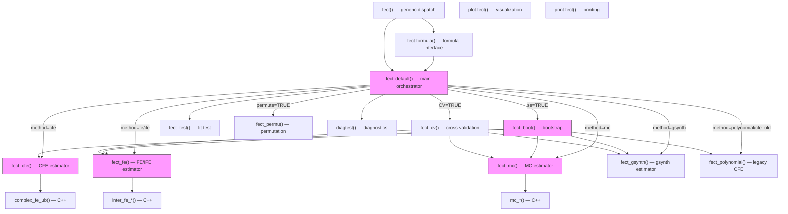

# Architecture — fect

> Generated by scribe for run `PATROL-20260314` on 2026-03-14.

## Overview

**fect** (Fixed Effects Counterfactual Estimators) is an R package for causal inference in panel data with binary treatments. It implements multiple counterfactual imputation estimators — Fixed Effects (FE), Interactive Fixed Effects (IFE/gsynth), Matrix Completion (MC), Complex Fixed Effects (CFE), and Polynomial/Legacy CFE — plus bootstrap inference, cross-validation for tuning, diagnostic tests, sensitivity analysis, and event-study visualization. The package is written in R with performance-critical estimation routines in C++ (via Rcpp/RcppArmadillo). Key external dependencies include `fixest`, `parallelly`, `future`/`doFuture` for parallelism, and `ggplot2` for plotting.

---

## Module Structure

```mermaid
graph TD
    subgraph API["API Layer (User-Facing)"]
        A1["R/default.R — fect() generic + fect.formula + fect.default"]
        A2["R/interFE.R — interFE() standalone IFE estimator"]
        A3["R/did_wrapper.R — did_wrapper() DID integrations"]
        A4["R/fect_mspe.R — fect_mspe() MSPE diagnostics"]
        A5["R/fect_sens.R — fect_sens() sensitivity analysis"]
    end

    subgraph Estimators["Core Estimators"]
        E1["R/fe.R — fect_fe() FE/IFE estimator"]
        E2["R/cfe.R — fect_cfe() Complex FE estimator"]
        E3["R/mc.R — fect_mc() Matrix Completion"]
        E4["R/fect_gsynth.R — fect_gsynth() Generalized Synth"]
        E5["R/polynomial.R — fect_polynomial() Legacy CFE"]
    end

    subgraph Inference["Inference & Validation"]
        I1["R/boot.R — fect_boot() bootstrap inference"]
        I2["R/cv.R — fect_cv() cross-validation"]
        I3["R/cv_binary.R — fect_binary_cv() binary CV"]
        I4["R/fittest.R — fect_test() goodness-of-fit"]
        I5["R/diagtest.R — diagtest() diagnostic tests"]
        I6["R/permutation.R — fect_permu() permutation test"]
    end

    subgraph Output["Output & Visualization"]
        O1["R/plot.R — plot.fect() plotting"]
        O2["R/print.R — print.fect() print method"]
        O3["R/esplot.R — esplot() event-study plot"]
        O4["R/effect.R — effect() cumulative effect"]
        O5["R/cumu.R — att.cumu() cumulative ATT"]
        O6["R/plot_return.R — print.fect_plot_return()"]
    end

    subgraph Utils["Utilities"]
        U1["R/support.R — helper functions"]
        U2["R/getcohort.R — get.cohort() cohort extraction"]
        U3["R/RcppExports.R — Rcpp bindings"]
    end

    subgraph Cpp["C++ Backend (src/)"]
        C1["src/cfe.cpp — complex_fe_ub()"]
        C2["src/cfe_sub.cpp — CFE sub-routines"]
        C3["src/ife.cpp — IFE estimation"]
        C4["src/ife_sub.cpp — IFE sub-routines"]
        C5["src/fe_sub.cpp — FE sub-routines"]
        C6["src/mc.cpp — Matrix Completion"]
        C7["src/auxiliary.cpp — shared C++ helpers"]
        C8["src/binary_qr.cpp + binary_svd.cpp + binary_sub.cpp — binary probit"]
    end

    A1 --> E1
    A1 --> E2
    A1 --> E3
    A1 --> E4
    A1 --> E5
    A1 --> I1
    A1 --> I2
    A1 --> I6

    E1 --> U3
    E2 --> U3
    E3 --> U3
    E4 --> U3
    E5 --> U3

    U3 --> C1
    U3 --> C3
    U3 --> C5
    U3 --> C6
    U3 --> C7

    I1 --> E1
    I1 --> E2
    I1 --> E3
    I1 --> E4
    I1 --> E5
    I2 --> E1
    I2 --> E3
    I2 --> E4

    A1 --> O1
    A1 --> O2
    A1 --> I5
    A5 --> A1

    style E2 fill:#f9f,stroke:#333
    style E1 fill:#f9f,stroke:#333
    style E3 fill:#f9f,stroke:#333
    style A1 fill:#f9f,stroke:#333
    style I1 fill:#f9f,stroke:#333
```

> Nodes with pink fill (`fill:#f9f`) were modified in this run.

### Module Reference

| Module / File | Layer | Purpose | Key Exports | Changed |
| --- | --- | --- | --- | --- |
| `R/default.R` | API | Main entry point; `fect()` generic dispatches to estimators, sets up parallelism, calls bootstrap | `fect`, `fect.formula`, `fect.default` | **yes** (B2: `detectCores` fix) |
| `R/interFE.R` | API | Standalone interactive fixed effects estimator | `interFE` | no |
| `R/did_wrapper.R` | API | Wrapper for external DID estimators (did, DIDmultiplegtDYN) | `did_wrapper` | no |
| `R/fect_mspe.R` | API | MSPE-based diagnostic analysis | `fect_mspe`, `fect_mspe_sim` | no |
| `R/fect_sens.R` | API | Sensitivity analysis via HonestDiDFEct | `fect_sens` | no |
| `R/cfe.R` | Estimator | Complex Fixed Effects estimator with Z/gamma, Q/kappa, extra FE, IFE | `fect_cfe` (internal) | **yes** (B1: sigma2 guard) |
| `R/fe.R` | Estimator | Fixed Effects / Interactive FE estimator | `fect_fe` (internal) | **yes** (B1: sigma2 guard) |
| `R/mc.R` | Estimator | Matrix Completion estimator | `fect_mc` (internal) | **yes** (B1: sigma2 guard) |
| `R/fect_gsynth.R` | Estimator | Generalized Synthetic Control (gsynth-style) | `fect_gsynth` (internal) | no |
| `R/polynomial.R` | Estimator | Legacy CFE using polynomial/sfe/cfe arguments | `fect_polynomial` (internal) | no |
| `R/boot.R` | Inference | Parametric bootstrap for all estimators | `fect_boot` (internal) | **yes** (B3: `detectCores` fix) |
| `R/cv.R` | Inference | Cross-validation for r (IFE) and lambda (MC) | `fect_cv` (internal) | no |
| `R/cv_binary.R` | Inference | Cross-validation for binary probit models | `fect_binary_cv` (internal) | no |
| `R/fittest.R` | Inference | Wild bootstrap goodness-of-fit test | `fect_test` (internal) | no |
| `R/diagtest.R` | Inference | Pre-trend, placebo, and carryover diagnostic tests | `diagtest` (internal) | no |
| `R/permutation.R` | Inference | Permutation test for treatment assignment | `fect_permu` (internal) | no |
| `R/plot.R` | Output | Rich plot method: gap, equiv, status, exit, factors, calendar | `plot.fect` | no |
| `R/esplot.R` | Output | Standalone event-study plot function | `esplot` | no |
| `R/print.R` | Output | Print method for fect objects | `print.fect` | no |
| `R/effect.R` | Output | Cumulative / sub-group treatment effect estimation | `effect` | no |
| `R/cumu.R` | Output | Cumulative ATT computation | `att.cumu` | no |
| `R/support.R` | Utils | Shared helper functions (get_term, data prep, etc.) | internal | no |
| `R/getcohort.R` | Utils | Cohort extraction from panel data | `get.cohort` | no |
| `R/RcppExports.R` | Utils | Auto-generated Rcpp bindings to C++ routines | internal | no |
| `src/cfe.cpp` | C++ | Core CFE EM algorithm (`complex_fe_ub`) | C++ export | no |
| `src/ife.cpp` | C++ | IFE estimation routines | C++ export | no |
| `src/mc.cpp` | C++ | Matrix Completion estimation | C++ export | no |
| `src/fe_sub.cpp` | C++ | FE sub-routines (demeaning, projection) | C++ internal | no |
| `src/auxiliary.cpp` | C++ | Shared C++ helpers (matrix ops, indicators) | C++ internal | no |
| `man/fect.Rd` | Docs | Main help page for fect() | — | **yes** (B4: index param) |
| `NEWS.md` | Docs | Package changelog | — | **yes** (B5: v2.2.0 section) |

---

## Function Call Graph

> Shows call chains for functions affected by this run. Pink nodes = changed. Trace from public entry points down to leaf operations.

### Function Reference

| Function | Defined In | Called By | Calls | Changed | Purpose |
| --- | --- | --- | --- | --- | --- |
| `fect()` | `R/default.R` | user (exported) | `fect.formula`, `fect.default` | no | Generic entry point |
| `fect.formula()` | `R/default.R` | `fect()` | `fect.default` | no | Formula interface; parses formula, calls default |
| `fect.default()` | `R/default.R` | `fect.formula`, direct | estimators, `fect_cv`, `fect_boot`, `fect_test`, `diagtest`, `fect_permu` | **yes** (B2) | Main orchestrator: validates input, sets up parallelism, dispatches estimator, runs CV/bootstrap/tests |
| `fect_cfe()` | `R/cfe.R` | `fect.default`, `fect_boot` | `complex_fe_ub` (C++) | **yes** (B1) | CFE estimator: extra FE, Z/gamma, Q/kappa, IFE |
| `fect_fe()` | `R/fe.R` | `fect.default`, `fect_boot`, `fect_cv` | `inter_fe_*` (C++) | **yes** (B1) | FE/IFE estimator |
| `fect_mc()` | `R/mc.R` | `fect.default`, `fect_boot`, `fect_cv` | `mc_*` (C++) | **yes** (B1) | Matrix Completion estimator |
| `fect_gsynth()` | `R/fect_gsynth.R` | `fect.default`, `fect_boot`, `fect_cv` | `inter_fe_*` (C++) | no | Generalized Synthetic Control |
| `fect_polynomial()` | `R/polynomial.R` | `fect.default`, `fect_boot` | `subfe` (C++) | no | Legacy polynomial/CFE estimator |
| `fect_boot()` | `R/boot.R` | `fect.default` | all estimators, parallel setup | **yes** (B3) | Bootstrap inference with parallel workers |
| `fect_cv()` | `R/cv.R` | `fect.default` | `fect_fe`, `fect_mc`, `fect_gsynth` | no | Cross-validation for hyperparameters |
| `fect_test()` | `R/fittest.R` | `fect.default` | wild bootstrap | no | Goodness-of-fit test |
| `diagtest()` | `R/diagtest.R` | `fect.default` | stat computations | no | Pre-trend, placebo, carryover tests |
| `fect_permu()` | `R/permutation.R` | `fect.default` | estimators | no | Permutation test |
| `plot.fect()` | `R/plot.R` | user (S3 method) | ggplot2 | no | Rich visualization (gap, equiv, status, etc.) |
| `esplot()` | `R/esplot.R` | user (exported) | ggplot2 | no | Standalone event-study plot |
| `effect()` | `R/effect.R` | user (exported) | stat computations | no | Cumulative / sub-group effects |
| `att.cumu()` | `R/cumu.R` | user (exported) | stat computations | no | Cumulative ATT |
| `interFE()` | `R/interFE.R` | user (exported) | `inter_fe_*` (C++) | no | Standalone IFE estimator |
| `did_wrapper()` | `R/did_wrapper.R` | user (exported) | external DID packages | no | Wrapper for did/DIDmultiplegtDYN |
| `fect_mspe()` | `R/fect_mspe.R` | user (exported) | `fect()` re-runs | no | MSPE diagnostic |
| `fect_sens()` | `R/fect_sens.R` | user (exported) | HonestDiDFEct | no | Sensitivity analysis |
| `get.cohort()` | `R/getcohort.R` | user (exported) | data manipulation | no | Cohort extraction |

---

## Data Flow

```mermaid
graph LR
    Input["User Input\n(data, formula,\nindex, method, ...)"] --> Parse["Input Parsing\n(fect.formula →\nfect.default)"]
    Parse --> DataPrep["Data Preparation\n(balance, normalize,\nmissing handling)"]
    DataPrep --> CV{"Cross-Validation?\n(CV=TRUE)"}
    CV -->|yes| CVRun["fect_cv()\nSelect r / lambda"]
    CVRun --> Estimate
    CV -->|no| Estimate["Estimation\n(fect_fe / fect_cfe /\nfect_mc / fect_gsynth /\nfect_polynomial)"]
    Estimate --> Normalize["De-normalize\n(if normalize=TRUE)"]
    Normalize --> Boot{"Bootstrap?\n(se=TRUE)"}
    Boot -->|yes| BootRun["fect_boot()\nParallel bootstrap"]
    BootRun --> Diag
    Boot -->|no| Diag["Diagnostic Tests\n(diagtest, fect_test)"]
    Diag --> Result["fect Object\n(ATT, CI, fit,\nfactors, residuals)"]
    Result --> Display["plot.fect()\nprint.fect()\nesplot()"]

    style Normalize fill:#f9f,stroke:#333
    style BootRun fill:#f9f,stroke:#333
    style Estimate fill:#f9f,stroke:#333
```

> Left-to-right flow showing how data moves through the system from input to output. Pink nodes = changed in this run.

---

## Architectural Patterns

- **Method dispatch via string matching**: `fect.default()` uses `method` argument (`"fe"`, `"ife"`, `"cfe"`, `"mc"`, `"gsynth"`, `"polynomial"`, `"cfe_old"`) to select the appropriate estimator function. All estimators share a common interface (Y, X, D, W, I, II, T.on, ...).

- **R orchestration + C++ computation**: All estimators call C++ routines (via Rcpp) for the heavy matrix algebra. R handles data preparation, normalization, cross-validation loop control, bootstrap orchestration, and output assembly.

- **Normalization pattern**: When `normalize=TRUE`, `fect.default()` normalizes the outcome before estimation, then de-normalizes results using `norm.para`. The sigma2 de-normalization was the bug fixed in B1 (it must only run when `boot==FALSE` because `est.fect` is NULL during bootstrap).

- **Bootstrap architecture**: `fect_boot()` re-calls the same estimator function in parallel workers using `future`/`doFuture`/`foreach`. Workers use `parallelly::availableCores()` for safe core detection (fixed in B2/B3).

- **Two-stage estimation**: `fect.default()` first runs the point estimator, then optionally runs `fect_boot()` for standard errors. The boot function calls the same estimator on resampled data with `boot=TRUE`, which disables certain outputs (like `sigma2`).

- **Cross-validation before estimation**: When `CV=TRUE`, `fect_cv()` runs first to select optimal hyperparameters (`r` for IFE, `lambda` for MC), then the final estimator runs with the selected values.

- **S3 class system**: `fect()` returns an object of class `"fect"` with methods `print.fect()` and `plot.fect()`. `interFE()` returns class `"interFE"`.

- **Parallel execution**: Uses the `future` ecosystem (`doFuture`, `future.apply`, `parallelly`) for portable parallel backends. Core detection uses `parallelly::availableCores()` with `omit=2` to leave headroom.

---

## Notes

- The `est.fect$sigma2` normalization bug (B1) was a systematic error present in all three estimator files (`cfe.R`, `fe.R`, `mc.R`), indicating the code was likely copy-pasted across estimators.
- The `detectCores()` issue (B2/B3) affected two files but three call sites: one in `default.R` (the initial parallel setup) and two in `boot.R` (bootstrap worker setup and retry worker setup). All three now use the consistent `parallelly::availableCores(omit=2L)` pattern, matching existing usage in `fect_sens.R` and `did_wrapper.R`.
- The legacy CFE interface (`method="polynomial"` / `method="cfe_old"`) coexists with the new `method="cfe"` in the codebase. The new CFE path goes through `fect_cfe()` -> `complex_fe_ub()` (C++), while the legacy path goes through `fect_polynomial()` -> `subfe()` (C++).
- The C++ backend in `src/` is organized per-estimator (`cfe.cpp`, `ife.cpp`, `mc.cpp`) with shared routines in `auxiliary.cpp` and `fe_sub.cpp`.
