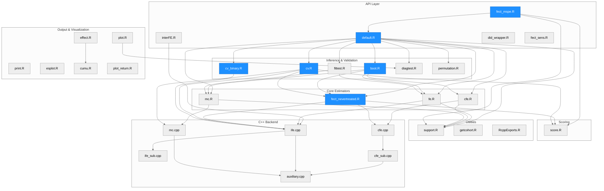
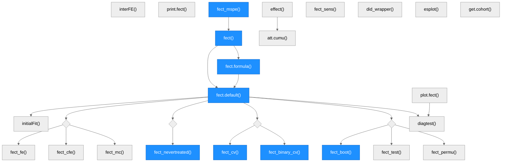
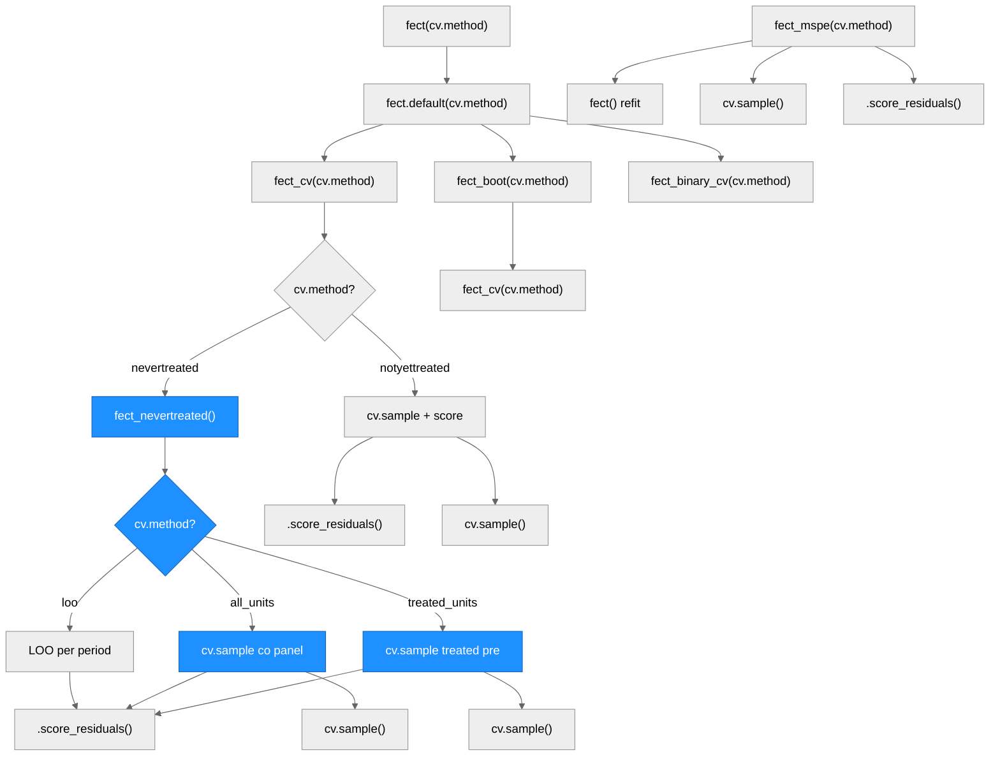
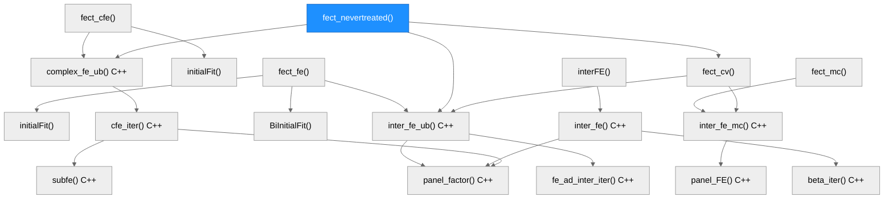
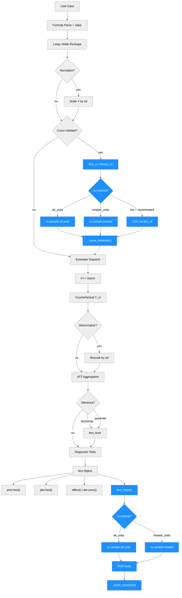

# Architecture — fect

> Generated by scribe for run `REQ-cv-sample-nevertreated` on 2026-03-16. Previous: `REQ-cv-method-phase2` (2026-03-16).

## Overview

**fect** (Fixed Effects Counterfactual Estimators) is an R package for causal inference in panel data with binary treatments under the parallel trends assumption. It estimates average treatment effects on the treated (ATT) by imputing counterfactual outcomes for treated units using one of several estimators: Fixed Effects (FE), Interactive Fixed Effects (IFE), Complex Fixed Effects (CFE), Matrix Completion (MC), and Generalized Synthetic Control (gsynth). The package supports staggered adoption, treatment reversals, limited carryover effects, and binary outcomes. Written in R for orchestration and C++ (Rcpp/RcppArmadillo) for matrix algebra, it depends on `fixest` for initial regression fits, `future`/`doFuture`/`parallelly` for parallel computing, and `ggplot2` for visualization.

---

## Module Structure

> One unified diagram grouping all R and C++ modules into seven layers. Blue-filled nodes were modified in this run. Phase 2 changes span multiple layers: API (default.R, fect_mspe.R), Estimators (fect_nevertreated.R), and Inference (cv.R, boot.R, cv_binary.R). The `cv.method` parameter threads through all of these, replacing the old `cv.treat` boolean and `mask.method` string.

### Module Reference

| Module / File | Layer | Purpose | Key Exports | Changed |
| --- | --- | --- | --- | --- |
| `R/default.R` | API | Main entry point; formula parsing, input validation, data reshaping, method dispatch, normalization, bootstrap orchestration, diagnostics | `fect()`, `fect.formula()`, `fect.default()` | **yes** — `cv.treat` replaced with `cv.method` in 3 signatures + 5 call sites |
| `R/interFE.R` | API | Standalone interactive fixed effects estimator for complete panels | `interFE()`, `interFE.formula()`, `interFE.default()` | no |
| `R/did_wrapper.R` | API | Unified wrapper for external DID estimators (did, DIDmultiplegtDYN) with event-study output | `did_wrapper()` | no |
| `R/fect_mspe.R` | API | MSPE diagnostics; simplified to cv.sample-only masking with `cv.method` parameter ("all_units"/"treated_units"), all 9 scoring criteria via `.score_residuals()`. Removed: random/pre.trend/user masking, hide_mask, n_rep, actual, control.only | `fect_mspe()` | **yes** — major simplification |
| `R/fect_sens.R` | API | Sensitivity analysis via HonestDiDFEct (Rambachan-Roth bounds) | `fect_sens()` | no |
| `R/fe.R` | Estimator | FE and IFE estimator; computes counterfactuals, ATT, dynamic effects, cohort effects, calendar effects | `fect_fe()` (internal) | no |
| `R/cfe.R` | Estimator | Complex FE estimator; supports extra additive FEs, Z/gamma, Q/kappa, latent factors | `fect_cfe()` (internal) | no |
| `R/mc.R` | Estimator | Matrix completion estimator with nuclear norm regularization | `fect_mc()` (internal) | no |
| `R/fect_nevertreated.R` | Estimator | Nevertreated predictive routine for IFE and CFE; co-only estimation with three-layer projection and block coordinate descent for treated parameters. Accepts `cv.method` with LOO, all_units, treated_units — all three paths fully implemented with cv.sample k-fold CV; hardcoded 1% selection rule; W/count.T.cv passed to scoring | `fect_nevertreated()` (internal) | **yes** — cv.sample k-fold CV for all_units and treated_units |
| `R/boot.R` | Inference | Parametric and wild bootstrap, jackknife; parallel execution via future/doFuture | `fect_boot()` (internal) | **yes** — `cv.treat` replaced with `cv.method` |
| `R/cv.R` | Inference | Cross-validation for r (factors) or lambda (regularization); delegates nevertreated paths to fect_nevertreated; 7 scoring criteria via `.score_residuals()` | `fect_cv()` (internal) | **yes** — `cv.treat` replaced with `cv.method`, added IFE+nevertreated delegation, cv.method passthrough to nevertreated |
| `R/cv_binary.R` | Inference | Cross-validation for binary probit models | `fect_binary_cv()` (internal) | **yes** — `cv.treat` replaced with `cv.method` |
| `R/fittest.R` | Inference | Wild bootstrap goodness-of-fit test for pre-trends | `fect_test()` (internal) | no |
| `R/diagtest.R` | Inference | Diagnostic tests: F-test, TOST equivalence, placebo, carryover | `diagtest()` (internal) | no |
| `R/permutation.R` | Inference | Block permutation test for treatment effect significance | `fect_permu()` (internal) | no |
| `R/score.R` | Scoring | Shared scoring function: computes MSPE, WMSPE, GMSPE, WGMSPE, MAD, Moment, GMoment, RMSE, Bias from residuals with optional observation weights, period weights, and normalization | `.score_residuals()` (internal) | no |
| `R/plot.R` | Output | S3 plot method; gap, equivalence, status, exit, factor, calendar, counterfactual, HTE plots | `plot.fect()` | no |
| `R/print.R` | Output | S3 print method; tabular display of ATT estimates | `print.fect()` | no |
| `R/esplot.R` | Output | Standalone event-study plot from user-supplied data frames | `esplot()` | no |
| `R/effect.R` | Output | Cumulative and subgroup treatment effects with optional plotting | `effect()` | no |
| `R/cumu.R` | Output | Cumulative ATT over a specified event window | `att.cumu()` (internal) | no |
| `R/plot_return.R` | Output | Print method for plot return objects (auto-renders the ggplot) | `print.fect_plot_return()` | no |
| `R/support.R` | Utilities | `get_term()` (event-time encoding), `initialFit()` / `BiInitialFit()` (initial regression via fixest), `align_beta0()`, `cv.sample()`, data manipulation helpers | (internal) | no |
| `R/getcohort.R` | Utilities | Constructs cohort variables (FirstTreat, Time_to_Treatment) from panel data | `get.cohort()` | no |
| `R/RcppExports.R` | Utilities | Auto-generated R-side bindings for all C++ functions | (internal) | no |
| `src/ife.cpp` | C++ | Core IFE solver: `inter_fe()`, `inter_fe_ub()` (unbalanced); EM-style iteration with factor extraction | (internal) | no |
| `src/ife_sub.cpp` | C++ | IFE subroutines: `fe_ad_iter()`, `fe_ad_inter_iter()`, `beta_iter()`, iterative demeaning | (internal) | no |
| `src/cfe.cpp` | C++ | CFE solver: `complex_fe_ub()` with block coordinate descent over extra FEs, Z/gamma, Q/kappa, factors | (internal) | no |
| `src/cfe_sub.cpp` | C++ | CFE iteration subroutine: `cfe_iter()` | (internal) | no |
| `src/fe_sub.cpp` | C++ | FE subroutines: `subfe()` for sub-fixed-effects, `IND()` for indicator matrices | (internal) | no |
| `src/mc.cpp` | C++ | Matrix completion solver: `inter_fe_mc()` with soft-thresholding of singular values | (internal) | no |
| `src/auxiliary.cpp` | C++ | Matrix utilities: `crossprod()`, `E_adj()`, `panel_beta()`, `panel_factor()`, `panel_FE()`, `Y_demean()`, `fe_add()` | (internal) | no |
| `src/binary_qr.cpp` | C++ | Binary probit estimator via QR decomposition | (internal) | no |
| `src/binary_svd.cpp` | C++ | Binary probit estimator via SVD | (internal) | no |
| `src/binary_sub.cpp` | C++ | Binary probit subroutines | (internal) | no |
| `src/fect.h` | C++ | Header file declaring all C++ function signatures | (internal) | no |
| `data/` | Data | Bundled datasets: `simdata`, `simgsynth`, `turnout`, `hh2019`, `gs2020` | (exported) | no |
| `tests/testthat/` | Tests | Test suite: factors-from refactor (208), utility functions (44), score unification (130) | (test) | **yes** — updated and expanded |
| `vignettes/` | Docs | Quarto book: getting started, fect tutorial, plots, gsynth, panel diagnostics, sensitivity, CFE | (docs) | no |

---

## Function Call Graph

### Main Pipeline

> Traces from public entry points through R-side orchestration. Diamond nodes represent method dispatch branch points. Blue nodes were modified in this run (cv.method threading).

### cv.method Threading Detail

> Shows how `cv.method` flows from user-facing `fect()` through all CV-related functions. `fect_cv` delegates all nevertreated paths to `fect_nevertreated`, which now fully implements all three cv.method options: LOO (leave-one-period-out), all_units (cv.sample on control panel), and treated_units (cv.sample on treated pre-treatment). Blue nodes highlight the new cv.sample branches added in this run.

### Estimator-to-C++ Detail

> Traces from each R estimator to its C++ solver functions. fect_nevertreated highlighted as it gained cv.method, W.tr, count.T.cv, and 1% selection rule in this run.

### Function Reference

| Function | Defined In | Called By | Calls | Changed | Purpose |
| --- | --- | --- | --- | --- | --- |
| `.score_residuals()` | `score.R` | `fect_cv()`, `fect_mspe()`, `fect_nevertreated()` | (self-contained) | no | Shared scoring: computes 9 criteria from residuals with optional obs weights, period weights, normalization |
| `fect()` | `default.R` | user | `fect.formula()`, `fect.default()` | **yes** | Generic entry point; `cv.method` replaces `cv.treat` in signature |
| `fect.formula()` | `default.R` | `fect()` | `fect.default()` | **yes** | Formula interface; `cv.method` replaces `cv.treat` |
| `fect.default()` | `default.R` | `fect.formula()`, user | `initialFit()`, estimators, `fect_cv()`, `fect_boot()`, `fect_test()`, `diagtest()`, `fect_permu()` | **yes** | Core orchestrator; `cv.method` replaces `cv.treat`, resolved default inconsistency |
| `fect_cv()` | `cv.R` | `fect.default()`, `fect_nevertreated()` | `inter_fe_ub()`, `inter_fe_mc()`, `.score_residuals()`, `fect_nevertreated()` | **yes** | Cross-validation; `cv.method` replaces `cv.treat`, added IFE+nevertreated delegation with cv.method passthrough |
| `fect_mspe()` | `fect_mspe.R` | user | `fect()`, `.score_residuals()`, `cv.sample()` | **yes** | MSPE diagnostics; simplified to cv.sample-only, `cv.method` replaces `mask.method`, removed 8 parameters |
| `fect_nevertreated()` | `fect_nevertreated.R` | `fect.default()`, `fect_cv()`, `fect_boot()` | `inter_fe_ub()`, `complex_fe_ub()`, `.score_residuals()` | **yes** | Nevertreated predictive routine; added cv.method, W.tr/count.T.cv scoring, hardcoded 1% rule |
| `fect_boot()` | `boot.R` | `fect.default()` | `fect_fe()`, `fect_cfe()`, `fect_mc()`, `fect_nevertreated()`, `fect_cv()` | **yes** | Bootstrap/jackknife inference; `cv.method` replaces `cv.treat` |
| `fect_binary_cv()` | `cv_binary.R` | `fect.default()` | `inter_fe_ub()`, `cv.sample()` | **yes** | Binary CV; `cv.method` replaces `cv.treat` with internal mapping |
| `fect_fe()` | `fe.R` | `fect.default()`, `fect_boot()` | `initialFit()`, `inter_fe_ub()` | no | FE/IFE estimator |
| `fect_cfe()` | `cfe.R` | `fect.default()`, `fect_boot()` | `initialFit()`, `complex_fe_ub()` | no | CFE estimator |
| `fect_mc()` | `mc.R` | `fect.default()`, `fect_boot()` | `inter_fe_mc()` | no | Matrix completion estimator |
| `initialFit()` | `support.R` | `fect_fe()`, `fect_cfe()` | `feols()` (fixest) | no | Initial OLS fit for warm starts |
| `cv.sample()` | `support.R` | `fect_cv()`, `fect_mspe()` | (self-contained) | no | Structured CV mask generation with donut exclusion; internal `cv.treat` boolean unchanged |
| `plot.fect()` | `plot.R` | user | `diagtest()` | no | S3 plot method |
| `effect()` | `effect.R` | user | `att.cumu()` | no | Cumulative/subgroup effects |

---

## Data Flow

> Vertical flowchart showing the full data pipeline. The CV path now branches on `cv.method`, showing three distinct masking strategies. The fect_mspe path is simplified to cv.sample-only (random/pre.trend/user masking removed). Blue nodes indicate components modified or created in this run.

---

## Architectural Patterns

- **Two-language design**: R handles orchestration (input validation, data reshaping, method dispatch, result aggregation, plotting) while C++ (via Rcpp/RcppArmadillo) handles all performance-critical matrix algebra (EM iterations, SVD, soft-thresholding, block coordinate descent). The boundary is defined by `RcppExports.R`/`RcppExports.cpp`.

- **S3 method dispatch**: `fect()` and `interFE()` use S3 generics with `.formula` and `.default` methods, following standard R package conventions. `plot.fect()` and `print.fect()` extend the S3 system for output objects.

- **Method-dispatch hub**: `fect.default()` is the central orchestrator (~2900 lines). It routes to one of five estimator families based on the `method` argument, then uniformly handles bootstrap inference, cross-validation, diagnostic tests, and output assembly regardless of the chosen estimator.

- **Shared estimator contract**: All estimators (`fect_fe`, `fect_cfe`, `fect_mc`, `fect_nevertreated`) accept a common interface (Y, X, D, W, I, II matrices plus control parameters) and return a common output structure (Y.ct, eff, att.avg, att.on, time.on, etc.). This allows `fect_boot()` to call any estimator polymorphically during resampling.

- **Shared scoring layer**: `.score_residuals()` is the single function for computing prediction quality scores from residuals. It accepts observation weights, period-level weights, time indices, and normalization parameters. `fect_cv`, `fect_nevertreated`, and `fect_mspe` all call this function, ensuring scoring consistency across the package.

- **Unified cv.method parameter (new in Phase 2)**: The `cv.method` parameter replaces the old `cv.treat` boolean and `mask.method` string with a single string parameter taking values `"all_units"`, `"treated_units"`, or `"loo"`. Each function maps `cv.method` to the internal `cv.treat` boolean for `cv.sample()`, which remains unchanged. This eliminates the inconsistency where `fect()` defaulted `cv.treat=FALSE` but `fect.default()` defaulted `cv.treat=TRUE`.

- **cv.method delegation in fect_cv**: `fect_cv` now delegates to `fect_nevertreated` for three cases: gsynth, IFE+nevertreated, and CFE+nevertreated. The cv.method and all cv.sample sub-options (k, cv.prop, cv.nobs, cv.donut, min.T0) are passed through to the delegated function. This ensures `cv.method="loo"` only reaches `fect_nevertreated` (which supports it) and never falls through to `fect_cv`'s `match.arg` which rejects it.

- **cv.sample-only fect_mspe (new in Phase 2)**: `fect_mspe` was simplified from 4 masking strategies (random, pre.trend, cv.sample, user) to cv.sample-only. The removed strategies were redundant with cv.sample masking. The function now accepts only `cv.method = "all_units"` or `"treated_units"`, maps to the internal `cv.treat` boolean, and uses `cv.sample()` for structured k-fold evaluation.

- **Initial value strategy**: Before iterative estimation, `initialFit()` uses `fixest::feols()` to compute initial regression values (Y0, beta0), providing warm starts for the C++ EM iterations and improving convergence.

- **Block coordinate descent (CFE)**: The CFE estimator (`complex_fe_ub` in C++) iterates over multiple parameter blocks: covariates (beta), extra additive FEs, time-invariant covariates with grouped time coefficients (Z/gamma), unit-specific time trends (Q/kappa), and latent factors/loadings. Each block is updated while holding the others fixed.

- **Nuclear norm regularization (MC)**: The matrix completion estimator uses soft-thresholding of singular values (`panel_FE` in C++) to impose low-rank structure, with the regularization parameter lambda selected via cross-validation.

- **Parallel computing ecosystem**: Bootstrap and permutation tests use `future`/`doFuture`/`parallelly` for backend-agnostic parallelism. The `trim_closure_env()` helper in `boot.R` reduces serialization overhead by pruning closure environments before parallel export.

- **Normalization/denormalization sandwich**: When `normalize=TRUE`, `fect.default()` scales Y by its standard deviation before estimation, then rescales all output quantities (effects, residuals, variance estimates) back to the original scale, improving numerical stability for large-valued outcomes.

---

## Notes

- The `cv.method` parameter unification (Phase 2) is a **breaking change** on the `cfe` branch. Old code using `cv.treat=TRUE/FALSE` or `mask.method="random"` will fail. This is intentional — the `cfe` branch is a development branch.

- The cv.sample-based CV paths in `fect_nevertreated` for `cv.method="all_units"` and `"treated_units"` are now fully implemented. For "all_units": pre-computes k fold masks on the control panel via `cv.sample()`, then per fold masks control observations, re-estimates factors via `inter_fe_ub`/`complex_fe_ub` on the masked panel, and scores held-out control positions. For "treated_units": pre-computes k fold masks on treated pre-treatment observations, estimates factors once on the full control panel per r, then per fold re-estimates loadings (lambda via OLS for r>0, unit FE alpha for r=0) on masked pre-treatment and scores held-out positions. Both paths use `.score_residuals()` for scoring and share the existing model selection logic (1% improvement criterion).

- `fect_nevertreated` now returns `CV.out` in its output list (previously computed but not included in the return value). This enables tests to inspect criterion scores per r value.

- The 1% selection rule is now hardcoded in `fect_nevertreated` (both IFE and CFE blocks), aligning it with `fect_cv` which already used 0.01. The old `tol`-based threshold allowed the selection rule to vary with convergence tolerance, which was not the intended behavior.

- `fect_mspe`'s `.is_fect_output()` validator was updated to check `obj$call` and `obj$Y.dat` instead of `obj$Y.ct.full`, as `Y.ct.full` is not always present (e.g., when `CV=TRUE, se=FALSE`). The prediction extraction also falls back from `Y.ct.full` to `Y.ct`.

- Known issue: `fect_mspe()` throws "No valid residuals collected from cv.sample folds" when called on a model fitted with `CV=TRUE`. This appears to be a source-code bug where internal state gets modified during CV fitting. Workaround: use `CV=FALSE` when fitting models intended for `fect_mspe()` comparison.
