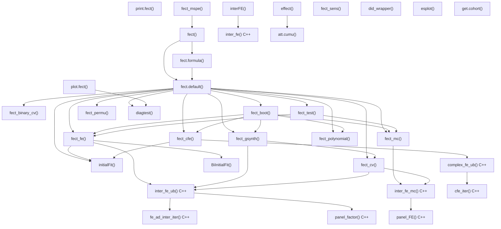

# Architecture — fect

## Overview

**fect** (Fixed Effects Counterfactual Estimators) is an R package for causal inference in panel data with binary treatments under the parallel trends assumption. It estimates average treatment effects on the treated (ATT) by imputing counterfactual outcomes for treated units using one of several estimators: Fixed Effects (FE), Interactive Fixed Effects (IFE), Complex Fixed Effects (CFE), Matrix Completion (MC), and Generalized Synthetic Control (gsynth). The package supports staggered adoption, treatment reversals, limited carryover effects, and binary outcomes. Written in R for orchestration and C++ (Rcpp/RcppArmadillo) for matrix algebra, it depends on `fixest` for initial regression fits, `future`/`doFuture`/`parallelly` for parallel computing, and `ggplot2` for visualization.

---

## Module Structure

```mermaid
graph TD
    subgraph API["API Layer"]
        A1["default.R<br/>fect&#40;&#41;"]
        A2["interFE.R<br/>interFE&#40;&#41;"]
        A3["did_wrapper.R<br/>did_wrapper&#40;&#41;"]
        A4["fect_mspe.R<br/>fect_mspe&#40;&#41;"]
        A5["fect_sens.R<br/>fect_sens&#40;&#41;"]
    end

    subgraph Estimators["Core Estimators"]
        E1["fe.R<br/>fect_fe&#40;&#41;"]
        E2["cfe.R<br/>fect_cfe&#40;&#41;"]
        E3["mc.R<br/>fect_mc&#40;&#41;"]
        E4["fect_gsynth.R<br/>fect_gsynth&#40;&#41;"]
        E5["polynomial.R<br/>fect_polynomial&#40;&#41;"]
    end

    subgraph Inference["Inference and Validation"]
        I1["boot.R<br/>fect_boot&#40;&#41;"]
        I2["cv.R<br/>fect_cv&#40;&#41;"]
        I3["cv_binary.R<br/>fect_binary_cv&#40;&#41;"]
        I4["fittest.R<br/>fect_test&#40;&#41;"]
        I5["diagtest.R<br/>diagtest&#40;&#41;"]
        I6["permutation.R<br/>fect_permu&#40;&#41;"]
    end

    subgraph Output["Output and Visualization"]
        O1["plot.R<br/>plot.fect&#40;&#41;"]
        O2["print.R<br/>print.fect&#40;&#41;"]
        O3["esplot.R<br/>esplot&#40;&#41;"]
        O4["effect.R<br/>effect&#40;&#41;"]
        O5["cumu.R<br/>att.cumu&#40;&#41;"]
        O6["plot_return.R<br/>print.fect_plot_return&#40;&#41;"]
    end

    subgraph Utils["Utilities"]
        U1["support.R<br/>helpers"]
        U2["getcohort.R<br/>get.cohort&#40;&#41;"]
        U3["RcppExports.R<br/>Rcpp bindings"]
    end

    subgraph Cpp["C++ Backend"]
        C1["ife.cpp / ife_sub.cpp<br/>IFE solvers"]
        C2["cfe.cpp / cfe_sub.cpp<br/>CFE solver"]
        C3["mc.cpp<br/>MC solver"]
        C4["fe_sub.cpp<br/>FE iteration"]
        C5["auxiliary.cpp<br/>matrix helpers"]
        C6["binary_qr.cpp / binary_sub.cpp / binary_svd.cpp<br/>binary probit"]
    end

    A1 --> E1
    A1 --> E2
    A1 --> E3
    A1 --> E4
    A1 --> E5
    A1 --> I1
    A1 --> I2
    A1 --> I3
    A1 --> I4
    A1 --> I5
    A1 --> I6
    A2 --> C1
    A4 --> A1

    E1 --> U1
    E1 --> C1
    E1 --> C4
    E2 --> U1
    E2 --> C2
    E3 --> C3
    E4 --> C1
    E5 --> U1

    I1 --> E1
    I1 --> E2
    I1 --> E3
    I1 --> E4
    I1 --> E5
    I2 --> C1
    I2 --> C3
    I3 --> C6

    O1 --> I5
    O4 --> O5

    U3 --> C1
    U3 --> C2
    U3 --> C3
    U3 --> C4
    U3 --> C5
    U3 --> C6
```

### Module Reference

| Module / File | Layer | Purpose | Key Exports |
| --- | --- | --- | --- |
| `R/default.R` | API | Main entry point; formula parsing, input validation, data reshaping, method dispatch, normalization, bootstrap orchestration, diagnostics | `fect()`, `fect.formula()`, `fect.default()` |
| `R/interFE.R` | API | Standalone interactive fixed effects estimator for complete panels | `interFE()`, `interFE.formula()`, `interFE.default()` |
| `R/did_wrapper.R` | API | Unified wrapper for external DID estimators (did, DIDmultiplegtDYN) with event-study output | `did_wrapper()` |
| `R/fect_mspe.R` | API | Mean squared prediction error diagnostics; hides treated periods and re-estimates | `fect_mspe()`, `fect_mspe_sim()` |
| `R/fect_sens.R` | API | Sensitivity analysis via HonestDiDFEct (Rambachan-Roth bounds) | `fect_sens()` |
| `R/fe.R` | Estimator | FE and IFE estimator; computes counterfactuals, ATT, dynamic effects, cohort effects, calendar effects | `fect_fe()` (internal) |
| `R/cfe.R` | Estimator | Complex FE estimator; supports extra additive FEs, Z/gamma, Q/kappa, latent factors | `fect_cfe()` (internal) |
| `R/mc.R` | Estimator | Matrix completion estimator with nuclear norm regularization | `fect_mc()` (internal) |
| `R/fect_gsynth.R` | Estimator | Generalized synthetic control (Xu 2017); separate CV for factor selection | `fect_gsynth()` (internal) |
| `R/polynomial.R` | Estimator | Polynomial/B-spline time trends with fixest; legacy CFE pathway | `fect_polynomial()` (internal) |
| `R/boot.R` | Inference | Parametric and wild bootstrap, jackknife; parallel execution via future/doFuture | `fect_boot()` (internal) |
| `R/cv.R` | Inference | Cross-validation for r (factors) or lambda (regularization); MSPE/PC criterion | `fect_cv()` (internal) |
| `R/cv_binary.R` | Inference | Cross-validation for binary probit models | `fect_binary_cv()` (internal) |
| `R/fittest.R` | Inference | Wild bootstrap goodness-of-fit test for pre-trends | `fect_test()` (internal) |
| `R/diagtest.R` | Inference | Diagnostic tests: F-test, TOST equivalence, placebo, carryover | `diagtest()` (internal) |
| `R/permutation.R` | Inference | Block permutation test for treatment effect significance | `fect_permu()` (internal) |
| `R/plot.R` | Output | S3 plot method; gap, equivalence, status, exit, factor, calendar, counterfactual, HTE plots | `plot.fect()` |
| `R/print.R` | Output | S3 print method; tabular display of ATT estimates | `print.fect()` |
| `R/esplot.R` | Output | Standalone event-study plot from user-supplied data frames | `esplot()` |
| `R/effect.R` | Output | Cumulative and subgroup treatment effects with optional plotting | `effect()` |
| `R/cumu.R` | Output | Cumulative ATT over a specified event window | `att.cumu()` (internal) |
| `R/plot_return.R` | Output | Print method for plot return objects (auto-renders the ggplot) | `print.fect_plot_return()` |
| `R/support.R` | Utilities | `get_term()` (event-time encoding), `initialFit()` / `BiInitialFit()` (initial regression via fixest), `align_beta0()`, data manipulation helpers | (internal) |
| `R/getcohort.R` | Utilities | Constructs cohort variables (FirstTreat, Time_to_Treatment) from panel data | `get.cohort()` |
| `R/RcppExports.R` | Utilities | Auto-generated R-side bindings for all C++ functions | (internal) |
| `src/ife.cpp` | C++ | Core IFE solver: `inter_fe()`, `inter_fe_ub()` (unbalanced); EM-style iteration with factor extraction | (internal) |
| `src/ife_sub.cpp` | C++ | IFE subroutines: `fe_ad_iter()`, `fe_ad_inter_iter()`, `beta_iter()`, iterative demeaning | (internal) |
| `src/cfe.cpp` | C++ | CFE solver: `complex_fe_ub()` with block coordinate descent over extra FEs, Z/gamma, Q/kappa, factors | (internal) |
| `src/cfe_sub.cpp` | C++ | CFE iteration subroutine: `cfe_iter()` | (internal) |
| `src/fe_sub.cpp` | C++ | FE subroutines: `subfe()` for sub-fixed-effects, `IND()` for indicator matrices | (internal) |
| `src/mc.cpp` | C++ | Matrix completion solver: `inter_fe_mc()` with soft-thresholding of singular values | (internal) |
| `src/auxiliary.cpp` | C++ | Matrix utilities: `crossprod()`, `E_adj()`, `panel_beta()`, `panel_factor()`, `panel_FE()`, `Y_demean()`, `fe_add()` | (internal) |
| `src/binary_qr.cpp` | C++ | Binary probit estimator via QR decomposition | (internal) |
| `src/binary_svd.cpp` | C++ | Binary probit estimator via SVD | (internal) |
| `src/binary_sub.cpp` | C++ | Binary probit subroutines | (internal) |
| `src/fect.h` | C++ | Header file declaring all C++ function signatures | (internal) |
| `data/` | Data | Bundled datasets: `simdata`, `simgsynth`, `turnout`, `hh2019`, `gs2020` | (exported) |
| `tests/testthat/` | Tests | Test suite: basic FE/IFE/CFE simulations, staggered designs, normalization, plots, edge cases, DID wrapper, sensitivity | (test) |
| `vignettes/` | Docs | Quarto book: getting started, fect tutorial, plots, gsynth, panel diagnostics, sensitivity, CFE | (docs) |

---

## Function Call Graph

### Function Reference

| Function | Defined In | Called By | Calls | Purpose |
| --- | --- | --- | --- | --- |
| `fect()` | `default.R` | user | `fect.formula()`, `fect.default()` | Generic entry point; dispatches on formula vs. direct arguments |
| `fect.formula()` | `default.R` | `fect()` | `fect.default()` | Parses formula, extracts Y/D/X variable names, delegates |
| `fect.default()` | `default.R` | `fect.formula()`, user | `initialFit()`, estimators, `fect_cv()`, `fect_boot()`, `fect_test()`, `diagtest()`, `fect_permu()` | Core orchestrator: validates inputs, reshapes long-to-wide, normalizes, dispatches estimator and inference |
| `fect_fe()` | `fe.R` | `fect.default()`, `fect_boot()` | `initialFit()`, `inter_fe_ub()` | FE/IFE estimator; computes counterfactuals, ATT, dynamic/cohort/calendar effects |
| `fect_cfe()` | `cfe.R` | `fect.default()`, `fect_boot()` | `initialFit()`, `complex_fe_ub()` | CFE estimator; handles extra FEs, Z/gamma, Q/kappa, latent factors via block coordinate descent |
| `fect_mc()` | `mc.R` | `fect.default()`, `fect_boot()` | `inter_fe_mc()` | Matrix completion estimator with nuclear norm penalty |
| `fect_gsynth()` | `fect_gsynth.R` | `fect.default()`, `fect_boot()` | `inter_fe_ub()`, `fect_cv()` | Generalized synthetic control with own CV for factor count |
| `fect_polynomial()` | `polynomial.R` | `fect.default()`, `fect_boot()` | `feols()` (fixest) | Polynomial/B-spline time trend estimator via fixest regression |
| `fect_boot()` | `boot.R` | `fect.default()` | `fect_fe()`, `fect_cfe()`, `fect_mc()`, `fect_gsynth()`, `fect_polynomial()` | Bootstrap/jackknife inference; parallel via future/doFuture |
| `fect_cv()` | `cv.R` | `fect.default()`, `fect_gsynth()` | `inter_fe_ub()`, `inter_fe_mc()` | Cross-validation for r (IFE) or lambda (MC) |
| `fect_binary_cv()` | `cv_binary.R` | `fect.default()` | `inter_fe_d_ub()`, `inter_fe_d_qr_ub()` | Cross-validation for binary probit IFE models |
| `fect_test()` | `fittest.R` | `fect.default()` | `fect_fe()`, `fect_mc()` | Wild bootstrap F-test for pre-treatment fit |
| `diagtest()` | `diagtest.R` | `fect.default()`, `plot.fect()` | (self-contained) | F-test and TOST equivalence tests for pre-trend, placebo, carryover |
| `fect_permu()` | `permutation.R` | `fect.default()` | estimators via internal dispatch | Block permutation test for treatment effects |
| `plot.fect()` | `plot.R` | user | `diagtest()` | S3 plot method; produces gap, equivalence, status, exit, factor, calendar, counterfactual, HTE plots |
| `print.fect()` | `print.R` | user | (self-contained) | S3 print method; tabular summary of estimates |
| `esplot()` | `esplot.R` | user | (self-contained) | Standalone event-study plot from data frames |
| `effect()` | `effect.R` | user | `att.cumu()` | Cumulative/subgroup effects from fect output |
| `att.cumu()` | `cumu.R` | `effect()` | (self-contained) | Cumulative ATT computation over event windows |
| `interFE()` | `interFE.R` | user | `inter_fe()` | Standalone IFE regression for complete panels |
| `did_wrapper()` | `did_wrapper.R` | user | `did::att_gt()`, `DIDmultiplegtDYN::did_multiplegt_dyn()` | Wrapper for external DID estimators with unified output |
| `fect_mspe()` | `fect_mspe.R` | user | `fect()` | MSPE diagnostic: hides treated observations and re-estimates |
| `fect_sens()` | `fect_sens.R` | user | HonestDiDFEct functions | Sensitivity analysis via Rambachan-Roth framework |
| `get.cohort()` | `getcohort.R` | user | (self-contained) | Constructs cohort/event-time variables from panel data |
| `initialFit()` | `support.R` | `fect_fe()`, `fect_cfe()` | `feols()` (fixest) | Initial OLS fit to obtain starting values for iterative estimators |
| `BiInitialFit()` | `support.R` | `fect_fe()` | `feols()` (fixest) | Initial fit for binary probit models |
| `inter_fe_ub()` | `ife.cpp` | `fect_fe()`, `fect_gsynth()`, `fect_cv()` | `panel_factor()`, `fe_ad_inter_iter()` | C++ IFE solver for unbalanced panels; EM-style alternating estimation |
| `complex_fe_ub()` | `cfe.cpp` | `fect_cfe()` | `cfe_iter()` | C++ CFE solver; block coordinate descent over multiple FE components |
| `inter_fe_mc()` | `mc.cpp` | `fect_mc()`, `fect_cv()` | `panel_FE()` | C++ MC solver; iterates soft-thresholding with FE demeaning |
| `inter_fe()` | `ife.cpp` | `interFE()` | `panel_factor()`, `beta_iter()` | C++ IFE solver for balanced panels |
| `cfe_iter()` | `cfe_sub.cpp` | `complex_fe_ub()` | `subfe()`, `panel_factor()` | C++ CFE iteration subroutine |
| `panel_factor()` | `auxiliary.cpp` | IFE/CFE solvers | (SVD) | Extracts latent factors and loadings from residual matrix via SVD |
| `panel_FE()` | `auxiliary.cpp` | MC solver | (SVD) | Soft-thresholds singular values for nuclear norm regularization |

---

## Data Flow

```mermaid
graph LR
    Input["User Input<br/>data, formula,<br/>method, params"] --> Parse["Formula Parsing<br/>+ Input Validation"]
    Parse --> Reshape["Long-to-Wide<br/>Reshape<br/>Y: T x N matrix<br/>X: T x N x p array"]
    Reshape --> Normalize{"Normalize?"}
    Normalize -->|yes| Norm["Scale Y<br/>by sd"]
    Normalize -->|no| CV
    Norm --> CV{"Cross-Validate?"}
    CV -->|yes| CVStep["fect_cv / fect_binary_cv<br/>select r or lambda"]
    CV -->|no| Estimate
    CVStep --> Estimate["Estimator Dispatch<br/>fe / ife / cfe / mc / gsynth / polynomial"]
    Estimate --> CppSolver["C++ Solver<br/>EM iteration / block coord descent /<br/>soft-thresholding"]
    CppSolver --> Counterfactual["Counterfactual Y_ct<br/>+ Treatment Effect eff = Y - Y_ct"]
    Counterfactual --> Denorm{"Denormalize?"}
    Denorm -->|yes| Denormalize["Rescale by sd"]
    Denorm -->|no| ATT
    Denormalize --> ATT["ATT Aggregation<br/>avg, dynamic, cohort,<br/>calendar, on/off"]
    ATT --> Inference{"Inference?"}
    Inference -->|bootstrap| Boot["fect_boot<br/>parallel resampling"]
    Inference -->|jackknife| Boot
    Inference -->|no| Diagnostics
    Boot --> Diagnostics["Diagnostic Tests<br/>F-test, TOST, placebo,<br/>carryover, permutation"]
    Diagnostics --> FectObj["fect Object<br/>S3 class"]
    FectObj --> Print["print.fect()"]
    FectObj --> Plot["plot.fect()"]
    FectObj --> Effect["effect() / att.cumu()"]
```

---

## Architectural Patterns

- **Two-language design**: R handles orchestration (input validation, data reshaping, method dispatch, result aggregation, plotting) while C++ (via Rcpp/RcppArmadillo) handles all performance-critical matrix algebra (EM iterations, SVD, soft-thresholding, block coordinate descent). The boundary is defined by `RcppExports.R`/`RcppExports.cpp`.

- **S3 method dispatch**: `fect()` and `interFE()` use S3 generics with `.formula` and `.default` methods, following standard R package conventions. `plot.fect()` and `print.fect()` extend the S3 system for output objects.

- **Method-dispatch hub**: `fect.default()` is the central orchestrator (~2900 lines). It routes to one of five estimator families based on the `method` argument, then uniformly handles bootstrap inference, cross-validation, diagnostic tests, and output assembly regardless of the chosen estimator.

- **Shared estimator contract**: All estimators (`fect_fe`, `fect_cfe`, `fect_mc`, `fect_gsynth`, `fect_polynomial`) accept a common interface (Y, X, D, W, I, II matrices plus control parameters) and return a common output structure (Y.ct, eff, att.avg, att.on, time.on, etc.). This allows `fect_boot()` to call any estimator polymorphically during resampling.

- **Initial value strategy**: Before iterative estimation, `initialFit()` uses `fixest::feols()` to compute initial regression values (Y0, beta0), providing warm starts for the C++ EM iterations and improving convergence.

- **Block coordinate descent (CFE)**: The CFE estimator (`complex_fe_ub` in C++) iterates over multiple parameter blocks: covariates (beta), extra additive FEs, time-invariant covariates with grouped time coefficients (Z/gamma), unit-specific time trends (Q/kappa), and latent factors/loadings. Each block is updated while holding the others fixed.

- **Nuclear norm regularization (MC)**: The matrix completion estimator uses soft-thresholding of singular values (`panel_FE` in C++) to impose low-rank structure, with the regularization parameter lambda selected via cross-validation.

- **Parallel computing ecosystem**: Bootstrap and permutation tests use `future`/`doFuture`/`parallelly` for backend-agnostic parallelism. The `trim_closure_env()` helper in `boot.R` reduces serialization overhead by pruning closure environments before parallel export.

- **Normalization/denormalization sandwich**: When `normalize=TRUE`, `fect.default()` scales Y by its standard deviation before estimation, then rescales all output quantities (effects, residuals, variance estimates) back to the original scale, improving numerical stability for large-valued outcomes.

- **Diagnostic test integration**: `diagtest()` computes F-tests (pre-trend), TOST equivalence tests, placebo tests, and carryover tests. These are invoked automatically at the end of `fect.default()` and also on-demand by `plot.fect()` for displaying test statistics on plots.

- **Comprehensive event-study output**: Every estimator computes dynamic effects along two axes: time-since-treatment-onset (T.on) and time-since-treatment-exit (T.off), plus cohort-specific and calendar-time effects. This uniform dynamic-effect structure feeds directly into `plot.fect()`.

---

## Notes

- The `method = "cfe"` pathway is the newest and most complex estimator, supporting extra additive fixed effects (`sfe`/`cfe` arguments), time-invariant covariates with time-grouped coefficients (`Z`/`gamma`), unit-specific time trends (`Q`/`kappa` with polynomial or B-spline basis), and latent factors. The R-side `fect_cfe()` includes input validation guards (dimension checks, binary D validation, convergence warnings) that the older estimators lack.

- The `method = "cfe_old"` pathway routes through `fect_polynomial()`, which uses `fixest::feols()` for polynomial/B-spline time trends. This is a legacy pathway retained for backward compatibility.

- The `fect_gsynth()` function implements the estimator from Xu (2017) within the fect framework. Unlike `fect_fe()`, it performs its own internal cross-validation loop for factor count selection.

- `did_wrapper()` provides a bridge to external DID packages (`did`, `DIDmultiplegtDYN`), producing event-study data frames compatible with `esplot()`.

- `fect_sens()` interfaces with the optional `HonestDiDFEct` package (not on CRAN) for Rambachan-Roth sensitivity analysis.

- The `fect_mspe()` function provides a leave-future-out diagnostic: it hides treated periods, re-runs `fect()`, and compares predicted vs. actual outcomes to assess counterfactual quality.

- The package bundles five datasets: `simdata` and `simgsynth` (simulated DGPs for testing), `turnout` (voter turnout), `hh2019` (Hainmueller-Hopkins 2019 replication), and `gs2020` (Grumbach-Sahn 2020 replication).

- The vignette directory contains a Quarto-based tutorial book with chapters covering getting started, fect usage, plotting, gsynth, panel diagnostics, sensitivity analysis, and the CFE estimator.
