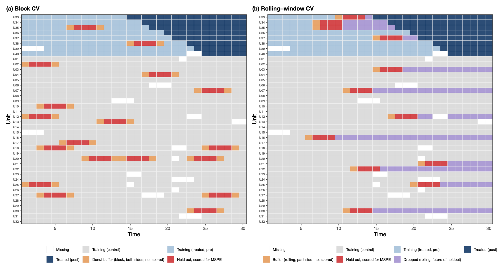

# Factor-Based Methods {#sec-ife-mc}

```{r .common, include = FALSE}
source("_common.R")
```

```{r setup-ife-mc, echo = FALSE, message = FALSE, warning = FALSE}
set.seed(1234)
data(simdata)
```

When the parallel trends assumption is violated due to latent common factors with heterogeneous loadings, the FE estimator from [Chapter @sec-fect] is biased. This chapter introduces two methods that account for such latent factors: the **interactive fixed effects** (IFE) method, which explicitly models unit-specific factor loadings, and the **matrix completion** (MC) method, which uses nuclear-norm regularization to recover the low-rank structure of the untreated potential outcomes. The [R script for this chapter](https://raw.githubusercontent.com/xuyiqing/fect/dev/vignettes/rscript/03-ife-mc.R) is available for download.

We use `simdata`, which includes two latent factors ($r = 2$). The FE estimator is biased on this dataset, while IFE and MC recover the correct ATT.

Before running any estimation, it is good practice to visualize the panel structure: who is treated, when, and how the outcome varies over time. We use the **panelView** package for both views.

```{r panelview-treatment-ifemc, message = FALSE, warning = FALSE, fig.width = 6, fig.height = 4.5}
library(panelView)
panelview(Y ~ D, data = simdata, index = c("id", "time"),
  axis.lab = "time", xlab = "Time", ylab = "Unit",
  gridOff = TRUE, by.timing = TRUE,
  background = "white", main = "simdata: Treatment Status")
```

`simdata` has 200 units across 35 periods, with treatment that can switch on and off (treatment reversal allowed) --- a typical DID/TWFE setting. Out of 200 units, 50 are pure controls (D = 0 throughout) and 150 receive treatment at some point. The status plot above shows the staggered, on-off pattern.

```{r panelview-outcome-ifemc, message = FALSE, warning = FALSE, fig.width = 6, fig.height = 4.5}
panelview(Y ~ D, data = simdata, index = c("id", "time"),
  axis.lab = "time", xlab = "Time", ylab = "Outcome",
  theme.bw = TRUE, type = "outcome", by.group = FALSE,
  main = "simdata: Outcome")
```

`by.group = FALSE` shows all unit trajectories overlaid (treated and control together) so the latent factor structure is visible to the eye. The outcome series clearly co-move in two distinct directions, foreshadowing $r = 2$ latent factors that the FE estimator cannot capture but IFE will.

## Interactive fixed effects

In addition to FEct, **fect** supports the interactive fixed effects counterfactual (IFEct) method proposed by @Gobillon2016 and @Xu2017 and the matrix completion (MC) method proposed by @Athey2021---`method = "ife"` and `method = "mc"`, respectively. The EM algorithm is used to impute the counterfactuals of treated observations.

For the IFE approach, we need to specify the number of factors using option `r`. By default, the algorithm will select an optimal hyper-parameter via a built-in cross-validation procedure (see the Cross-validation section below).

We specify an interval of candidate number of unobserved factors in option `r` like `r=c(0,5)`. When cross-validation is switched off, the first element in `r` will be set as the number of factors. Below we use the MSPE criterion and search the number of factors from 0 to 5.

```{r simdata_ife, eval=TRUE, cache = TRUE}
out.ife <- fect(Y ~ D + X1 + X2, data = simdata, index = c("id","time"),
          force = "two-way", method = "ife", CV = TRUE, r = c(0, 5),
          se = TRUE, nboots = 200, parallel = TRUE, cores = 16)
print(out.ife)
```

The figure below shows the estimated ATT using the IFE method. The cross-validation procedure selects the correct number of factors ($r=2$).

```{r plot-att-ife,  fig.width = 6, fig.height = 4.5}
plot(out.ife, main = "Estimated ATT (IFEct)")
```

We can also inspect the latent factors and the per-unit loadings directly. The **factors** plot shows the two estimated time-varying factors $F_1(t)$ and $F_2(t)$:

```{r plot-factors-ifemc, fig.width = 6, fig.height = 4}
plot(out.ife, type = "factors", main = "Estimated Factors")
```

The **loadings** plot shows the joint distribution of $\lambda_1$ and $\lambda_2$ across treated and control units (rendered as a `GGally::ggpairs` matrix when $r \geq 2$):

```{r plot-loadings-ifemc, fig.width = 6, fig.height = 5}
plot(out.ife, type = "loadings", main = "Factor Loadings")
```

The companion plot type `type = "loading.overlap"` visualizes whether treated-unit factor loadings lie inside the convex hull of control loadings --- a diagnostic for whether the synthetic-control intuition (imputing inside the donor pool's support) is reasonable for these data. With $r = 2$, the plot is a 2D scatter on factors 1 and 2, with the convex hull of controls shaded and treated units overlaid as red triangles:

```{r plot-loading-overlap-ifemc, fig.width = 6, fig.height = 5}
plot(out.ife, type = "loading.overlap")
```

The treated loadings extend well beyond the controls' convex hull, which is **expected for this dataset and consistent with the DGP**. `simdata` is built for the DID/TWFE regime: 200 units total, but only 50 are pure controls --- the remaining 150 receive treatment at some point, with reversals allowed. With three times more treated than control units in the panel, treated factor loadings naturally span a wider range than the controls' joint distribution. For the default `time.component.from = "notyettreated"` regime, this non-overlap is less concerning because factors are estimated from pre-treatment observations of *all* units (treated and control), not from the controls alone. The diagnostic is informative but not actionable here.

::: {.callout-note appearance="simple"}

### Bounded factor loadings (Synth setting only)

When the diagnostic above shows treated units outside the hull *and* you are in the Synth setting (few treated, many controls, no reversal), the new argument `loading.bound = "simplex"` (introduced in v2.3.0) constrains each treated-unit loading to lie inside the convex hull of control loadings via an entropy-regularized simplex projection, recovering the synthetic-control intuition that the imputed counterfactual should sit inside the donor pool's support. The bound is currently restricted to the Synth setting (`time.component.from = "nevertreated"`) and is highly recommended for the `gsynth` method; see [Chapter @sec-gsynth] for the objective and a worked ON/OFF comparison.

:::

------------------------------------------------------------------------

## Matrix completion

For the MC method, we need to specify the tuning parameter in the penalty term using option `lambda`. If users don't have any prior knowledge to set candidate tuning parameters, a number of candidate tuning parameters can be generated automatically based on the information from the outcome variable. We specify the number in option `nlambda`, e.g. `nlambda = 10`.

```{r simdata_mc, eval=TRUE, cache = TRUE}
out.mc <- fect(Y ~ D + X1 + X2, data = simdata, index = c("id","time"),
          force = "two-way", method = "mc", CV = TRUE,
          se = TRUE, nboots = 200, parallel = TRUE, cores = 16)

print(out.mc)
```

```{r plot-att-mc, fig.width = 6, fig.height = 4.5}
plot(out.mc, main = "Estimated ATT (MC)")
```

::: {.callout-note appearance="simple"}

### The `em` parameter

By default, `em = TRUE` and the EM algorithm is used to estimate the factor model when the estimation sample has missing entries. This is always the case in the default DID setting (`time.component.from = "notyettreated"`), where treated post-treatment cells are unobserved under control. For the synthetic control setting, see [Chapter @sec-gsynth].

:::

------------------------------------------------------------------------

## Cross-validation

When using `method = "ife"` or `method = "mc"`, we need to choose a tuning parameter --- the number of factors `r` (IFE) or the regularization strength `lambda` (MC). Setting `CV = TRUE` activates the built-in cross-validation procedure. In each round, a subset of observations is masked (held out), the model is re-estimated on the remaining data, and the prediction error on the held-out set is scored. The tuning parameter that minimizes the chosen criterion is selected.

```{r cv_ife_demo, eval=TRUE, cache=TRUE, message=FALSE, results='hide'}
out.cv <- fect(Y ~ D + X1 + X2, data = simdata, index = c("id","time"),
               method = "ife", CV = TRUE, r = c(0, 5),
               se = FALSE, parallel = TRUE, cores = 16)
```

```{r print-cv-selected-r}
cat("Selected r:", out.cv$r.cv, "\n")
```

### CV method

The `cv.method` parameter controls *which observations are masked* during cross-validation. As of v2.3.0, three masking strategies are exposed:

| `cv.method` | What is masked | What it tests |
| :--- | :--- | :--- |
| **`"rolling"`** (default) | Per-unit anchor with `cv.nobs` scored holdout, `cv.buffer` past-side buffer, and drop-future from anchor onward; samples `cv.prop` of eligible units per fold (controls + treated pre-treatment) | Forecast-style prediction quality with no future-side leakage; closes the AR-leakage channel that block CV cannot |
| `"block"` | Random scattered anchors over control observations; mask `cv.nobs` contiguous cells per anchor; `cv.donut` cells flank each side excluded from training but not scored | Factor estimation quality on the full panel under approximately i.i.d. residuals |
| `"loo"` | One treated pre-treatment period at a time | Projection quality (legacy gsynth method); available for `fect_nevertreated` only |

::: {.callout-note appearance="simple"}

### Which `cv.method` should I use?

`"rolling"` is the new default and the recommended choice in nearly all settings. It is essential when residuals are temporally correlated (post-fit residual AR(1) above ~0.4); under approximately i.i.d. residuals, it agrees closely with block CV (no penalty for the safer choice). `"block"` is available when a forecast-style holdout is not needed --- e.g., for benchmarking against pre-v2.3.0 fits. `"loo"` (nevertreated only) is the original gsynth leave-one-out method; it can be unstable with few pre-treatment periods.

The legacy values `"all_units"` (= the new `"block"`) and `"treated_units"` (block masking restricted to treated pre-treatment cells) are still accepted but emit a deprecation message and will be removed in v2.4.0; see the [cheatsheet](aa-cheatsheet.html#sec-cheatsheet-cv) for the deprecation plan.

:::

We compare the new rolling default with the block strategy below:

```{r cv_method_compare, eval=TRUE, cache=TRUE, message=FALSE, results='hide'}
out.roll <- fect(Y ~ D + X1 + X2, data = simdata, index = c("id","time"),
                 method = "ife", CV = TRUE, r = c(0, 5),
                 cv.method = "rolling", se = FALSE, parallel = TRUE, cores = 16)

out.block <- fect(Y ~ D + X1 + X2, data = simdata, index = c("id","time"),
                  method = "ife", CV = TRUE, r = c(0, 5),
                  cv.method = "block", se = FALSE, parallel = TRUE, cores = 16)
```

```{r print-cv-method-compare}
cat("cv.method = 'rolling': r.cv =", out.roll$r.cv, "\n")
cat("cv.method = 'block':   r.cv =", out.block$r.cv, "\n")
```

The two strategies often agree on i.i.d.-residual panels but diverge when residuals are temporally correlated (block CV tends to over-select; see the empirical evidence in the [cheatsheet](aa-cheatsheet.html#sec-cheatsheet-cv)).

### Rolling-window CV at a glance

Block CV (`cv.method = "block"`) and rolling CV (`cv.method = "rolling"`) differ in how the holdout cells are positioned within each unit's time series. Block CV drops random scattered anchors and masks `cv.nobs` contiguous cells flanked on both sides by training observations, which lets serially correlated residuals leak across the train/test boundary and inflate the apparent accuracy of high-rank models. Rolling CV positions the holdout at a per-unit anchor and drops everything from the anchor onward through the unit's end-of-eligible, so training never sees the future of the held-out block; the past side carries a small `cv.buffer` to attenuate same-side AR leakage. The figure below shows both designs side-by-side.

```{r cv-strategies-fig, echo=FALSE, out.width='100%', fig.cap='Block CV (left) versus rolling-window CV (right) on a synthetic 40-unit panel with staggered treatment timing. Both panels use the same random missing pattern. Block CV (panel a) drops random anchors and masks contiguous holdouts (red) flanked by donut buffer (orange). Rolling CV (panel b) samples a fraction of eligible units per fold; for each sampled unit it masks a past-side buffer (orange), a scored holdout (red), and drops everything from the holdout onward (purple). Treated post-treatment cells (dark blue) are never masked.'}

```

Both designs are wired into the main `fect()` dispatcher; switch between them by setting `cv.method`. The `"rolling"` strategy is supported for `method ∈ {"ife", "gsynth", "cfe", "mc", "both"}`.

```{r rcv_dispatcher_demo, eval=FALSE}
fit <- fect(Y ~ D + X1 + X2, data = simdata, index = c("id", "time"),
            method = "ife", force = "two-way",
            CV = TRUE, r = c(0, 5),
            cv.method = "rolling",
            cv.buffer = 1, cv.nobs = 3, k = 20, cv.prop = 0.1,
            cv.rule = "1se", se = TRUE)
fit$r.cv      # selected r
```

For the full parameter reference (`k`, `cv.prop`, `cv.nobs`, `cv.donut`, `cv.buffer`, `cv.rule`, `min.T0`, `seed`), the scoring-criterion options, and the K=200 simulation evidence that motivates rolling as the recommended default, see the [Cross-Validation section of the cheatsheet](aa-cheatsheet.html#sec-cheatsheet-cv).

```{r criterion_compare, eval=TRUE, cache=TRUE, message=FALSE, results='hide'}
out.mspe <- fect(Y ~ D + X1 + X2, data = simdata, index = c("id","time"),
                 method = "ife", CV = TRUE, r = c(0, 5),
                 criterion = "mspe", se = FALSE, parallel = TRUE, cores = 16)

out.pc <- fect(Y ~ D + X1 + X2, data = simdata, index = c("id","time"),
               method = "ife", CV = TRUE, r = c(0, 5),
               criterion = "gmspe", se = FALSE, parallel = TRUE, cores = 16)
```

```{r print-criterion-compare}
cat("criterion = 'mspe': r.cv =", out.mspe$r.cv, "\n")
cat("criterion = 'gmspe': r.cv =", out.pc$r.cv, "\n")
```

::: {.callout-tip appearance="simple"}

### Selection rule

A candidate `r` is selected over a smaller value only if its criterion score improves by more than 1%. This prevents overfitting to marginal improvements.

:::

### Parallel computing

Cross-validation can be computationally expensive, especially with `cv.method = "block"` or `"rolling"` (which re-estimate the full factor or low-rank model `k` times per candidate tuning parameter). Parallel computing is enabled by default (`parallel = TRUE`); on large panels, the CV step engages multiple workers automatically.

#### Auto-threshold

When `parallel = TRUE`, parallel CV auto-activates only when the control panel is large enough that worker startup and serialization overhead are amortized by per-fold compute time. The thresholds are method-specific:

| Method | Auto-engage threshold ($N_{co} \times T$) | Notes |
| :--- | :--- | :--- |
| `"ife"` | 20,000 | EM-based factor estimation; per-fit cost scales linearly |
| `"mc"` | 20,000 | SVD-based; similar cost profile to IFE |
| `"cfe"` | 60,000 | Higher per-fit overhead; smaller panels lose to serialization |

Below these thresholds, the CV runs serially even with `parallel = TRUE`. To force CV parallelism on a smaller panel — for example, when the per-fit time is large because $r$ or $k$ is high — pass `parallel = "cv"` (string form), which bypasses the auto-threshold and engages workers regardless of panel size.

#### What runs in parallel

The unit of parallel work is the (rank, fold) pair (or (lambda, fold) for MC), dispatched flat across workers via `future_lapply`. This gives near-linear speedup up to the number of total tasks: e.g., with `r=c(0,5)` and `k=20`, there are 120 tasks per CV invocation. The `"loo"` method (and the legacy `"treated_units"` value) are always sequential, because their per-fold computations depend on rank-specific quantities that cannot be batched.

#### MC-specific note: `break_check` short-circuit

For MC cross-validation in serial mode, the lambda search short-circuits via the `break_check` rule once MSPE stops improving. In parallel mode, **all candidate lambdas are computed**: the search is dispatched up-front, so there is no opportunity to terminate early. On well-conditioned problems where the optimal lambda is in the first few values, parallel mode performs slightly more work than serial; the wall-time is still much lower in absolute terms when many CV folds are dispatched together. In pathological cases where the search would have terminated early, serial mode (`parallel = FALSE`) is the better choice.

#### CV vs. bootstrap, independent control

The single `parallel` argument controls both CV and bootstrap parallelism. To enable one but not the other — for example, to keep the bootstrap serial during a debugging session while keeping CV parallel — use the string forms `parallel = "cv"` or `parallel = "boot"`. See the parallel-computing callout in [Chapter @sec-fect] for the full table.

------------------------------------------------------------------------

## Diagnostics

We provide three types of diagnostic tests: (1) a placebo test, (2) a joint test for (no) pretrend, and (3) a test for (no) carry-over effects. For each test, we support both the difference-in-means approach and the equivalence approach. The details are provided in the paper. We demonstrate each test using both the IFE and MC estimators.

### Placebo tests

We provide a placebo test for a settled model---hence, cross-validation is not allowed---by setting `placeboTest = TRUE`. We specify a range of pre-treatment periods as "placebo periods" in option `placebo.period` to remove observations in the specified range for model fitting, and then test whether the estimated ATT in this range is significantly different from zero. Below, we set `c(-2, 0)` as the placebo periods.

```{r placebo_ife, eval = TRUE, cache = TRUE, message = FALSE, results='hide'}
out.ife.p <- fect(Y ~ D + X1 + X2, data = simdata, index = c("id", "time"),
  force = "two-way", method = "ife",  r = 2, CV = 0,
  parallel = TRUE, cores = 16, se = TRUE,
  nboots = 200, placeboTest = TRUE, placebo.period = c(-2, 0))

out.mc.p <- fect(Y ~ D + X1 + X2, data = simdata, index = c("id", "time"),
  force = "two-way", method = "mc",  lambda = out.mc$lambda.cv,
  CV = 0, parallel = TRUE, cores = 16, se = TRUE,
  nboots = 200, placeboTest = TRUE, placebo.period = c(-2, 0))
```

The placebo test conducts two types of tests:

**t test.** If t-test p-value is smaller than a pre-specified threshold (e.g. 5%), we reject the null of no-differences. Hence, the placebo test is deemed failed.

**TOST.** The TOST checks whether the 90% confidence intervals for estimated ATTs in the placebo period exceed a pre-specified range (defined by a threshold), or the equivalence range. A TOST p-value smaller than a pre-specified threshold suggests that the null of difference bigger than the threshold is rejected; hence, the placebo test is passed.

By default, the plot will display the p-value of the $t$-test (`stats = "placebo.p"`). Users can also add the p-value of a corresponding TOST test by setting `stats = c("placebo.p","equiv.p")`. A larger placebo p-value from a t-test and a smaller placebo TOST p-value are preferred.

```{r placebo_ife_plot, eval = TRUE, cache = TRUE, warning = FALSE, fig.width = 6, fig.height = 4.5}
plot(out.ife.p, ylab = "Effect of D on Y", main = "Estimated ATT (IFE)",
     cex.text = 0.8, stats = c("placebo.p","equiv.p"))
```

```{r placebo_mc_plot, eval = TRUE, cache = TRUE, warning = FALSE, fig.width = 6, fig.height = 4.5}
plot(out.mc.p, cex.text = 0.8, stats = c("placebo.p","equiv.p"),
     main = "Estimated ATT (MC)")
```

The results in the placebo test confirm that IFEct is a better model than MC for this particular DGP.

### LOO pre-trend test {#loo-pre-trend-test}

Instead of using estimated ATTs for periods prior to the treatment to test for pre-trends, we recommend users employ a leave-one-out (LOO) approach (`loo = TRUE`) to consecutively hide one pre-treatment period (relative to the timing of the treatment) and repeatedly estimate the pseudo treatment effects for that pre-treatment period. The LOO approach can be understood as an extension of the placebo test. It has the benefit of providing users with a more holistic view of whether the identifying assumptions likely hold. However, as the program needs to conduct uncertainty estimates for each turn, it is much more time-consuming than the original one.

```{r simdata_ife_loo, eval=TRUE, cache = TRUE, message = FALSE, results = 'hide'}
out.ife.loo <- fect(Y ~ D + X1 + X2, data = simdata, index = c("id","time"),
  method = "ife", force = "two-way", se = TRUE, parallel = TRUE, cores = 16, nboots = 200, loo = TRUE)
out.mc.loo <- fect(Y ~ D + X1 + X2, data = simdata, index = c("id","time"),
  method = "mc", force = "two-way", se = TRUE, parallel = TRUE, cores = 16, nboots = 200, loo = TRUE)
```

After the LOO estimation, one can plot these LOO pre-trends in the gap plot or the equivalence plot by setting `loo = TRUE` in the `plot` function. Since all pre-treatment estimates are now out-of-sample, the plot uses a uniform black color for all points (no gray/black distinction). The equivalence plots below use the LOO estimates directly.

### Joint tests

We now introduce two statistical tests for the presence of a pre-trend (or the lack thereof) that *jointly* assess pre-trend quality. The first test is an $F$ test for zero residual averages in the pre-treatment periods. The second test is a two-one-sided $t$ (TOST) test, a type of equivalence tests.

**F test.** We offer a goodness-of-fit test (a variant of the $F$ test) and to gauge the presence of pre-treatment (differential) trends. A larger F-test p-value suggests a better pre-trend fitting. Users can specify a test range in option `pre.periods`. For example, `pre.periods = c(-4,0)` means that we test pre-treatment trend of the last 5 periods prior to the treatment (from period -4 to period 0). If `pre.period = NULL` (default), all pre-treatment periods in which the number of treated units exceeds the total number of treated units \* `proportion` will be included in the test.

**TOST.** The TOST checks whether the 90% confidence intervals for estimated ATTs in the pre-treatment periods (again, subject to the `proportion` option) exceed a pre-specified range, or the equivalence range. A smaller TOST p-value suggests a better pre-trend fitting. While users can check the values of confidence intervals, we give a visualization of the equivalence test. We can plot the pre-treatment residual average with the equivalence confidence intervals by setting `type = "equiv"`. Option `tost.threshold` sets the equivalence range (the default is $0.36\sigma_{\epsilon}$ in which $\sigma_{\epsilon}$ is the standard deviation of the outcome variable after two-way fixed effects are partialed out). By setting `range = "both"`, both the minimum range (in gray) and the equivalence range (in red) are drawn.

On the topleft corner of the graph, we show several statistics of the user's choice. User can choose which statistics to show by setting `stats = c("none", "F.stat", "F.p", "F.equiv.p", "equiv.p")` which corresponds to not showing any, the $F$ statistic, the p-value for the $F$ test, the p-value for the equivalence $F$ test, the (maximum) p-value for the TOST tests, respectively. For the gap plot, the default is `stats = "none"`. For the equivalence plot, the default is `stats = c("equiv.p, F.p")`. Users can also change the labels of statistics using the `stats.labs` options. Users can adjust its position using the `stats.pos` option, for example `stats.pos = c(-30, 4)`. To turn off the statistics, set `stats = "none"`.

Below, we visualize the result of the joint pre-trend test for each of the two estimators using our simulated data. We use the LOO estimates computed above, which provide a more honest out-of-sample pre-trend assessments.

::: {.callout-note appearance="simple"}
### Why LOO for pre-trend testing?

In-sample pre-trend estimates can be misleadingly close to zero because the model is fitted to these same observations. LOO provides genuine out-of-sample estimates, giving a more honest assessment of whether the parallel trends assumption holds.
:::

```{r pretrend_ife, eval = TRUE, cache = TRUE, fig.width = 6, fig.height = 4.5, warning = FALSE}
plot(out.ife.loo, type = "equiv", ylim = c(-4,4), loo = TRUE,
     cex.legend = 0.6, main = "Testing Pre-Trend (IFEct)", cex.text = 0.8)
```

```{r pretrend_mc, eval = TRUE, cache = TRUE, fig.width = 6, fig.height = 4.5, warning = FALSE}
plot(out.mc.loo, type = "equiv", ylim = c(-4,4), loo = TRUE,
     cex.legend = 0.6, main = "Testing Pre-Trend (MC)", cex.text = 0.8)
```

From the above plots, we see that IFEct passes both tests using a conventional test size (5%); and MC fails the F tests, but passes the TOST (equivalence) test. Hence, we may conclude that IFEct is a more suitable model.

### Carryover effects

The idea of the placebo test can be extended to testing the presence of carryover effects. Instead of hiding a few periods right before the treatment starts, we hide a few periods right after the treatment ends. If carryover effects do not exist, we would expect the average prediction error in those periods to be close to zero. To perform the carryover test, we set the option `carryoverTest = TRUE`. We can treat a range of exit-treatment periods in option `carryover.period` to remove observations in the specified range for model fitting, and then test whether the estimated ATT in this range is significantly different from zero.

Below, we set `carryover.period = c(1, 3)`. As we deduct the treatment effect from the outcome in `simdata`, we expect the average prediction error for these removed periods to be close to zero.

```{r carryover_ife, eval = TRUE, cache = TRUE, message = FALSE, results='hide'}
out.ife.c <- fect(Y ~ D + X1 + X2, data = simdata, index = c("id", "time"),
  force = "two-way", method = "ife", r = 2, CV = 0,
  parallel = TRUE, cores = 16, se = TRUE,
  nboots = 200, carryoverTest = TRUE, carryover.period = c(1, 3))

out.mc.c <- fect(Y ~ D + X1 + X2, data = simdata, index = c("id", "time"),
  force = "two-way", method = "mc",  lambda = out.mc$lambda.cv,
  CV = 0, parallel = TRUE, cores = 16, se = TRUE,
  nboots = 200, carryoverTest = TRUE, carryover.period = c(1, 3))
```

Like the placebo test, the plot will display the p-value of the carryover effect test (`stats = "carryover.p"`). Users can also add the p-value of a corresponding TOST test by setting `stats = c("carryover.p","equiv.p")`. In exit plots, pre-exit estimates are shown in black (out-of-sample) and post-exit estimates in gray (in-sample).

```{r carryover_ife_plot, eval = TRUE, cache = TRUE, warning = FALSE, fig.width = 6, fig.height = 5}
plot(out.ife.c, type = "exit", ylim = c(-2.5,4.5),
          cex.text = 0.8, main = "Carryover Effects (IFE)")
```

```{r carryover_mc_plot, eval = TRUE, cache = TRUE, warning = FALSE, fig.width = 6, fig.height = 5}
plot(out.mc.c, type = "exit", ylim = c(-2.5,4.5),
          cex.text = 0.8, main = "Carryover Effects (MC)")
```

Once again, the IFE estimator outperforms the other two.

Using real-world data, researchers will likely find that carryover effects exist. If such effects are limited, researchers can consider removing a few periods after the treatment ended for the treated units from the first-stage estimation (using the `carryover.period` option) and re-estimated the model (and re-conduct the test). We provide such an example in the paper. Here, we illustrate the option using `simdata`.

```{r carryover_rm, eval = TRUE, cache = TRUE, message = FALSE, results='hide', fig.width = 6, fig.height = 4.5}
out.ife.rm.test <- fect(Y ~ D + X1 + X2, data = simdata, index = c("id", "time"),
  force = "two-way", method = "ife", r = 2, CV = 0,
  parallel = TRUE, cores = 16, se = TRUE,  carryover.rm = 3,
  nboots = 200, carryoverTest = TRUE, carryover.period = c(1, 3))# remove three periods

plot(out.ife.rm.test, cex.text = 0.8, stats.pos = c(5, 2.5))
```

In the above plot, the three periods in blue are dropped from the first-stage estimation of the factor model while the periods in red are reserved for the (no) carryover effects test.

### Summary

| Test | Purpose | Key arguments | Plot type | Statistics shown |
| :--- | :--- | :--- | :--- | :--- |
| Placebo test | Tests whether the model produces zero ATT in withheld pre-treatment periods | `placeboTest = TRUE`, `placebo.period = c(a, b)` | `"gap"` (default) | `placebo.p`, `equiv.p` |
| LOO pre-trend test | Out-of-sample check for pre-trends by leaving out one pre-treatment period at a time | `loo = TRUE` (in `fect()`), `loo = TRUE` (in `plot()`) | `"gap"` or `"equiv"` | `F.p`, `equiv.p` |
| Joint pre-trend test (F + TOST) | Joint assessment: F test for zero residual averages; TOST for equivalence within a threshold | `type = "equiv"` in `plot()`, `tost.threshold` | `"equiv"` | `F.p`, `F.equiv.p`, `equiv.p` |
| Carryover test | Tests whether treatment effects persist after treatment ends | `carryoverTest = TRUE`, `carryover.period = c(a, b)` | `"exit"` | `carryover.p`, `equiv.p` |

::: {.callout-tip appearance="simple"}

- A **larger** F-test / placebo / carryover p-value suggests the model passes the test.
- A **smaller** TOST / equivalence p-value suggests the pre-trends or carryover effects are within an acceptable range.
- We recommend using `loo = TRUE` for pre-trend tests to avoid the false reassurance of in-sample fit.
- The `proportion` option controls which pre-treatment periods are included in the tests (default: periods where the number of treated units exceeds `proportion` $\times$ total treated units).
- The `tost.threshold` option sets the equivalence range for the TOST test (default: $0.36\hat{\sigma}_\epsilon$). Finding the "right" threshold is often a challenge in empirical research.

:::

## How to Cite

If you find these methods helpful, you can cite @LWX2024.

```bibtex
@article{LWX2024,
  title = {A Practical Guide to Counterfactual Estimators for Causal Inference with Time-Series Cross-Sectional Data},
  author = {Liu, Licheng and Wang, Ye and Xu, Yiqing},
  journal = {American Journal of Political Science},
  volume = {68},
  number = {1},
  pages = {160--176},
  year = {2024}
}
```
