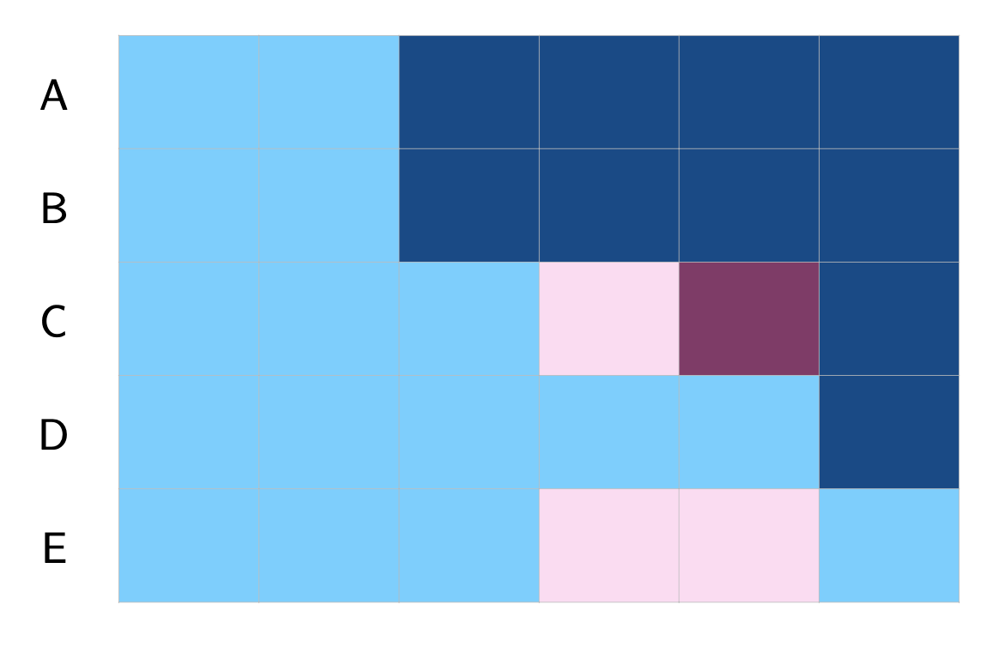
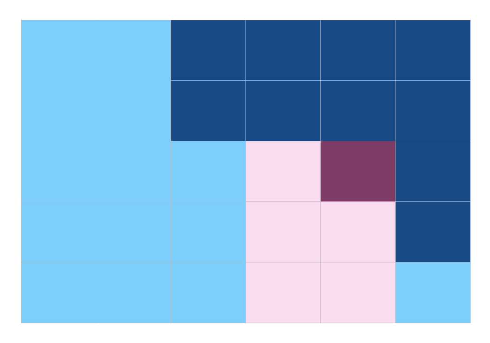
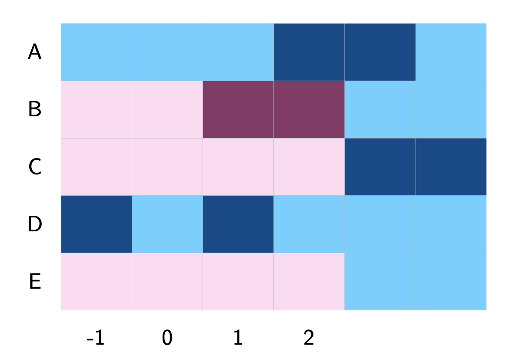
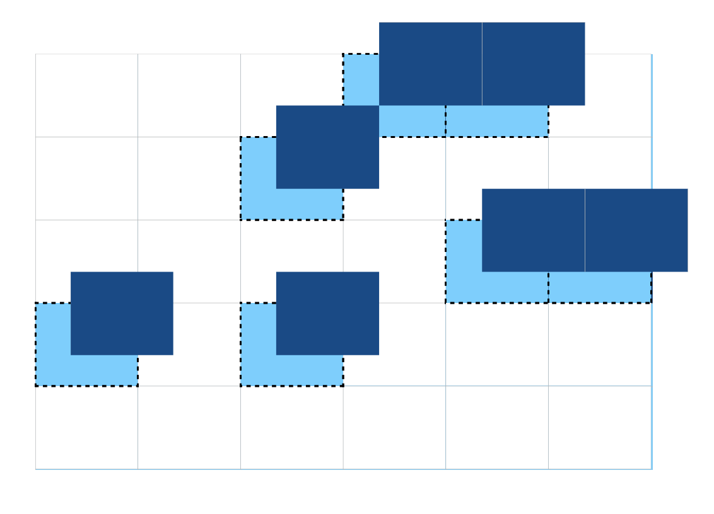

# New DID Methods {#sec-panel}

This chapter, authored by Ziyi Liu and Yiqing Xu, complements @CLLX2025 ([paper](https://yiqingxu.org/papers/english/2023_panel/CLLX.pdf), [slides](https://yiqingxu.org/papers/english/2023_panel/CLLX_slides.pdf)).
Rivka Lipkovitz also contributes to this tutorial.
Download the R code used in this chapter [here](rscript/05-panel.R).

------------------------------------------------------------------------

In recent years, researchers have proposed various heterogeneous treatment effect (HTE) robust estimators for causal panel analysis under parallel trends (PT) as alternatives to traditional two-way fixed effects (TWFE) models.
Examples include those proposed by @CDLZ, @sun2021-event, @callaway2021-did, @CDH2020, @IKW2023, @BJS2024, and @LWX2022.
These methods are closely connected to the classic difference-in-differences (DID) estimator.

This chapter will guide you through implementing these HTE-robust estimators, as well as TWFE, in R.
It will also provide instructions on creating event study plots to display estimated dynamic treatment effects.
In the process, we will present a recommended pipeline for analyzing panel data, covering data exploration, estimation, result visualization, and diagnostic tests.

We illustrate these methods with two empirical examples: @HH2019 (without treatment reversals) and @GS2020 (with treatment reversals).

## Install Packages

To begin, you will need to install the necessary packages from CRAN and GitHub.

```{r message = FALSE, warning = FALSE}
# install packages from CRAN
packages <- c("dplyr", "fixest", "did", "didimputation", 
              "panelView", "ggplot2", "bacondecomp", "HonestDiD",
              "DIDmultiplegtDYN", "PanelMatch")
install.packages(setdiff(packages, rownames(installed.packages())))  

# install most up-to-date "fect" from Github
if ("fect" %in% rownames(installed.packages()) == FALSE) {
  devtools:: install_github("xuyiqing/fect")
}

# install forked "HonestDiD" package compatible with "fect"
if ("HonestDiDFEct" %in% rownames(installed.packages()) == FALSE) {
  devtools:: install_github("lzy318/HonestDiDFEct")
}
```

Load libraries:

```{r message = FALSE, warning = FALSE}
library(dplyr)
library(readstata13)
library(fixest)
library(did)
library(fect)
library(panelView)
library(PanelMatch)
library(ggplot2)
library(bacondecomp)
library(fect)
library(didimputation)
library(doParallel)
library(HonestDiD)
library(HonestDiDFEct)
library(DIDmultiplegtDYN) # may require XQuartz 
```

## No Treatment Reversals

We begin with an empirical example from @HH2019, who investigate the effects of indirect democracy versus direct democracy on naturalization rates in Switzerland using municipality-year panel data from 1991 to 2009.
The study finds that switching from direct to indirect democracy increased naturalization rates by an average of 1.22 percentage points (Model 1, Table 1).

```{r message = FALSE, warning = FALSE}
data(fect)
data <- hh2019
head(data)
```

### Visualizing Data

First, we examine the evolution of treatment status using the **panelView** package.
The variables `bfs` and `year` represent the unit and time indicators, respectively.
The treatment variable is `indirect`, and the outcome is `nat_rate_ord`.
In the baseline analysis, we exclude covariates.
We set `by.timing = TRUE` to sort units by the timing of treatment receipt.

```{r hh_panelview_treat, message = FALSE, warning = FALSE, fig.width = 7, fig.height = 5, cache=TRUE}
panelview(nat_rate_ord ~ indirect, data = data, index = c("bfs","year"), 
  xlab = "Year", ylab = "Unit", display.all = T,
  gridOff = TRUE, by.timing = TRUE)
```

The treatment status plot shows that treatment is introduced in different years across municipalities, with no treatment reversals (a staggered adoption setting).
Following @sun2021-event, we define units that receive treatment in the same year as a cohort.
We can then use **panelView** to plot the average outcomes for each cohort.
Because there are many cohorts, the figure is not as informative as desired.

```{r hh_panelview_cohort, message = FALSE, warning = FALSE, fig.width = 7, fig.height = 5,cache=TRUE}
panelview(data = data,Y='nat_rate_ord',
          D='indirect',index=c("bfs","year"),
          by.timing = TRUE, display.all = TRUE,
          type = "outcome", by.cohort = TRUE)
```

### TWFE

The staggered adoption setup allows us to implement several estimators to obtain the treatment effect estimates.
We will first estimate a two-way fixed-effects (TWFE) model, as the authors do in the paper: $$Y_{it} = \alpha_i + \xi_t + \delta^{TWFE}D_{it} + \epsilon$$ We can implement this estimator using the`feols` function in the **fixest** package.
The estimated coefficient using TWFE is 1.339, with a standard error of 0.187.

```{r hh_twfe1, message = FALSE, warning = FALSE, fig.width = 6, fig.height = 4.5}
# remember to cluster standard errors
model.twfe.0 <- feols(nat_rate_ord~indirect|bfs+year,
                      data=data, cluster = "bfs") 
print(model.twfe.0)
```

### Goodman-Bacon Decomposition

@goodman2021difference shows that the TWFE estimator in a staggered adoption setting can be expressed as a weighted average of all possible 2×2 DID estimates across different cohorts.
However, when treatment effects vary over time across cohorts, forbidden comparisons—where post-treatment data from early adopters serve as controls for late adopters—can introduce bias into the TWFE estimator.
To address this, we follow the procedure in @goodman2021difference and decompose the TWFE estimate using the `bacon` function from the **bacondecomp** package.

```{r hh_bacon, message = FALSE, warning = FALSE, fig.width = 7, fig.height = 5, cache=TRUE}
data.complete <- data[which(!is.na(data$nat_rate_ord)),] # bacon requires no missingness in the data
df_bacon <- bacon(nat_rate_ord~indirect,
                  data = data.complete,
                  id_var = "bfs",
                  time_var = "year")
ggplot(df_bacon) +
   aes(x = weight, y = estimate, shape = factor(type), color = factor(type)) +
   labs(x = "Weight", y = "Estimate", shape = "Type", color = 'Type') +
   geom_point()

print(aggregate(df_bacon$estimate * df_bacon$weight, 
                list(df_bacon$type), FUN=sum))
```

The decomposition of the TWFE estimator in a staggered adoption setting, as shown by @goodman2021difference, reveals that the largest contribution to the TWFE estimate comes from DIDs comparing ever-treated cohorts switching into treatment with the never-treated (purple crosses labeled "Treated vs Untreated").
The second-largest contribution comes from DIDs comparing ever-treated cohorts switching into treatment with other ever-treated cohorts still in their pretreatment periods (red dots labeled "Earlier vs Later Treated"), followed by forbidden comparisons between ever-treated cohorts and the always-treated (green triangles labeled "Later vs Always Treated").
The smallest contribution comes from "forbidden" DIDs comparing ever-treated cohorts switching into treatment with other ever-treated cohorts already treated (blue squares labeled "Later vs Earlier Treated").

Before applying HTE-robust estimators, we first remove the always-treated units for easier comparison.
Then, we create an event study plot using a dynamic specification of TWFE.

```{r hh_twfe2, message = FALSE, warning = FALSE, fig.width = 6, fig.height = 4.5, cache=TRUE}
# drop always treated units
df <- as.data.frame(data %>% 
                      group_by(bfs) %>%
                      mutate(treatment_mean = mean(indirect,na.rm = TRUE)))
df.use <- df[which(df$treatment_mean<1),]

# Re-estimate TWFE on this Sub-sample
model.twfe.1 <- feols(nat_rate_ord~indirect|bfs+year,
                      data=df.use, cluster = "bfs")
print(model.twfe.1)
```

After removing the always-treated units, the estimated treatment effect increases to 1.609, with a standard error of 0.195.

### TWFE Event Study Plot

To create an event study plot, we first generate the cohort index and the relative time period for each observation in relation to treatment.
These details are essential for various HTE-robust estimators, such as those in @sun2021-event and @callaway2021-did.
We use the `get.cohort` function in **fect** to generate these indices.
To maintain consistency with canonical TWFE regressions, we set `start0 = TRUE`, designating period 0 as the first post-treatment period and period -1 as the last pre-treatment period.

```{r hh_cohort, message = FALSE, warning = FALSE, fig.width = 6, fig.height = 4.5, cache=TRUE}
df.use <- get.cohort(df.use, D = "indirect", index=c("bfs","year"), 
                     start0 = TRUE)
head(df.use[,-5],19)
```

The column `FirstTreat` indicates the first period when a unit receives treatment (set to `NA` for never-treated units).
The column `Time_to_Treatment` represents the relative period to treatment onset (set to `NA` for always-treated and never-treated units).
The period `-1` corresponds to the last pre-treatment period.

Now, we run a dynamic TWFE regression, also known as a model with "leads and lags." This is the standard approach for estimating dynamic treatment effects in event studies.
The model includes a series of interaction terms between a dummy indicating whether a unit is treated and each lead and lag indicator relative to treatment in a TWFE regression.
This specification allows effects to vary over time, typically using the period immediately before treatment as the reference period.
If the regression is fully saturated and there is no HTE across cohorts, the dynamic TWFE model can consistently estimate the dynamic treatment effect.

We use `feols` to implement this estimator.
The column `Time_to_Treatment` can serve as the lead/lag indicator (we need to replace the `NA` in `Time_to_Treatment` with an arbitrary number).
Note that the period `-1` in `Time_to_Treatment` corresponds to the last pre-treatment period and is the reference period.

```{r hh_twfeplot, message = FALSE, warning = FALSE, fig.width = 6, fig.height = 4.5, cache=TRUE}
# Dynamic TWFE
df.twfe <- df.use
# drop always treated units
df.twfe$treat <- as.numeric(df.twfe$treatment_mean>0) 
df.twfe[which(is.na(df.twfe$Time_to_Treatment)),'Time_to_Treatment'] <- 0 # can be an arbitrary value
twfe.est <- feols(nat_rate_ord ~ i(Time_to_Treatment, treat, ref = -1)| bfs + year, 
                  data = df.twfe, cluster = "bfs")
twfe.output <- as.matrix(twfe.est$coeftable)
print(round(twfe.output, 3))
```

**fect** includes a plotting function, `esplot()`, to create an event study plot based on a vector of point estimates and estimated standard errors.
Here, we use this function to examine dynamic effects over a 13-period pre-treatment span and a 10-period post-treatment span.
The data reveals a significant treatment effect, along with a subtle pre-trend discrepancy in several periods preceding treatment.
Notably, `esplot()` treats period 0 as the last pre-treatment period by default, so the period index must be shifted by one.

```{r hh_twfeplot2, message = FALSE, warning = FALSE, fig.width = 7, fig.height = 5, cache=TRUE}
twfe.output <- as.data.frame(twfe.output)
twfe.output$Time <- c(c(-18:-2),c(0:17))+1 
p.twfe <- esplot(twfe.output,Period = 'Time',Estimate = 'Estimate',
                               SE = 'Std. Error', xlim = c(-12,10))
p.twfe
```

By setting `start0 = TRUE`, we designate period 0 as the first post-treatment period, making period -1 the last pre-treatment period.
As a result, there is no need to shift the period index, as it already aligns with the conventional TWFE framework.

```{r hh_twfeplot3, message = FALSE, warning = FALSE, fig.width = 7, fig.height = 5, cache=TRUE}
twfe.output <- as.data.frame(twfe.est$coeftable)
twfe.output$Time <- c(c(-18:-2),c(0:17)) 
p.twfe <- esplot(twfe.output, Period = 'Time',
                 Estimate = 'Estimate', SE = 'Std. Error', 
                 xlim = c(-12,10),start0 = TRUE)
p.twfe
```

### Stacked DID

@CDLZ examine the effect of variations in minimum wage on low-wage employment across 138 state-level minimum wage changes in the United States between 1979 and 2016, using a stacked DID approach.
A similar estimator is also implemented in the Stata package STACKEDEV [@STACKEDEV].
See a simple illustration below.


The stacked DID method removes the bias caused by forbidden comparisons in the Goodman-Bacon decomposition.
However, it returns a variance-weighted ATT with the implicit weights chosen by OLS instead of the ATT.

```{r hh_st, message = FALSE, warning = FALSE, fig.width = 6, fig.height = 4.5, cache=TRUE}
df.st <- NULL
target.cohorts <- setdiff(unique(df.use$Cohort),"Control")
k <- 1
for(cohort in target.cohorts){
  df.sub <- df.use[which(df.use$Cohort%in%c(cohort,"Control")),]
  df.sub$stack <- k
  df.st <- rbind(df.st,df.sub)
  k <- k + 1
}
df.st$st_unit <- as.numeric(factor(paste0(df.st$stack,'-',df.st$bfs)))
df.st$st_year <- as.numeric(factor(paste0(df.st$stack,'-',df.st$year)))
model.st <- feols(nat_rate_ord~indirect|st_unit+st_year,
                  data=df.st, cluster = "st_unit")

print(model.st)
```

We then make an event study plot using a dynamic specification.

```{r hh_stplot, message = FALSE, warning = FALSE, fig.width = 7, fig.height = 5, cache=TRUE}
df.st$treat <- as.numeric(df.st$treatment_mean>0)
df.st[which(is.na(df.st$Time_to_Treatment)),'Time_to_Treatment'] <- 1000 
# note, this "1000" can be arbitrary value

st.est <- feols(nat_rate_ord ~ 
                  i(Time_to_Treatment, treat, ref = -1)| st_unit + 
                  st_year,data = df.st,cluster = "st_unit")

# make plot
st.output <- as.data.frame(st.est$coeftable)
st.output$Time <- c(c(-18:-2),c(0:17))+1 
p.st <- esplot(st.output,Period = 'Time',Estimate = 'Estimate',
                               SE = 'Std. Error', xlim = c(-12,10))
p.st
```

The stacked DID plot closely resembles that of the TWFE model, suggesting that potential bias from forbidden comparisons is minimal.

### Interaction Weighted

@sun2021-event proposes an interaction-weighted (IW) estimator for estimating the ATT.
the IW estimator computes a weighted average of ATT estimates for each cohort, obtained from a TWFE regression where cohort dummies are fully interacted with indicators of relative time to treatment onset.
See a simple illustration below.

```{r, echo=FALSE, out.width="50%", fig.align="center"}

```

The IW estimator is HTE-robust and can be implemented using the `sunab` function in the **fixest** package.
The column `FirstTreat` serves as the cohort indicator, with any missing values replaced by an arbitrary number.
The estimated ATT using the IW estimator is 1.331, with a standard error of 0.288.

```{r hh_sa, message = FALSE, warning = FALSE, fig.width = 6, fig.height = 4.5, cache=TRUE}
df.sa <- df.use
df.sa[which(is.na(df.sa$FirstTreat)),"FirstTreat"] <- 1000 
# above, replace NA with an arbitrary number 

model.sa.1 <- feols(nat_rate_ord~sunab(FirstTreat,year)|bfs+year,
                    data = df.sa, cluster = "bfs")
summary(model.sa.1,agg = "ATT")
```

The estimation results are saved `coeftable` for plotting.
We can make an event study plot as before.
The results are quite similar to TWFE and stacked DID.

```{r hh_saplot, message = FALSE, warning = FALSE, fig.width = 7, fig.height = 5, cache=TRUE}
sa.output <- as.data.frame(as.matrix(model.sa.1$coeftable))
sa.output$Time <- c(c(-18:-2),c(0:17)) + 1
p.sa <- esplot(sa.output,Period = 'Time',Estimate = 'Estimate',
                             SE = 'Std. Error', xlim = c(-12,10))
p.sa
```

### CSDID

@callaway2021-did propose a doubly robust estimator, known as CSDID, which incorporates pre-treatment covariates by using either never-treated or not-yet-treated units as the comparison group.
Due to lack of time-invariant covariates, we use only the outcome model (rather than the full doubly robust estimator) to estimate the ATT and dynamic treatment effects.

First, we use the never-treated units as the comparison group.
The column `FirstTreat` serves as the cohort indicator, with missing values replaced by 0.
The estimated ATT is numerically identical to the IW estimator.
Additionally, we set `bstrap = FALSE` to report the analytical standard error, which is 0.302.

```{r hh_cs1, message = FALSE, warning = FALSE, fig.width = 6, fig.height = 4.5, cache=TRUE}
df.cs <- df.use
df.cs[which(is.na(df.cs$FirstTreat)),"FirstTreat"] <- 0 # replace NA with 0
cs.est.1 <- att_gt(yname = "nat_rate_ord",
                 gname = "FirstTreat",
                 idname = "bfs",
                 tname = "year",
                 xformla = ~1,
                 control_group = "nevertreated",
                 allow_unbalanced_panel = TRUE,
                 data = df.cs,
                 est_method = "reg")
cs.est.att.1 <- aggte(cs.est.1, type = "simple", na.rm=T, bstrap = F)
print(cs.est.att.1)
```

Using the **csdid** package, we can use the `aggte` function to aggregate cohort-period average treatment effects.
We set `bstrap = FALSE` to report analytical standard errors and `cband = FALSE` to display period-wise confidence intervals, allowing for easy comparison with other estimators.
While `aggte` can compute uniform confidence bands by setting both `cband` and `bstrap` to `TRUE`, we opt to report period-wise intervals in this case.

```{r hh_csplot1, message = FALSE, warning = FALSE, fig.width = 6, fig.height = 4.5, cache=TRUE}
cs.att.1 <- aggte(cs.est.1, type = "dynamic",
                  bstrap=FALSE, cband=FALSE, na.rm=T) 
print(cs.att.1)
```

The estimated dynamic treatment effects in the post-treatment period are numerically identical to those from the IW estimator.
However, pre-treatment estimates may differ because **csdid** defaults to using the preceding period as the reference point in pre-treatment periods.

```{r hh_csplot1a, message = FALSE, warning = FALSE, fig.width = 7, fig.height = 5, cache=TRUE}
cs.output <- cbind.data.frame(Estimate = cs.att.1$att.egt,
                              SE = cs.att.1$se.egt,
                              time = cs.att.1$egt + 1)
p.cs.1 <- esplot(cs.output,Period = 'time',Estimate = 'Estimate',
                               SE = 'SE', xlim = c(-12,10))
p.cs.1
```

We prefer to set `base_period = "universal"`, which designates the last pre-treatment period as the reference period.
This produces results that closely align with the IW estimator.

```{r hh_csplot1b, message = FALSE, warning = FALSE, fig.width = 7, fig.height = 5, cache=TRUE}
cs.est.1.u <- att_gt(yname = "nat_rate_ord",
                 gname = "FirstTreat",
                 idname = "bfs",
                 tname = "year",
                 xformla = ~1,
                 control_group = "nevertreated",
                 allow_unbalanced_panel = TRUE,
                 data = df.cs,
                 est_method = "reg", 
                 base_period = "universal")
cs.att.1.u <- aggte(cs.est.1.u, type = "dynamic",
                    bstrap=FALSE, cband=FALSE, na.rm=T) 
cs.output.u <- cbind.data.frame(Estimate = cs.att.1.u$att.egt,
                                SE = cs.att.1.u$se.egt,
                                time = cs.att.1.u$egt + 1)
p.cs.1.u <- esplot(cs.output.u,Period = 'time',Estimate = 'Estimate',
                               SE = 'SE', xlim = c(-12,10))
p.cs.1.u
```

One advantage of CSDID is the ability to use **not-yet-treated** units as the comparison group by setting `control_group = "notyettreated"`.
See a simple illustration below.

```{r, echo=FALSE, out.width="50%", fig.align="center"}

```

The choice of the comparison group depends on the specific version of the parallel trends assumption that researchers aim to justify.
The estimated ATT is 1.292, with a standard error of 0.308.

```{r hh_cs2, message = FALSE, warning = FALSE, fig.width = 6, fig.height = 4.5, cache=TRUE}
cs.est.2 <- att_gt(yname = "nat_rate_ord",
                   gname = "FirstTreat",
                   idname = "bfs",
                   tname = "year",
                   xformla = ~1,
                   control_group = "notyettreated",
                   allow_unbalanced_panel = TRUE,
                   data = df.cs,
                   est_method = "reg")
cs.est.att.2 <- aggte(cs.est.2, type = "simple",na.rm=T, bstrap = F)
print(cs.est.att.2)
```

We can calculate the dynamic treatment effects using the same method, and then use `esplot` to make the event study plot.
Note that we set the reference period to be the last pre-treatment period.

```{r hh_csplot2b, message = FALSE, warning = FALSE, fig.width = 7, fig.height = 5, cache=TRUE}
cs.est.2.u <- att_gt(yname = "nat_rate_ord", gname = "FirstTreat",
                     idname = "bfs", tname = "year", xformla = ~1,
                     control_group = "notyettreated",
                     allow_unbalanced_panel = TRUE,
                     data = df.cs, est_method = "reg", 
                     base_period = "universal")

cs.att.2.u <- aggte(cs.est.2.u, type = "dynamic",
                    bstrap=FALSE, cband=FALSE, na.rm=T) 

# plot
cs.output.u <- cbind.data.frame(Estimate = cs.att.2.u$att.egt,
                                SE = cs.att.2.u$se.egt,
                                time = cs.att.2.u$egt + 1)
p.cs.2.u <- esplot(cs.output.u,Period = 'time',Estimate = 'Estimate',
                               SE = 'SE', xlim = c(-12,10))
p.cs.2.u
```

### DIDmultiple

@de2020two and @de2024difference introduce a method for multi-group, multi-period designs that accommodate a potentially non-binary treatment, which can change (increase or decrease) multiple times.
For details, see @de2024event.
Here, we demonstrate only the basic usage for a binary, staggered treatment.

When calling `did_multiplegt_dyn`, specify the outcome, treatment, unit index (`group`), and time index (`time`).
The `effects` option determines how many event-study coefficients to estimate.
For each period $l$, the event-study effect represents the average change in the outcome for all switchers after receiving the treatment for $l$ periods, compared to remaining at their initial treatment level.
The `placebo` option specifies how many placebo coefficients to compute.
For each placebo period $k$, the command compares the outcome evolution of switchers and their controls $k$ periods before the switchers' first treatment change.

See a simple illustration below with $l = 2$ (number of lags, capturing post-treatment effects) and $k = 2$ (number of leads, capturing pre-treatment placebo effects).

```{r, echo=FALSE, out.width="50%", fig.align="center"}

```

In the following example, we set $l = 12$ and $k = 9$.

```{r hh_didm, message = FALSE, warning = FALSE, fig.width = 6, fig.height = 4.5, cache=TRUE}
didm.results <- did_multiplegt_dyn(
      df = df.use,
      outcome = "nat_rate_ord",
      group = "bfs",
      controls = NULL,
      time = "year",
      treatment = "indirect",
      effects = 12, 
      placebo = 9,
      cluster = "bfs",
      graph_off = TRUE
    )
print(didm.results)
```

Again, we make an event study plot using `esplot`.

```{r hh_didm.dynamic, message = FALSE, warning = FALSE, fig.width = 7, fig.height = 5, cache=TRUE}
T.post <- dim(didm.results$results$Effects)[1]
T.pre <- dim(didm.results$results$Placebos)[1]
didm.vis <- rbind(didm.results$results$Placebos,didm.results$results$Effects)
didm.vis <- as.data.frame(didm.vis)
didm.vis[,'Time'] <- c(c(-1:-(T.pre)),c(1:T.post))
est.dynamic <- didm.vis[,c(9,1,2,3,4)]
colnames(est.dynamic) <- c("T","estimate","se","lb","ub")
p.didm <- esplot(est.dynamic,Period = 'T',Estimate = 'estimate',
                               SE = 'se', xlim = c(-9, 9))
p.didm
```

### PanelMatch

@IKW2023 propose a matching method, similar in spirit to DIDm, for panel data analysis.
It allows researchers to match each treated observation for a given unit in a particular period with untreated observations from other units in the same period that have similar treatment, outcome, or covariate histories.
Their package is called **PanelMatch**.

The `PanelMatch` function in **PanelMatch** creates matched sets.
The option `lag = 3` specifies that pre-treatment history should span three periods, while `lead = c(0:3)` sets the lead window to include four post-treatment periods.
Note that the terms *lead* and *lag* here are opposite to their traditional usage in a dynamic TWFE specification, where *lags* correspond to post-treatment effects and *leads* correspond to pre-treatment placebo effects.

To assign equal weights to all control units in each matched set, we set `refinement.method = "none"` (without matching on controls).
Notably, by matching on treatment history and defining the lead window, `PanelMatch` uses only the subset of treated units with three pre-treatment periods and four post-treatment periods to compute the average treatment effects.

The PanelMatch estimator is equivalent to the DIDmulitple estimator proposed by @CDH2020 if we only match on the last pre-treatment period and only estimate the treatment effect at the first post-treatment period.

```{r hh_pm, message = FALSE, warning = FALSE, fig.width = 6, fig.height = 4.5, cache=TRUE}
df.pm <- df.use
# we need to convert the unit and time indicator to integer
df.pm[,"bfs"] <- as.integer(as.factor(df.pm[,"bfs"]))
df.pm[,"year"] <- as.integer(as.factor(df.pm[,"year"]))
df.pm <- df.pm[,c("bfs","year","nat_rate_ord","indirect")]

# Pre-processes and balances panel data
df.pm <- PanelData(panel.data = df.pm,
                    unit.id = "bfs",
                    time.id = "year",
                    treatment = "indirect",
                    outcome = "nat_rate_ord")

PM.results <- PanelMatch(lag=3, 
                         refinement.method = "none", 
                         panel.data = df.pm, 
                         qoi = "att", 
                         lead = c(0:3), 
                         match.missing = TRUE)

## For pre-treatment dynamic effects
PM.results.placebo <- PanelMatch(lag=3, 
                         refinement.method = "none", 
                         panel.data = df.pm, 
                         qoi = "att", 
                         lead = c(0:3), 
                         match.missing = TRUE,
                         placebo.test = TRUE)

```

We can estimate the ATT and dynamic treatment effects using the function `PanelEstimate`.
To obtain the ATT, we set the option `pooled = TRUE`.
The standard error is calculated using a block bootstrapping method.
This is different from the standard boostrapping method, which is not valid for matching estimators \cite{abadie2008failure}.

```{r hh_pm1, message = FALSE, warning = FALSE, fig.width = 6, fig.height = 4.5, cache=TRUE}
# ATT
PE.results.pool <- PanelEstimate(PM.results, panel.data = df.pm, pooled = TRUE)
summary(PE.results.pool)
```

We can also use the function `PanelEstimate` to estimate the dynamic treatment effects at post-treatment periods.
Additionally, for pre-treatment periods, **PanelMatch** offers the function `placebo_test` to compute the change in outcomes for each pre-treatment period in the lag window compared to the last pre-treatment period.

```{r hh_pm2, message = FALSE, warning = FALSE, fig.width = 7, fig.height = 5, cache=TRUE}
# Dynamic Treatment Effects
PE.results <- PanelEstimate(PM.results, panel.data = df.pm)
PE.results.placebo <- placebo_test(PM.results.placebo, panel.data = df.pm, plot = F)

# obtain lead and lag (placebo) estimates
est_lead <- as.vector(PE.results$estimate)
est_lag <- as.vector(PE.results.placebo$estimates)
sd_lead <- apply(PE.results$bootstrapped.estimates,2,sd)
sd_lag <- apply(PE.results.placebo$bootstrapped.estimates,2,sd)
coef <- c(est_lag, 0, est_lead)
sd <- c(sd_lag, 0, sd_lead)
pm.output <- cbind.data.frame(ATT=coef, se=sd, t=c(-2:4))

# plot
p.pm <- esplot(data = pm.output,Period = 't',
               Estimate = 'ATT',SE = 'se')
p.pm
```

### Imputation Method

Now, we return to the imputation method, which **fect** is originally designed to implement.
See a simple illustration below.
For details, see @sec-fect.

```{r, echo=FALSE, out.width="50%", fig.align="center"}

```

For a fair comparison, we implement this estimator—the fixed effects counterfactual (**fect**) estimator—based on a TWFE model.
The estimated ATT is 1.506, with a standard error of 0.197.

```{r hh_fect, message = FALSE, warning = FALSE, fig.width = 6, fig.height = 4.5, cache=TRUE}
out.fect <- fect(nat_rate_ord~indirect, data = df, 
                 index = c("bfs","year"),
                 method = 'fe', se = TRUE)
print(out.fect$est.avg)
```

The `fect` function stores the estimated dynamic treatment effects obtained using the counterfactual method in the object `est.att`.
Uncertainty estimates are derived through a nonparametric clustered bootstrap/jackknife procedure.

```{r hh_fectplot, message = FALSE, warning = FALSE, fig.width = 6, fig.height = 4.5, cache=TRUE}
fect.output <- as.matrix(out.fect$est.att)
head(fect.output)
```

@BJS2024 also provide the **didimputation** package to estimate the ATT using the same approach as @LWX2022.

```{r hh_impute, message = FALSE, warning = FALSE, fig.width = 6, fig.height = 4.5, cache=TRUE}
df.impute <- df.use
df.impute[which(is.na(df.impute$FirstTreat)),"FirstTreat"] <- 0 
# above, replace NA with 0

out.impute <- did_imputation(data = df.impute,
                               yname = "nat_rate_ord",
                               gname = "FirstTreat",
                               tname = "year",
                               idname = "bfs",
                               cluster_var = "bfs")
out.impute
```

We can use `esplot()` to create the event study plot as before.
Additionally, the **fect** package offers more advanced visualization tools specifically designed for imputation estimators (see the previous chapters and the next chapter).

```{r hh_fectplot2, message = FALSE, warning = FALSE, fig.width = 7, fig.height = 5, cache=TRUE}
fect.output <- as.data.frame(fect.output)
fect.output$Time <- c(-17:18)
p.fect <- esplot(fect.output,Period = 'Time',Estimate = 'ATT',
                   SE = 'S.E.',CI.lower = "CI.lower", 
                   CI.upper = 'CI.upper',xlim = c(-12,10))
p.fect
```

The **didimputation** package also supports event study estimation, producing numerically equivalent estimates for dynamic treatment effects in the post-treatment period.
However, `didimputation` uses a distinct TWFE regression applied only to untreated observations to obtain pre-treatment estimates and test for parallel trends.
In this case, we specify `pretrends = c(-13:-1)` to compute regression coefficients for pre-treatment periods ranging from -13 to -1.

```{r hh_impute2, message = FALSE, warning = FALSE, fig.width = 7, fig.height = 5, cache=TRUE}
model.impute <- did_imputation(data = df.impute,
                               yname = "nat_rate_ord",
                               gname = "FirstTreat",
                               tname = "year",
                               idname = "bfs",
                               cluster_var = "bfs",
                               pretrends = c(-13:-1),
                               horizon = TRUE)
model.impute$term <- as.numeric(model.impute$term)+1 
# above, set 1 as the first post-treatment period

# plot
to_plot <- as.data.frame(model.impute)
esplot(data=to_plot,Period = "term", 
       Estimate = 'estimate', SE = 'std.error',
       xlim = c(-12,10))
out.impute
```

To compare the results with those obtained using the **PanelMatch** method, **fect** provides the option to compute the ATT for the subset of units with three pre-treatment periods and four post-treatment periods.
This can be done by setting `balance.period = c(-2,4)`, which includes periods -2, -1, and 0 for pre-treatment and 1, 2, 3, and 4 for post-treatment.

```{r hh_balance, message = FALSE, warning = FALSE, fig.width = 7, fig.height = 5, cache=TRUE}
out.fect.balance <- fect(nat_rate_ord~indirect, data = df, 
                         index = c("bfs","year"),
                         method = 'fe', se = TRUE, 
                         balance.period = c(-2,4))
# att
print(out.fect.balance$est.balance.avg)

# event study plot
fect.balance.output <- as.data.frame(out.fect.balance$est.balance.att)
fect.balance.output$Time <- c(-2:4)
p.fect.balance <- esplot(fect.balance.output,Period = 'Time',
                         Estimate = 'ATT', SE = 'S.E.',
                         CI.lower = "CI.lower", 
                         CI.upper = 'CI.upper')
p.fect.balance
```

## With Treatment Reversals

We use data from @GS2020 to demonstrate methods that can accommodate treatment reversals, where treatment can switch on and off.
These methods include TWFE, PanelMatch, and the imputation estimator.

In the original paper, the authors use district by election-cycle panel data from U.S.
House general elections between 1980 and 2012, arguing that the presence of Asian (Black/Latino) candidates in general elections increases the proportion of campaign contributions from Asian (Black/Latino) donors.
Here, we focus specifically on the effects of Asian candidates, as shown in the top left panel of Figure 5 in the paper.

```{r message = FALSE, warning = FALSE}
data(fect)
data <- gs2020
data$cycle <- as.integer(as.numeric(data$cycle/2))
head(data)
```

### Visualizing Data

In our analysis, `district_final` and `cycle` serve as the unit and time indices, respectively.
The treatment variable, `cand_A_all`, indicates the presence of an Asian candidate, while the outcome variable, `general_sharetotal_A_all`, represents the proportion of donations from Asian donors.
The covariates included are `cand_H_all`, indicating a Hispanic candidate, and `cand_B_all`, indicating a Black candidate.

As usual, we use the **panelView** package to examine treatment conditions and missing values in the data.
We set `by.timing = TRUE` to organize units by treatment timing.
Below, we can see that this dataset has missing values in the outcome variable, and the treatment may switch on and off.

```{r gb_panelview_treat, message = FALSE, warning = FALSE, fig.width = 7, fig.height = 5, cache=TRUE}
y <- "general_sharetotal_A_all"
d <- "cand_A_all"
unit <- "district_final"
time <- "cycle"
controls <- c("cand_H_all", "cand_B_all")
index <- c("district_final", "cycle")

panelview(Y=y, D=d, X=controls, index = index, data = data, 
          xlab = "Time Period", ylab = "Unit", gridOff = TRUE, 
          by.timing = TRUE, cex.legend=5, cex.axis= 5, 
          cex.main = 10, cex.lab = 5)

```

### TWFE

First, we estimate the effect of an Asian candidate on the proportion of Asian donations using the TWFE estimator.
The estimated coefficient is 0.128, with a standard error of 0.025, clustered at the district level.

```{r gb_twfe1, message = FALSE, warning = FALSE, fig.width = 6, fig.height = 4.5, cache=TRUE}
model.twfe <- feols(general_sharetotal_A_all ~ cand_A_all + 
                      cand_H_all + cand_B_all | district_final + cycle,
                    data=data, cluster = "district_final") 
summary(model.twfe)
```

To estimate dynamic treatment effects using TWFE, we first use the `get.cohort` function to determine the relative period to treatment.
Next, we generate the treated unit indicator `treat` using the following steps:

1.  Set `treat = 0` for observations of units that have never been treated.\
2.  For treated units, if the treatment switches on and off, assign `treat = 1` only for observations before the last treatment exit. For example, if a unit's treatment status sequence is `0, 0, 0, 1, 1, 0, 0`, we set `treat = 1` only for the first five observations. This approach assumes no carryover effects, meaning treatment affects only the current period.\
3.  Finally, we interact the dummy variable `treat` with the relative period index in a two-way fixed effects regression to estimate dynamic treatment effects.

```{r gb_twfe2, message = FALSE, warning = FALSE, fig.width = 6, fig.height = 4.5, cache=TRUE}
data_cohort <- get.cohort(data, index = index, D=d,start0 = TRUE)
# Generate a dummy variable treat
data_cohort$treat <- 0
data_cohort[which(data_cohort$Cohort!='Control'),'treat'] <- 1
data_cohort[which(is.na(data_cohort$Time_to_Treatment)), "treat"] <- 0

# remove observations that starts with treated status
remove <- intersect(which(is.na(data_cohort$Time_to_Treatment)),
                    which(data_cohort[,d]==1)) 
if(length(remove)>0){data_cohort <- data_cohort[-remove,]}

# replace missingness in Time_to_Treatment with an arbitrary number
data_cohort[which(is.na(data_cohort$Time_to_Treatment)), "Time_to_Treatment"] <- 999 

twfe.est <- feols(general_sharetotal_A_all ~ 
                    i(Time_to_Treatment, treat, ref = -1) + 
                    cand_H_all +cand_B_all | district_final + cycle,  
                  data = data_cohort, cluster = "district_final")
```

We then visualize the estimated dynamic treatment.

```{r gb_twfeplot, message = FALSE, warning = FALSE, fig.width = 7, fig.height = 5, cache=TRUE}
twfe.output <- as.data.frame(twfe.est$coeftable[c(1:25),])
twfe.output$Time <- c(c(-16:-2),c(0:9)) + 1 

# plot
p.twfe <- esplot(twfe.output,Period = 'Time',Estimate = 'Estimate',
                               SE = 'Std. Error', xlim = c(-15,1))
p.twfe
```

### PanelMatch

PanelMatch can handle treatment reversals but uses only a subset of the data based on the specified numbers of leads and lags.
DIDmultiple, proposed by @CDH2020, can also accommodate treatment reversals.
However, its current implementation in R, **DIDmultiplegtDYN**, focuses only on the first switch from the control condition to the treatment condition for each unit.
Therefore, we use **PanelMatch** to illustrate how matching methods work in this more general setting.

In this case, we use a subset of treated units with four pre-treatment periods and one post-treatment period to estimate the average treatment effects.

```{r gb_pm, message = FALSE, warning = FALSE, fig.width = 6, fig.height = 4.5, cache=TRUE}
df.pm <- data_cohort
# we need to convert the unit and time indicator to integer
df.pm[,"district_final"] <- as.integer(as.factor(df.pm[,"district_final"]))
df.pm[,"cycle"] <- as.integer(as.factor(df.pm[,"cycle"]))
df.pm <- df.pm[,c("district_final","cycle","cand_A_all", 
                  "general_sharetotal_A_all")]

# Pre-processes and balances panel data
df.pm <- PanelData(panel.data = df.pm,
                    unit.id = "district_final",
                    time.id = "cycle",
                    treatment = "cand_A_all",
                    outcome = "general_sharetotal_A_all")

PM.results <- PanelMatch(lag=4, 
                         refinement.method = "none", 
                         panel.data = df.pm, 
                         qoi = "att", 
                         lead = 0, 
                         match.missing = TRUE)

## For pre-treatment dynamic effects
PM.results.placebo <- PanelMatch(lag=4, 
                         refinement.method = "none", 
                         panel.data = df.pm, 
                         qoi = "att", 
                         lead = 0, 
                         match.missing = TRUE,
                         placebo.test = TRUE)

```

The ATT estimate is 0.124, with a standard error of 0.023.

```{r gb_pm1, message = FALSE, warning = FALSE, fig.width = 6, fig.height = 4.5, cache=TRUE}
PE.results.pool <- PanelEstimate(PM.results, panel.data = df.pm, pooled = TRUE)
summary(PE.results.pool)
```

We obtain the dynamic treatment effects using the same approach as demonstrated in the case of @HH2019 with the `esplot` function.

```{r gb_pm2, message = FALSE, warning = FALSE, fig.width = 7, fig.height = 5, cache=TRUE, eval = TRUE}
# Dynamic Treatment Effects
PE.results <- PanelEstimate(PM.results, panel.data = df.pm)
PE.results.placebo <- placebo_test(PM.results.placebo, panel.data = df.pm,
                                   plot = FALSE)

est_lead <- as.vector(PE.results$estimate)
est_lag <- as.vector(PE.results.placebo$estimates)
sd_lead <- apply(PE.results$bootstrapped.estimates,2,sd)
sd_lag <- apply(PE.results.placebo$bootstrapped.estimates,2,sd)
coef <- c(est_lag, 0, est_lead)
sd <- c(sd_lag, 0, sd_lead)
pm.output <- cbind.data.frame(ATT=coef, se=sd, t=c(-3:1))

# plot
p.pm <- esplot(data = pm.output,Period = 't',
               Estimate = 'ATT',SE = 'se')
p.pm
```

### Imputation Method

Now we return to the imputation method proposed by @BJS2024 and @LWX2022.
The estimated ATT is 0.127, with a standard error of 0.025.
Both are very close to the TWFE estimates.

```{r gb_fect, message = FALSE, warning = FALSE, fig.width = 6, fig.height = 4.5, cache=TRUE}
model.fect <- fect(Y = "general_sharetotal_A_all", D = "cand_A_all", 
                   X= c("cand_H_all", "cand_B_all"), data = data, 
                   method = "fe", index = index, se = TRUE, 
                   parallel = TRUE, seed = 1234, force = "two-way")

print(model.fect$est.avg)
```

We visualize the estimated dynamic treatment for the counterfactual estimator in the same way.

```{r gb_fectplot, message = FALSE, warning = FALSE, fig.width = 7, fig.height = 5, cache=TRUE}
fect.output <- as.data.frame(model.fect$est.att)
fect.output$Time <- c(-15:10)
p.fect <- esplot(fect.output,Period = 'Time',Estimate = 'ATT',
                   SE = 'S.E.',CI.lower = "CI.lower", 
                   CI.upper = 'CI.upper', xlim = c(-15,1))
p.fect
```

The **plot** function shipped with **fect** can make the event study plot easily with a bar plot in the bottom indicating the number of treated units for each period.

```{r gb_fectplot3, message = FALSE, warning = FALSE, fig.width = 7, fig.height = 5, cache=TRUE}
plot(model.fect)
```

We can visualize the period-wise ATT relative to the **exit** of the treatment by setting `type = "exit"`.

```{r gb_fectplot4, message = FALSE, warning = FALSE, fig.width = 7, fig.height = 5, cache=TRUE}
plot(model.fect, type = 'exit')
```

As discussed in @sec-fect, **fect** provides various diagnostic tests, including the $F$ test, placebo test, equivalence tests, and test for no-carryover effects.
The figure below presents the results of a placebo test, where we set `placebo.period = c(-2, 0)`, specifying that the placebo periods include the three periods preceding treatment onset.

```{r hh_fectplacebo, message = FALSE, warning = FALSE, fig.width = 7, fig.height = 5, cache=TRUE}
out.fect.p <- fect(Y = y, X = controls, D = d, data = data, index = index,
                   method = 'fe', se = TRUE, placeboTest = TRUE,
                   placebo.period = c(-2,0))

plot(out.fect.p, proportion = 0.1, stats = "placebo.p")
```

We then test for carryover effects by setting `carryoverTest = TRUE` and `carryover.period = c(1,2)`, which removes observations from periods after treatment has ended from the data used to fit the model.
The test then assesses whether the estimated ATT in this range is significantly different from zero.

```{r gb_fectcarryover, message = FALSE, warning = FALSE, fig.width = 7, fig.height = 5, cache=TRUE}
out.fect.c <- fect(Y = y, X = controls, D = d, data = data, index = index,
                   method = 'fe', se = TRUE, carryoverTest = TRUE, carryover.period = c(1,2))

# plot
plot(out.fect.c,  stats = "carryover.p", ylim = c(-0.15, 0.20))
```

To compare with the estimates from **PanelMatch**, we can construct a balanced sample by setting `balance.period = c(-3,1))`, ensuring that both methods use the same set of treated observations.
The ATT estimate is similar but slightly larger than that obtained using the full sample.

```{r gb_balance, message = FALSE, warning = FALSE, fig.width = 6, fig.height = 4.5, cache=TRUE}
out.fect.balance <- fect(Y = y, X = controls, D = d, data = data, 
                         index = index, method = 'fe', se = TRUE,
                         balance.period = c(-3,1))

# att
print(out.fect.balance$est.balance.avg)

# event study plot
fect.balance.output <- as.data.frame(out.fect.balance$est.balance.att)
fect.balance.output$Time <- c(-3:1)
p.fect.balance <- esplot(fect.balance.output,Period = 'Time',Estimate = 'ATT',
                   SE = 'S.E.',CI.lower = "CI.lower", 
                   CI.upper = 'CI.upper')
p.fect.balance
```

## `did_wrapper()`

While the preceding sections have meticulously detailed the individual implementation of various HTE-robust DID estimators, the **fect** package also provides a convenient function, `did_wrapper`, that can significantly streamline this process for several common methods.

The `did_wrapper` function can execute methods such as:

-   **Two-Way Fixed Effects (TWFE)**: by setting `method = "twfe"`.
    This replicates the dynamic TWFE event study estimation.

-   **Stacked DID**: by setting `method = "st"`.
    This implements the stacked difference-in-differences approach by @CDLZ.

-   **Interaction Weighted (IW) DID**: by setting `method = "iw"`.
    This corresponds to the @sun2021-event estimator.

-   **Callaway and Sant’Anna (CSDID)**:

    -   Using never-treated controls: `method = "cs_never"`.
    -   Using not-yet-treated controls: `method = "cs_notyet"`.

-   **DIDmultiplegtDYN ("didm")**: by setting `method = "didm"`.
    This calls the estimator by @CDH2020.

You could use `did_wrapper` to implement Stacked DID as follows:

```{r wrapper, message = FALSE, warning = FALSE, fig.width = 6, fig.height = 4.5, cache=TRUE}
res_st <- did_wrapper(
  data   = hh2019,
  Y      = "nat_rate_ord",
  D      = "indirect",
  index  = c("bfs", "year"),
  method = "st",
  se     = "default"
)
print(res_st)
```

It also supports a bootstrap variance estimator via the `se` argument: `se = "default"` uses the standard errors from the underlying estimator, while `se = "boot"` applies bootstrapping.

```{r wrapper_boot, message = FALSE, warning = FALSE, fig.width = 6, fig.height = 4.5, cache=TRUE}
res_st <- did_wrapper(
  data   = hh2019,
  Y      = "nat_rate_ord",
  D      = "indirect",
  index  = c("bfs", "year"),
  method = "st",
  se     = "boot"
)
print(res_st)
```

Finally, `esplot` can be used to visualize the results.
The `did_wrapper` function returns a list of objects, including the estimated coefficients and standard errors, which can be used to create event study plots.

```{r wrapper_plot, message = FALSE, warning = FALSE, fig.width = 7, fig.height = 5, cache=TRUE}
esplot(data = res_st, main = "Stacked DID", xlim = c(-12,10))
```

## How to Cite

Please cite the authors of the original papers for their innovations.
If you find this tutorial helpful, you can cite @CLLX2025.
